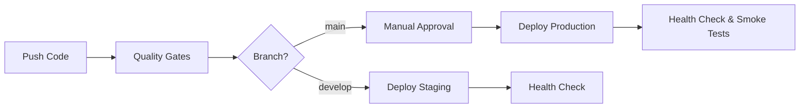

# GitHub Actions Deployment Configuration

This document describes the GitHub Actions setup for automatic deployment of the landing page to Cloudflare Pages.

## 📋 Overview

The deployment workflow automatically deploys the landing page to:

- **Staging**: `staging.tomriddelsdell.com` (from `develop` branch)
- **Production**: `tomriddelsdell.com` (from `main` branch)

## 🔧 GitHub Repository Setup

### Required Secrets

Navigate to **Settings → Secrets and variables → Actions** and add the following repository secrets:

| Secret Name | Description | Where to Get It |
|-------------|-------------|-----------------|
| `DOPPLER_TOKEN_STG` | Doppler service token for staging environment | Doppler dashboard → tomriddelsdell-infra → stg → Service Tokens |
| `DOPPLER_TOKEN_PRD` | Doppler service token for production environment | Doppler dashboard → tomriddelsdell-infra → prd → Service Tokens |
| `CLOUDFLARE_API_TOKEN` | Cloudflare API token with Pages permissions | Cloudflare dashboard → API Tokens (already created) |
| `CLOUDFLARE_ACCOUNT_ID` | Cloudflare account ID | Cloudflare dashboard → Account ID (already in Doppler) |

### GitHub Environments

Create two environments with protection rules:

#### 1. Staging Environment

Navigate to **Settings → Environments** and create `staging` environment:

- **Name**: `staging`
- **Deployment URL**: `https://staging.tomriddelsdell.com`
- **Protection Rules**:
  - ✅ Wait timer: 0 minutes (no delay)
  - ❌ Required reviewers: None (auto-deploy)
  - ✅ Restrict deployments to `develop` branch only

#### 2. Production Environment

Create `production` environment with stricter controls:

- **Name**: `production`
- **Deployment URL**: `https://tomriddelsdell.com`
- **Protection Rules**:
  - ✅ Required reviewers: Add yourself as a required reviewer
  - ✅ Wait timer: 0 minutes (review required instead)
  - ✅ Restrict deployments to `main` branch only
  - ✅ Prevent self-review (if team grows)

## 🚀 Deployment Workflow

### Automatic Deployments

The workflow triggers automatically on:

1. **Push to `develop`** → Deploys to staging
2. **Push to `main`** → Deploys to production (after manual approval)
3. **Manual trigger** → Choose environment to deploy

### Deployment Process



### Quality Gates

Before any deployment, the workflow runs:

- ✅ Type checking (`tsc --noEmit`)
- ✅ Linting (`eslint`)
- ✅ Unit tests (`jest`)
- ✅ Build test (ensure code compiles)

## 📊 Deployment Steps

### Staging Deployment (Automatic)

1. **Trigger**: Push to `develop` branch
2. **Quality Gates**: Run all checks
3. **Build**: Build with staging environment variables from Doppler
4. **Deploy**: Deploy to Cloudflare Pages (develop branch)
5. **Health Check**: Verify https://staging.tomriddelsdell.com is accessible
6. **Summary**: Post deployment summary to GitHub Actions

### Production Deployment (Manual Approval)

1. **Trigger**: Push to `main` branch
2. **Quality Gates**: Run all checks
3. **Approval**: Wait for manual approval from required reviewer
4. **Build**: Build with production environment variables from Doppler
5. **Deploy**: Deploy to Cloudflare Pages (main branch)
6. **Health Check**: Verify https://tomriddelsdell.com is accessible
7. **Smoke Tests**: Test critical paths (homepage, contact page)
8. **Summary**: Post deployment summary to GitHub Actions

## 🧪 Testing the Pipeline

### 1. Test Staging Deployment

```bash
# Make a minor change to the landing page
cd apps/landing-page
# Edit src/app/page.tsx or any component

# Commit and push to develop
git checkout develop
git add .
git commit -m "test: verify staging deployment pipeline"
git push origin develop

# Monitor deployment in GitHub Actions:
# https://github.com/TomRiddelsdell/tomriddelsdell.com/actions
```

### 2. Verify Staging Deployment

1. Go to GitHub Actions and watch the workflow execute
2. Check that all quality gates pass
3. Verify deployment completes successfully
4. Visit https://staging.tomriddelsdell.com to see your changes
5. Check deployment summary in GitHub Actions for quick links

### 3. Test Production Deployment

```bash
# Merge develop to main (creates PR automatically)
git checkout main
git pull origin main
git merge develop
git push origin main

# Monitor deployment in GitHub Actions
# Approve the deployment when prompted
```

### 4. Verify Production Deployment

1. GitHub Actions will wait for your approval
2. Click "Review deployments" and approve
3. Watch deployment execute with additional smoke tests
4. Visit https://tomriddelsdell.com to verify production deployment
5. Check all critical paths are working

## 🔄 Rollback Procedures

### Staging Rollback

1. Revert the commit on `develop` branch:
   ```bash
   git revert HEAD
   git push origin develop
   ```
2. GitHub Actions will automatically deploy the reverted version

### Production Rollback

**Option 1: Git Revert (Recommended)**

```bash
git checkout main
git revert HEAD
git push origin main
# Approve deployment when prompted
```

**Option 2: Cloudflare Pages Rollback**

1. Go to Cloudflare dashboard → Pages → landing-page-8t9
2. Navigate to "Deployments" tab
3. Find the previous working deployment
4. Click "..." → "Rollback to this deployment"
5. Confirm rollback

**Option 3: Redeploy Previous Version**

1. Find the last working commit SHA
2. Go to GitHub Actions → Deploy Landing Page
3. Click "Run workflow"
4. Select "production" environment
5. Specify the commit SHA

## 📈 Monitoring and Notifications

### Deployment Status

- **GitHub Actions**: View all deployment history and logs
- **Deployment Summary**: Each deployment creates a summary with:
  - Environment
  - URL
  - Branch
  - Commit SHA
  - Status
  - Quick links

### Health Checks

The workflow includes:

- **HTTP Status Check**: Verifies site returns 200 OK
- **Retry Logic**: 10 attempts with 10-second intervals
- **Failure Alerts**: GitHub Actions will fail and notify if unhealthy

### Smoke Tests (Production Only)

- Tests homepage (`/`)
- Tests contact page (`/contact`)
- Verifies all critical paths are accessible

## 🔐 Security Considerations

### Secret Management

- ✅ All secrets stored in GitHub Secrets (encrypted)
- ✅ Doppler tokens use least privilege (environment-specific)
- ✅ Cloudflare API token scoped to Pages only
- ✅ No secrets in logs or outputs

### Environment Protection

- ✅ Staging: Protected by Cloudflare Access (GitHub OAuth)
- ✅ Production: Protected by GitHub approval workflow
- ✅ Branch restrictions enforce correct deployment paths

### Audit Trail

- ✅ All deployments logged in GitHub Actions
- ✅ Approval history tracked for production
- ✅ Cloudflare Pages maintains deployment history
- ✅ Git history provides full change tracking

## 🐛 Troubleshooting

### Deployment Fails at Quality Gates

- Check the specific test that failed in GitHub Actions logs
- Fix the issue locally and retest
- Push fix to trigger new deployment

### Deployment Fails at Build Step

- Check for build errors in GitHub Actions logs
- Verify Doppler secrets are configured correctly
- Test build locally: `pnpm run build:staging` or `build:production`

### Deployment Fails at Cloudflare Pages

- Verify `CLOUDFLARE_API_TOKEN` has correct permissions
- Check Cloudflare Pages project exists: `landing-page-8t9`
- Verify `CLOUDFLARE_ACCOUNT_ID` is correct

### Health Check Fails

- Check if Cloudflare Access is blocking automated checks
- Verify DNS records are correct and proxied
- Check Cloudflare Pages deployment status in dashboard
- Wait a few minutes for DNS/CDN propagation

### Site Not Updating After Deployment

- Clear browser cache and hard refresh
- Check Cloudflare CDN cache (may take a few minutes)
- Verify correct branch was deployed in Cloudflare dashboard
- Check deployment used correct environment variables

## 📚 Additional Resources

- [GitHub Actions Documentation](https://docs.github.com/en/actions)
- [Cloudflare Pages Documentation](https://developers.cloudflare.com/pages/)
- [Doppler CLI Documentation](https://docs.doppler.com/docs/cli)
- [Wrangler CLI Documentation](https://developers.cloudflare.com/workers/wrangler/)

## 🎯 Next Steps

After deployment is working:

1. ✅ Set up Cloudflare Analytics for monitoring
2. ✅ Configure custom error pages
3. ✅ Add performance monitoring
4. ✅ Set up automated E2E tests with Playwright
5. ✅ Configure deployment notifications (Slack/Email)
6. ✅ Add deployment badges to README
