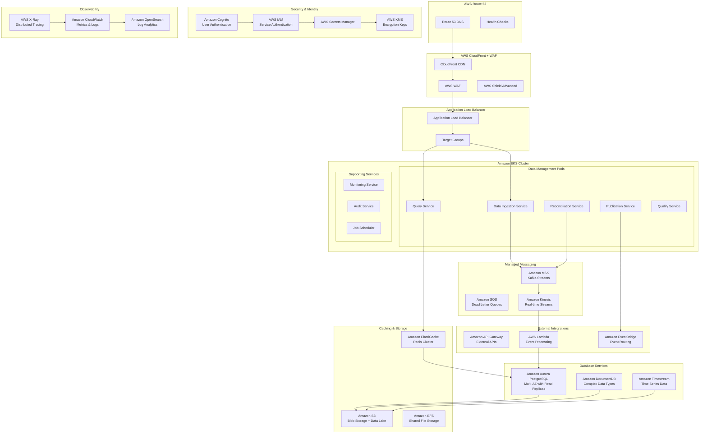

# QIS Data Management Domain - AWS Deployment Architecture

## Executive Summary

This document outlines the complete AWS deployment architecture for the QIS Data Management domain, leveraging AWS-native services for optimal performance, cost-efficiency, and operational excellence. The design utilizes managed services where possible to reduce operational overhead while maintaining enterprise-grade reliability and security.

## AWS Service Architecture Overview



## Core AWS Service Selection and Rationale

### Compute Platform: Amazon EKS

**Service**: Amazon Elastic Kubernetes Service (EKS)

**Configuration**:

```yaml
# EKS Cluster Configuration
apiVersion: eks.aws.com/v1alpha1
kind: Cluster
metadata:
  name: qis-data-management-cluster
  region: us-east-1
spec:
  version: '1.28'

  nodeGroups:
    - name: qis-data-compute
      instanceType: m6i.2xlarge
      amiType: AL2_x86_64
      scalingConfig:
        minSize: 3
        maxSize: 20
        desiredSize: 6

      subnets:
        - subnet-12345678 # Private subnet AZ-a
        - subnet-87654321 # Private subnet AZ-b
        - subnet-11223344 # Private subnet AZ-c

      launchTemplate:
        userData: |
          #!/bin/bash
          /etc/eks/bootstrap.sh qis-data-management-cluster

          # Install CloudWatch agent
          wget https://s3.amazonaws.com/amazoncloudwatch-agent/amazon_linux/amd64/latest/amazon-cloudwatch-agent.rpm
          rpm -U ./amazon-cloudwatch-agent.rpm

    - name: qis-data-memory-optimized
      instanceType: r6i.xlarge
      amiType: AL2_x86_64
      scalingConfig:
        minSize: 2
        maxSize: 10
        desiredSize: 4

      taints:
        - key: workload-type
          value: memory-intensive
          effect: NoSchedule

  addons:
    - name: vpc-cni
      version: v1.15.1-eksbuild.1
    - name: coredns
      version: v1.10.1-eksbuild.4
    - name: kube-proxy
      version: v1.28.2-eksbuild.2
    - name: aws-ebs-csi-driver
      version: v1.24.0-eksbuild.1

  fargate:
    profiles:
      - name: qis-serverless-workloads
        selectors:
          - namespace: qis-batch-processing
            labels:
              workload-type: batch
```

**Trade-offs**:

- **Pros**: Full Kubernetes compatibility, managed control plane, AWS-native integrations, auto-scaling, spot instance support
- **Cons**: Higher operational complexity than serverless options, requires Kubernetes expertise
- **Alternative**: AWS Fargate for serverless containers (simpler but less control)

### Database Architecture: Multi-Service Approach

#### Primary Event Store: Amazon Aurora PostgreSQL

**Configuration**:

```yaml
# Aurora PostgreSQL Cluster
Resources:
  QISEventStoreCluster:
    Type: AWS::RDS::DBCluster
    Properties:
      Engine: aurora-postgresql
      EngineVersion: '15.4'
      DatabaseName: qis_event_store
      MasterUsername: qis_admin
      ManageMasterUserPassword: true

      DBSubnetGroupName: !Ref QISDBSubnetGroup
      VpcSecurityGroupIds:
        - !Ref QISEventStoreSecurityGroup

      # High Availability Configuration
      BackupRetentionPeriod: 30
      PreferredBackupWindow: '03:00-04:00'
      PreferredMaintenanceWindow: 'sun:04:00-sun:05:00'

      # Performance Configuration
      DBClusterParameterGroupName: !Ref QISEventStoreParameterGroup
      EnableCloudwatchLogsExports:
        - postgresql

      # Security Configuration
      StorageEncrypted: true
      KmsKeyId: !Ref QISEncryptionKey
      DeletionProtection: true

  QISEventStoreWriter:
    Type: AWS::RDS::DBInstance
    Properties:
      DBInstanceClass: db.r6g.2xlarge
      DBClusterIdentifier: !Ref QISEventStoreCluster
      Engine: aurora-postgresql
      PubliclyAccessible: false

  QISEventStoreReader1:
    Type: AWS::RDS::DBInstance
    Properties:
      DBInstanceClass: db.r6g.xlarge
      DBClusterIdentifier: !Ref QISEventStoreCluster
      Engine: aurora-postgresql
      PubliclyAccessible: false

  QISEventStoreReader2:
    Type: AWS::RDS::DBInstance
    Properties:
      DBInstanceClass: db.r6g.xlarge
      DBClusterIdentifier: !Ref QISEventStoreCluster
      Engine: aurora-postgresql
      PubliclyAccessible: false
```

**Trade-offs**:

- **Pros**: ACID compliance, point-in-time recovery, automatic backups, read replicas
- **Cons**: Higher cost than managed NoSQL options, requires PostgreSQL expertise
- **Alternative**: Amazon DynamoDB (cheaper, simpler, but eventual consistency)

#### Time Series Data: Amazon Timestream

**Configuration**:

```typescript
// Timestream Database Configuration
interface TimestreamConfig {
  database: {
    name: 'QISTimeSeriesData';
    retentionProperties: {
      memoryStoreRetentionPeriodInHours: 24;
      magneticStoreRetentionPeriodInDays: 2555; // ~7 years
    };
  };

  tables: {
    officialDataValues: {
      retentionProperties: {
        memoryStoreRetentionPeriodInHours: 168; // 1 week
        magneticStoreRetentionPeriodInDays: 2555;
      };
      magneticStoreWriteProperties: {
        enableMagneticStoreWrites: true;
        magneticStoreRejectedDataLocation: {
          s3Configuration: {
            bucketName: 'qis-timestream-rejected-data';
            objectKeyPrefix: 'rejected-writes/';
          };
        };
      };
    };

    qualityMetrics: {
      retentionProperties: {
        memoryStoreRetentionPeriodInHours: 24;
        magneticStoreRetentionPeriodInDays: 365;
      };
    };
  };
}
```

**Trade-offs**:

- **Pros**: Purpose-built for time series, automatic scaling, cost-effective storage tiering
- **Cons**: AWS-specific, limited query capabilities compared to PostgreSQL
- **Alternative**: InfluxDB on EC2 (more flexible but requires management)

#### Complex Data Types: Amazon DocumentDB

**Configuration**:

```yaml
# DocumentDB Cluster for Complex Data Types
Resources:
  QISDocumentDBCluster:
    Type: AWS::DocDB::DBCluster
    Properties:
      DBClusterIdentifier: qis-complex-data
      Engine: docdb
      EngineVersion: '5.0.0'
      MasterUsername: qis_docdb_admin
      ManageMasterUserPassword: true

      # Performance Configuration
      DBClusterParameterGroupName: !Ref QISDocDBParameterGroup

      # Security Configuration
      VpcSecurityGroupIds:
        - !Ref QISDocumentDBSecurityGroup
      DBSubnetGroupName: !Ref QISDocDBSubnetGroup
      StorageEncrypted: true
      KmsKeyId: !Ref QISEncryptionKey

      # Backup Configuration
      BackupRetentionPeriod: 7
      PreferredBackupWindow: '02:00-03:00'

  QISDocumentDBInstance1:
    Type: AWS::DocDB::DBInstance
    Properties:
      DBClusterIdentifier: !Ref QISDocumentDBCluster
      DBInstanceClass: db.r6g.large
      Engine: docdb
```

**Trade-offs**:

- **Pros**: MongoDB compatibility, managed service, JSON document storage
- **Cons**: Not as feature-rich as MongoDB, additional service complexity
- **Alternative**: MongoDB Atlas (more features but higher cost)

### Messaging Architecture: Amazon MSK + Kinesis

#### Apache Kafka: Amazon MSK

**Configuration**:

```yaml
# MSK Cluster Configuration
Resources:
  QISMSKCluster:
    Type: AWS::MSK::Cluster
    Properties:
      ClusterName: qis-data-management-cluster
      KafkaVersion: '2.8.1'
      NumberOfBrokerNodes: 6

      BrokerNodeGroupInfo:
        InstanceType: kafka.m5.2xlarge
        ClientSubnets:
          - !Ref PrivateSubnet1
          - !Ref PrivateSubnet2
          - !Ref PrivateSubnet3
        SecurityGroups:
          - !Ref QISMSKSecurityGroup
        StorageInfo:
          EBSStorageInfo:
            VolumeSize: 1000 # 1TB per broker

      # Security Configuration
      EncryptionInfo:
        EncryptionInTransit:
          ClientBroker: TLS
          InCluster: true
        EncryptionAtRest:
          DataVolumeKMSKeyId: !Ref QISEncryptionKey

      ClientAuthentication:
        Sasl:
          Scram:
            Enabled: true
        Tls:
          Enabled: true
          CertificateAuthorityArnList:
            - !Ref QISCertificateAuthority

      # Monitoring
      EnhancedMonitoring: PER_TOPIC_PER_PARTITION
      LoggingInfo:
        BrokerLogs:
          CloudWatchLogs:
            Enabled: true
            LogGroup: !Ref QISMSKLogGroup
          S3:
            Enabled: true
            Bucket: !Ref QISLogsBucket
            Prefix: msk-logs/
```

**Trade-offs**:

- **Pros**: Fully managed Kafka, high throughput, exactly-once semantics
- **Cons**: More expensive than SQS, requires Kafka expertise
- **Alternative**: Amazon SQS/SNS (simpler and cheaper but lower throughput)

#### Real-time Streaming: Amazon Kinesis

**Configuration**:

```typescript
// Kinesis Data Streams Configuration
interface KinesisConfig {
  streams: {
    dataIngestionStream: {
      name: 'qis-data-ingestion-stream';
      shardCount: 10;
      retentionPeriod: 168; // hours (7 days)
      shardLevelMetrics: ['IncomingRecords', 'OutgoingRecords'];
      encryption: {
        type: 'KMS';
        keyId: 'alias/qis-kinesis-key';
      };
    };

    qualityAlertsStream: {
      name: 'qis-quality-alerts-stream';
      shardCount: 2;
      retentionPeriod: 24; // hours
      consumerApplications: [
        'qis-quality-processor',
        'qis-notification-service',
      ];
    };

    auditTrailStream: {
      name: 'qis-audit-trail-stream';
      shardCount: 5;
      retentionPeriod: 168; // 7 days
      consumers: [
        {
          applicationName: 'qis-audit-processor';
          processingGuarantee: 'EXACTLY_ONCE';
        },
      ];
    };
  };

  analytics: {
    kinesisAnalytics: {
      applicationName: 'qis-real-time-quality-analysis';
      sqlQueries: [
        `CREATE STREAM quality_anomalies AS
         SELECT reference_data_id, snap, quality_score
         FROM SOURCE_SQL_STREAM_001
         WHERE quality_score < 0.95;`,

        `CREATE STREAM ingestion_rate_monitoring AS
         SELECT ROWTIME_TO_TIMESTAMP(ROWTIME) as event_time,
                COUNT(*) as ingestion_count
         FROM SOURCE_SQL_STREAM_001
         WINDOW TUMBLING (INTERVAL '1' MINUTE);`,
      ];
    };
  };
}
```

**Trade-offs**:

- **Pros**: Real-time processing, automatic scaling, integrated with AWS analytics
- **Cons**: More complex than batch processing, higher cost for high-volume streams
- **Alternative**: Apache Spark on EMR (more flexible but requires management)

### Caching Strategy: Amazon ElastiCache

**Configuration**:

```yaml
# ElastiCache Redis Cluster
Resources:
  QISRedisCluster:
    Type: AWS::ElastiCache::ReplicationGroup
    Properties:
      ReplicationGroupDescription: 'QIS Data Management Cache'
      NumCacheClusters: 6 # 1 primary + 5 replicas
      Engine: redis
      EngineVersion: '7.0'
      CacheNodeType: cache.r6g.2xlarge

      # High Availability
      MultiAZEnabled: true
      AutomaticFailoverEnabled: true

      # Security
      AtRestEncryptionEnabled: true
      TransitEncryptionEnabled: true
      AuthToken: !Ref QISRedisAuthToken
      SecurityGroupIds:
        - !Ref QISRedisSecurityGroup
      SubnetGroupName: !Ref QISRedisSubnetGroup

      # Backup
      SnapshotRetentionLimit: 7
      SnapshotWindow: '01:00-02:00'

      # Performance
      Port: 6379
      ParameterGroupName: !Ref QISRedisParameterGroup

      # Monitoring
      NotificationTopicArn: !Ref QISRedisNotificationTopic
```

**Cache Architecture**:

```typescript
// Multi-layer caching strategy
interface ElastiCacheArchitecture {
  clusters: {
    hotData: {
      nodeType: 'cache.r6g.2xlarge';
      nodes: 6;
      purpose: 'Frequently accessed official data values';
      ttl: {
        officialData: 300; // 5 minutes
        qualityMetrics: 600; // 10 minutes
      };
    };

    sessionData: {
      nodeType: 'cache.r6g.large';
      nodes: 3;
      purpose: 'User sessions and temporary data';
      ttl: {
        userSessions: 3600; // 1 hour
        temporaryResults: 1800; // 30 minutes
      };
    };

    computeCache: {
      nodeType: 'cache.r6g.xlarge';
      nodes: 4;
      purpose: 'Expensive computation results';
      ttl: {
        reconciliationResults: 1800; // 30 minutes
        qualityCalculations: 3600; // 1 hour
      };
    };
  };

  keyPatterns: {
    officialData: 'official:{referenceDataId}:{snap}:{version}';
    historicalData: 'historical:{referenceDataId}:{from}:{to}:{granularity}';
    qualityMetrics: 'quality:{referenceDataId}:{timeWindow}:{metricType}';
    userSessions: 'session:{userId}:{sessionId}';
    computeResults: 'compute:{operationType}:{inputHash}';
  };

  evictionPolicies: {
    hotData: 'allkeys-lru';
    sessionData: 'volatile-ttl';
    computeCache: 'allkeys-lfu';
  };
}
```

**Trade-offs**:

- **Pros**: Fully managed Redis, automatic failover, backup/restore
- **Cons**: Higher cost than self-managed Redis, limited configuration options
- **Alternative**: Redis on EC2 (more control but requires management)

## Storage Architecture

### Object Storage: Amazon S3

**Configuration**:

```yaml
# S3 Buckets for Different Data Types
Resources:
  QISDataLakeBucket:
    Type: AWS::S3::Bucket
    Properties:
      BucketName: qis-data-lake-prod

      # Lifecycle Management
      LifecycleConfiguration:
        Rules:
          - Id: DataArchiving
            Status: Enabled
            Transitions:
              - TransitionInDays: 30
                StorageClass: STANDARD_IA
              - TransitionInDays: 90
                StorageClass: GLACIER
              - TransitionInDays: 2555 # 7 years
                StorageClass: DEEP_ARCHIVE

          - Id: IncompleteMultipartUploads
            Status: Enabled
            AbortIncompleteMultipartUpload:
              DaysAfterInitiation: 1

      # Security
      PublicAccessBlockConfiguration:
        BlockPublicAcls: true
        BlockPublicPolicy: true
        IgnorePublicAcls: true
        RestrictPublicBuckets: true

      # Encryption
      BucketEncryption:
        ServerSideEncryptionConfiguration:
          - ServerSideEncryptionByDefault:
              SSEAlgorithm: aws:kms
              KMSMasterKeyID: !Ref QISEncryptionKey
            BucketKeyEnabled: true

      # Versioning and Protection
      VersioningConfiguration:
        Status: Enabled
      ObjectLockEnabled: true
      ObjectLockConfiguration:
        ObjectLockEnabled: Enabled
        Rule:
          DefaultRetention:
            Mode: GOVERNANCE
            Years: 7

  QISBackupBucket:
    Type: AWS::S3::Bucket
    Properties:
      BucketName: qis-database-backups-prod
      # Cross-region replication for disaster recovery
      ReplicationConfiguration:
        Role: !GetAtt QISReplicationRole.Arn
        Rules:
          - Id: ReplicateToSecondaryRegion
            Status: Enabled
            Priority: 1
            Prefix: database-backups/
            Destination:
              Bucket: !Sub 'arn:aws:s3:::qis-database-backups-${AWS::Region}-dr'
              StorageClass: STANDARD_IA
```

**Storage Strategy**:

```typescript
interface S3StorageStrategy {
  buckets: {
    dataLake: {
      purpose: 'Historical data archive and analytics';
      partitioning: {
        scheme: 'year/month/day/hour';
        example: 's3://qis-data-lake/reference-data/ETH-USD/2025/01/15/14/';
      };
      formats: {
        timeSeriesData: 'Parquet'; // Optimized for analytics
        complexData: 'JSON'; // Schema flexibility
        auditLogs: 'Apache Avro'; // Schema evolution
      };
      lifecycle: {
        hot: 'Standard (30 days)';
        warm: 'Standard-IA (60 days)';
        cold: 'Glacier (7 years)';
        archive: 'Deep Archive (permanent)';
      };
    };

    backups: {
      purpose: 'Database and configuration backups';
      encryption: 'KMS with customer-managed keys';
      retention: '7 years for compliance';
      replication: 'Cross-region for disaster recovery';
    };

    staticAssets: {
      purpose: 'Application assets and documentation';
      cloudFrontIntegration: true;
      compression: 'Gzip and Brotli';
      caching: 'Long-term with versioning';
    };
  };

  optimizations: {
    multipartUpload: {
      threshold: '100MB';
      chunkSize: '10MB';
      parallelism: 5;
    };

    s3Transfer: {
      acceleration: true; // For global access
      intelligentTiering: true; // Automatic cost optimization
    };

    requestOptimization: {
      listOptimization: 'Use prefixes to reduce list operations';
      hotspotPrevention: 'Randomize key prefixes for high-throughput writes';
    };
  };
}
```

**Trade-offs**:

- **Pros**: Virtually unlimited storage, multiple storage classes, strong consistency
- **Cons**: Higher latency than EBS, pay-per-request pricing can be expensive
- **Alternative**: Amazon EFS for shared file storage (higher cost but better for concurrent access)

## Security Architecture

### Identity and Access Management

**Configuration**:

```yaml
# IAM Roles and Policies
Resources:
  QISDataManagementRole:
    Type: AWS::IAM::Role
    Properties:
      RoleName: QIS-DataManagement-ServiceRole
      AssumeRolePolicyDocument:
        Version: '2012-10-17'
        Statement:
          - Effect: Allow
            Principal:
              Service:
                - eks.amazonaws.com
                - ec2.amazonaws.com
            Action: sts:AssumeRole

          - Effect: Allow
            Principal:
              AWS: !Sub 'arn:aws:iam::${AWS::AccountId}:root'
            Action: sts:AssumeRole
            Condition:
              StringEquals:
                'aws:RequestedRegion': !Ref AWS::Region

      ManagedPolicyArns:
        - arn:aws:iam::aws:policy/AmazonEKSClusterPolicy
        - arn:aws:iam::aws:policy/AmazonEKSWorkerNodePolicy

      Policies:
        - PolicyName: QISDataManagementPolicy
          PolicyDocument:
            Version: '2012-10-17'
            Statement:
              # Aurora access
              - Effect: Allow
                Action:
                  - rds:DescribeDBClusters
                  - rds:DescribeDBInstances
                  - rds:CreateDBSnapshot
                Resource: !Sub 'arn:aws:rds:${AWS::Region}:${AWS::AccountId}:cluster:qis-*'

              # MSK access
              - Effect: Allow
                Action:
                  - kafka:DescribeCluster
                  - kafka:GetBootstrapBrokers
                  - kafka:ListClusters
                Resource: !Sub 'arn:aws:kafka:${AWS::Region}:${AWS::AccountId}:cluster/qis-*'

              # ElastiCache access
              - Effect: Allow
                Action:
                  - elasticache:DescribeReplicationGroups
                  - elasticache:DescribeCacheClusters
                Resource: !Sub 'arn:aws:elasticache:${AWS::Region}:${AWS::AccountId}:replicationgroup:qis-*'

              # S3 access
              - Effect: Allow
                Action:
                  - s3:GetObject
                  - s3:PutObject
                  - s3:DeleteObject
                Resource:
                  - !Sub '${QISDataLakeBucket}/*'
                  - !Sub '${QISBackupBucket}/*'

              # Secrets Manager access
              - Effect: Allow
                Action:
                  - secretsmanager:GetSecretValue
                  - secretsmanager:DescribeSecret
                Resource: !Sub 'arn:aws:secretsmanager:${AWS::Region}:${AWS::AccountId}:secret:qis/*'

              # KMS access
              - Effect: Allow
                Action:
                  - kms:Decrypt
                  - kms:DescribeKey
                Resource: !Ref QISEncryptionKey
```

### Encryption Strategy

**Configuration**:

```typescript
interface AWSEncryptionStrategy {
  kms: {
    customerManagedKeys: {
      dataEncryptionKey: {
        description: 'QIS Data Management - Data Encryption';
        keyUsage: 'ENCRYPT_DECRYPT';
        keySpec: 'SYMMETRIC_DEFAULT';
        policy: {
          keyAdministrators: ['arn:aws:iam::123456789012:role/QIS-Admin'];
          keyUsers: [
            'arn:aws:iam::123456789012:role/QIS-DataManagement-ServiceRole',
            'arn:aws:iam::123456789012:role/QIS-Lambda-ExecutionRole',
          ];
        };
        rotation: {
          enabled: true;
          rotationPeriodInDays: 365;
        };
      };

      logsEncryptionKey: {
        description: 'QIS Data Management - Logs Encryption';
        separateKeyReason: 'Compliance requirement for log data isolation';
      };
    };

    awsManagedKeys: {
      usage: [
        'S3 default encryption (for cost optimization)',
        'CloudWatch Logs (for managed service integration)',
        'Lambda environment variables',
      ];
    };
  };

  encryptionAtRest: {
    aurora: {
      encryption: true;
      kmsKeyId: '${customerManagedKeys.dataEncryptionKey}';
      backupEncryption: true;
    };

    documentDB: {
      encryption: true;
      kmsKeyId: '${customerManagedKeys.dataEncryptionKey}';
    };

    elastiCache: {
      atRestEncryption: true;
      transitEncryption: true;
      authToken: 'stored in Secrets Manager';
    };

    s3: {
      defaultEncryption: 'aws:kms';
      bucketKeyEnabled: true; // Cost optimization
      objectLevelEncryption: 'Per-object KMS keys for sensitive data';
    };

    ebs: {
      defaultEncryption: true;
      kmsKeyId: '${customerManagedKeys.dataEncryptionKey}';
    };
  };

  encryptionInTransit: {
    apiGateway: {
      tlsVersion: 'TLS 1.3';
      certificateManager: 'AWS Certificate Manager';
      customDomains: true;
    };

    rds: {
      sslMode: 'require';
      certificateValidation: true;
    };

    elastiCache: {
      transitEncryption: true;
      authTokenRequired: true;
    };

    msk: {
      encryptionInTransit: {
        clientBroker: 'TLS';
        inCluster: true;
      };
    };
  };
}
```

## Monitoring and Observability

### CloudWatch Configuration

**Configuration**:

```yaml
# CloudWatch Dashboards and Alarms
Resources:
  QISMainDashboard:
    Type: AWS::CloudWatch::Dashboard
    Properties:
      DashboardName: QIS-DataManagement-Overview
      DashboardBody: !Sub |
        {
          "widgets": [
            {
              "type": "metric",
              "properties": {
                "metrics": [
                  ["AWS/ApplicationELB", "RequestCount", "LoadBalancer", "${QISApplicationLoadBalancer}"],
                  ["AWS/ApplicationELB", "TargetResponseTime", "LoadBalancer", "${QISApplicationLoadBalancer}"],
                  ["AWS/RDS", "DatabaseConnections", "DBClusterIdentifier", "${QISEventStoreCluster}"],
                  ["AWS/ElastiCache", "CurrConnections", "CacheClusterId", "${QISRedisCluster}"],
                  ["AWS/MSK", "BytesInPerSec", "Cluster Name", "${QISMSKCluster}"],
                  ["Custom/QIS", "DataIngestionRate"],
                  ["Custom/QIS", "ReconciliationSuccessRate"],
                  ["Custom/QIS", "QualityScoreAverage"]
                ],
                "period": 300,
                "stat": "Average",
                "region": "${AWS::Region}",
                "title": "QIS Data Management - Key Metrics"
              }
            }
          ]
        }

  # Critical Alarms
  QISHighIngestionLatencyAlarm:
    Type: AWS::CloudWatch::Alarm
    Properties:
      AlarmName: QIS-HighIngestionLatency
      AlarmDescription: 'Data ingestion latency is above threshold'
      MetricName: IngestionLatencyP95
      Namespace: Custom/QIS
      Statistic: Average
      Period: 300
      EvaluationPeriods: 2
      Threshold: 200 # milliseconds
      ComparisonOperator: GreaterThanThreshold
      AlarmActions:
        - !Ref QISCriticalAlarmsTopic
      TreatMissingData: breaching

  QISLowDataQualityAlarm:
    Type: AWS::CloudWatch::Alarm
    Properties:
      AlarmName: QIS-LowDataQuality
      AlarmDescription: 'Data quality score has dropped below acceptable threshold'
      MetricName: QualityScoreAverage
      Namespace: Custom/QIS
      Statistic: Average
      Period: 600
      EvaluationPeriods: 2
      Threshold: 0.95
      ComparisonOperator: LessThanThreshold
      AlarmActions:
        - !Ref QISCriticalAlarmsTopic
      TreatMissingData: breaching
```

### X-Ray Tracing Configuration

**Configuration**:

```typescript
// X-Ray tracing setup for distributed tracing
interface XRayConfiguration {
  serviceMaps: {
    dataIngestionFlow: {
      services: [
        'qis-api-gateway',
        'qis-data-ingestion-service',
        'qis-aurora-cluster',
        'qis-msk-cluster',
        'qis-reconciliation-service',
      ];
      traceRetention: '30 days';
      samplingRate: 0.1; // 10% of requests
    };

    queryFlow: {
      services: [
        'qis-api-gateway',
        'qis-query-service',
        'qis-elasticache-cluster',
        'qis-aurora-read-replica',
      ];
      traceRetention: '7 days';
      samplingRate: 0.05; // 5% of requests
    };
  };

  customSegments: {
    dataValidation: {
      subsegmentName: 'data-validation';
      annotations: ['data-type', 'validation-rules'];
      metadata: ['validation-results', 'error-details'];
    };

    reconciliation: {
      subsegmentName: 'multi-source-reconciliation';
      annotations: ['source-count', 'conflict-resolution'];
      metadata: ['source-values', 'reconciliation-algorithm'];
    };

    qualityAssessment: {
      subsegmentName: 'quality-assessment';
      annotations: ['quality-score', 'assessment-type'];
      metadata: ['quality-metrics', 'anomaly-detection'];
    };
  };

  insights: {
    responseTimeAnalysis: {
      enabled: true;
      percentiles: [50, 90, 95, 99];
      timeRange: '24h';
    };

    errorAnalysis: {
      enabled: true;
      groupBy: ['service-name', 'error-type'];
      threshold: '1% error rate';
    };

    dependencyAnalysis: {
      enabled: true;
      focusServices: ['aurora-cluster', 'msk-cluster'];
    };
  };
}
```

## Cost Optimization Strategies

### Reserved Instances and Savings Plans

**Configuration**:

```typescript
interface CostOptimizationStrategy {
  reservedInstances: {
    rds: {
      instances: [
        {
          instanceType: 'db.r6g.2xlarge'; // Writer instance
          term: '3-year';
          paymentOption: 'All Upfront';
          expectedSavings: '60%';
        },
        {
          instanceType: 'db.r6g.xlarge'; // Reader instances
          quantity: 2;
          term: '1-year';
          paymentOption: 'Partial Upfront';
          expectedSavings: '40%';
        },
      ];
    };

    elastiCache: {
      instances: [
        {
          instanceType: 'cache.r6g.2xlarge';
          quantity: 6;
          term: '1-year';
          paymentOption: 'No Upfront';
          expectedSavings: '30%';
        },
      ];
    };
  };

  computeSavingsPlans: {
    eks: {
      commitment: '$500/month'; // Based on baseline compute needs
      term: '1-year';
      paymentOption: 'No Upfront';
      coverage: ['EC2', 'Fargate', 'Lambda'];
      expectedSavings: '17%';
    };
  };

  spotInstances: {
    eksNodeGroups: {
      spotAllocation: '50%'; // Mix with on-demand
      instanceTypes: ['m6i.2xlarge', 'm5.2xlarge', 'm5a.2xlarge']; // Diversify for availability
      maxPrice: '$0.20/hour'; // 30% of on-demand price
    };

    batchProcessing: {
      spotAllocation: '90%'; // Non-critical workloads
      interruptionHandling: 'Graceful shutdown with checkpointing';
    };
  };

  storageOptimization: {
    s3IntelligentTiering: {
      enabled: true;
      expectedSavings: '40-68%';
      applicableBuckets: ['data-lake', 'audit-logs'];
    };

    ebsGp3Migration: {
      fromGp2ToGp3: true;
      expectedSavings: '20%';
      performanceGains: 'Better IOPS and throughput baseline';
    };
  };

  networkOptimization: {
    natGateway: {
      strategy: 'Single NAT Gateway with route table optimization';
      expectedSavings: '$90/month per AZ';
      tradeoff: 'Single point of failure for outbound traffic';
    };

    dataTransfer: {
      cloudFrontUsage: 'Reduce S3 data transfer costs';
      s3TransferAcceleration: 'Only for global uploads';
      crossRegionReplication: 'Only for critical compliance data';
    };
  };
}
```

### Monitoring and Cost Alerts

**Configuration**:

```yaml
# Cost monitoring and budgets
Resources:
  QISMonthlyCostBudget:
    Type: AWS::Budgets::Budget
    Properties:
      Budget:
        BudgetName: QIS-DataManagement-Monthly-Budget
        BudgetLimit:
          Amount: 5000 # $5,000 per month
          Unit: USD
        TimeUnit: MONTHLY
        BudgetType: COST

        CostFilters:
          TagKey:
            - Project
          TagValue:
            - QIS-DataManagement

        PlannedBudgetLimits:
          # Quarterly review points
          '2025-03-01':
            Amount: 4500
            Unit: USD
          '2025-06-01':
            Amount: 4000
            Unit: USD
          '2025-09-01':
            Amount: 3500
            Unit: USD

      NotificationsWithSubscribers:
        - Notification:
            NotificationType: ACTUAL
            ComparisonOperator: GREATER_THAN
            Threshold: 80 # 80% of budget
          Subscribers:
            - SubscriptionType: EMAIL
              Address: qis-ops@company.com
        - Notification:
            NotificationType: FORECASTED
            ComparisonOperator: GREATER_THAN
            Threshold: 100 # Forecasted to exceed budget
          Subscribers:
            - SubscriptionType: EMAIL
              Address: qis-ops@company.com
            - SubscriptionType: SNS
              Address: !Ref QISCostAlertsTopic

  QISCostAnomalyDetector:
    Type: AWS::CE::AnomalyDetector
    Properties:
      AnomalyDetectorName: QIS-DataManagement-Cost-Anomaly
      MonitorType: DIMENSIONAL
      ResourceTags:
        - Key: Project
          Value: QIS-DataManagement
        - Key: Environment
          Value: Production

  QISCostAnomalySubscription:
    Type: AWS::CE::AnomalySubscription
    Properties:
      SubscriptionName: QIS-Cost-Anomaly-Alerts
      MonitorArnList:
        - !GetAtt QISCostAnomalyDetector.AnomalyDetectorArn
      Subscribers:
        - Type: EMAIL
          Address: qis-finance@company.com
        - Type: EMAIL
          Address: qis-ops@company.com
      Threshold: 100 # Alert on any anomaly over $100
      Frequency: IMMEDIATE
```

## Disaster Recovery and Business Continuity

### Multi-Region Setup

**Configuration**:

```yaml
# Primary Region: us-east-1
# Secondary Region: us-west-2

# Cross-region replication setup
Resources:
  # Aurora Global Cluster
  QISGlobalCluster:
    Type: AWS::RDS::GlobalCluster
    Properties:
      GlobalClusterIdentifier: qis-global-cluster
      Engine: aurora-postgresql
      EngineVersion: '15.4'
      DatabaseName: qis_event_store

  # Primary Region Cluster
  QISPrimaryCluster:
    Type: AWS::RDS::DBCluster
    Properties:
      Engine: aurora-postgresql
      GlobalClusterIdentifier: !Ref QISGlobalCluster
      DBSubnetGroupName: !Ref QISPrimaryDBSubnetGroup
      # ... other configuration

  # Secondary Region Cluster (in us-west-2)
  QISSecondaryCluster:
    Type: AWS::RDS::DBCluster
    Properties:
      Engine: aurora-postgresql
      GlobalClusterIdentifier: !Ref QISGlobalCluster
      DBSubnetGroupName: !Ref QISSecondaryDBSubnetGroup
      # Read-only initially, can be promoted to read-write

  # S3 Cross-Region Replication
  QISDataLakeReplication:
    Type: AWS::S3::Bucket
    Properties:
      BucketName: qis-data-lake-us-west-2-replica
      ReplicationConfiguration:
        Role: !GetAtt QISReplicationRole.Arn
        Rules:
          - Id: ReplicateEverything
            Status: Enabled
            Priority: 1
            DeleteMarkerReplication:
              Status: Enabled
            Filter:
              Prefix: ''
            Destination:
              Bucket: !Sub 'arn:aws:s3:::qis-data-lake-us-west-2-replica'
              ReplicationTime:
                Status: Enabled
                Time:
                  Minutes: 15
              Metrics:
                Status: Enabled
                EventThreshold:
                  Minutes: 15
```

### Backup Strategy

**Configuration**:

```typescript
interface BackupStrategy {
  rds: {
    automatedBackups: {
      retentionPeriod: 30; // days
      backupWindow: '03:00-04:00 UTC';
      deleteAutomatedBackups: false;
    };

    manualSnapshots: {
      frequency: 'daily';
      retention: '1 year';
      crossRegionCopy: true;
      encryption: true;
    };

    pointInTimeRecovery: {
      enabled: true;
      recoveryWindow: '35 days';
      granularity: '5 minutes';
    };
  };

  elastiCache: {
    snapshots: {
      frequency: 'daily';
      retention: '7 days';
      window: '02:00-03:00 UTC';
    };
  };

  s3: {
    versioning: {
      enabled: true;
      noncurrentVersionExpiration: '90 days';
    };

    crossRegionReplication: {
      enabled: true;
      destinationRegion: 'us-west-2';
      replicationTime: '15 minutes';
    };

    glacierBackup: {
      transitionDays: 30;
      retentionYears: 7;
      deepArchiveTransition: 2555; // days (~7 years)
    };
  };

  applicationData: {
    configurationBackup: {
      method: 'AWS Config';
      frequency: 'on-change';
      retention: '1 year';
    };

    secretsBackup: {
      method: 'Secrets Manager automatic rotation';
      versionRetention: 'AWSPENDING + AWSCURRENT';
    };
  };
}
```

## Trade-offs Summary

### Cost vs. Performance

- **Aurora vs. DynamoDB**: Aurora provides ACID compliance and complex queries but costs 3-5x more
- **MSK vs. SQS**: MSK offers higher throughput and exactly-once semantics but costs 10x more than SQS
- **EKS vs. Fargate**: EKS provides more control and cost efficiency at scale but requires operational expertise

### Complexity vs. Management

- **Managed services vs. Self-hosted**: AWS managed services reduce operational burden but may have limitations
- **Multi-service architecture**: Better separation of concerns but increased complexity in service mesh management
- **Cross-region replication**: Better disaster recovery but higher data transfer costs and complexity

### Vendor Lock-in vs. Optimization

- **AWS-native services**: Better integration and optimization but harder to migrate to other clouds
- **Open-source alternatives**: More portable but require more operational overhead
- **Proprietary features**: Services like Timestream offer unique capabilities but create dependencies

This AWS deployment architecture provides a robust, scalable, and cost-optimized foundation for the QIS Data Management domain while leveraging AWS-native services for operational excellence.
