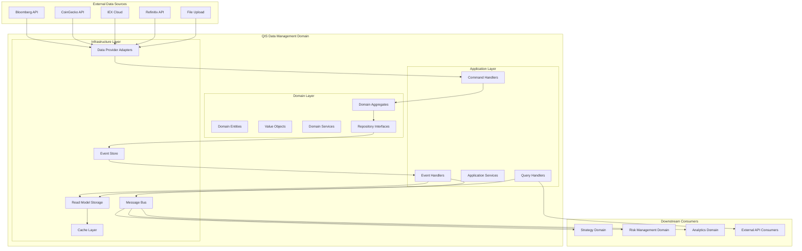
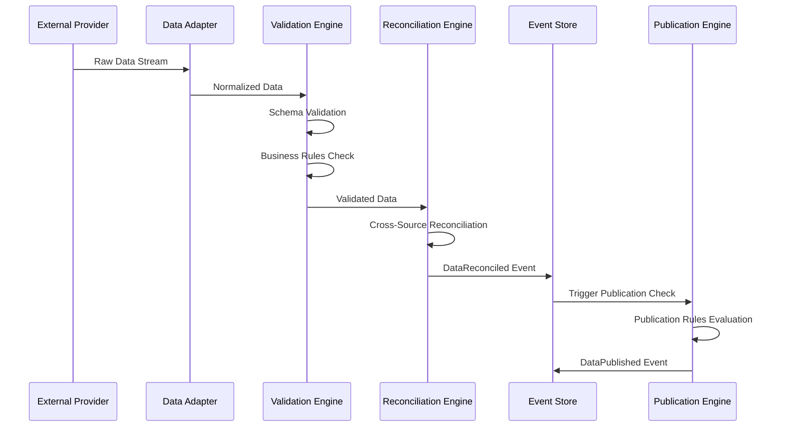
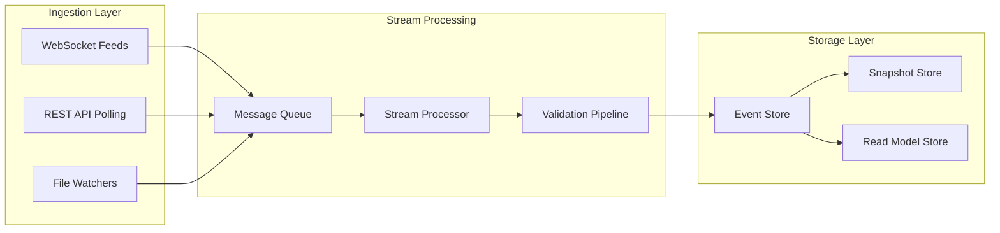

# QIS Data Management Domain - Architecture Design

## Architecture Overview

The QIS Data Management Domain follows Domain-Driven Design principles with a clean architecture approach, implementing event sourcing for complete audit trails and CQRS for optimal read/write separation.

## High-Level Architecture Diagram



## Domain Layer Architecture

### Core Aggregates

#### 1. ReferenceData Aggregate
- **Root Entity**: `ReferenceData`
- **Purpose**: Central authority for a specific timeseries data reference
- **Boundaries**: Complete lifecycle management from creation to publication
- **Key Behaviors**: 
  - Data ingestion from multiple sources
  - Reconciliation across sources
  - Quality validation
  - Publication approval
  - Restatement handling

#### 2. DataSource Aggregate  
- **Root Entity**: `DataSource`
- **Purpose**: Manage external data provider configurations
- **Boundaries**: Provider metadata and connection management
- **Key Behaviors**:
  - Provider registration and configuration
  - Connection health monitoring
  - Rate limiting and throttling
  - Error handling and retry logic

### Domain Entities

```typescript
// Core Domain Entities Structure
interface ReferenceData {
  referenceDataId: ReferenceDataId;
  dataSchema: DataSchema;
  sources: DataSource[];
  publishedValues: Map<Snap, OfficialDataValue>;
  qualityMetrics: QualityMetrics;
  auditTrail: AuditTrail;
  publicationStatus: PublicationStatus;
}

interface DataSource {
  sourceId: DataSourceId;
  providerInfo: ProviderInfo;
  connectionConfig: ConnectionConfig;
  healthStatus: HealthStatus;
  costMetrics: CostMetrics;
  dataValues: Map<Snap, SourceDataValue>;
}
```

### Value Objects

#### Core Value Objects
- **`ReferenceDataId`**: Strongly typed identifier for data series
- **`Snap`**: Event time with precision and timezone information
- **`DataValue<T>`**: Generic container for typed data values
- **`DataSchema`**: Structure definition for complex data types
- **`QualityScore`**: Composite quality assessment
- **`AuditEntry`**: Immutable audit trail record

#### Financial Value Objects
- **`Price`**: Currency-denominated value with precision
- **`Volume`**: Trading volume with unit specifications
- **`OptionsChain`**: Complete options universe snapshot
- **`CorporateAction`**: Structured corporate event data

## Event Sourcing Architecture

### Event Store Design

```typescript
interface DomainEvent {
  eventId: EventId;
  aggregateId: AggregateId;
  aggregateType: string;
  eventType: string;
  eventData: any;
  eventTimestamp: Date;
  eventVersion: number;
  userId?: UserId;
}

interface EventStream {
  streamId: StreamId;
  expectedVersion: number;
  events: DomainEvent[];
}
```

### Core Domain Events

#### Data Lifecycle Events
- **`DataIngested`**: Raw data received from source
- **`DataValidated`**: Data passed quality validation
- **`DataReconciled`**: Multi-source data reconciled
- **`DataPublished`**: Official data value published
- **`DataRestated`**: Published data corrected

#### Quality Events  
- **`QualityIssueDetected`**: Data quality problem identified
- **`QualityApproved`**: Manual quality approval
- **`QualityMetricsCalculated`**: Automated quality assessment

#### Administrative Events
- **`SchemaEvolved`**: Data schema updated
- **`SourceAdded`**: New data source configured
- **`PublicationScheduled`**: Publication workflow initiated

## CQRS Implementation

### Command Side (Write Model)

```typescript
// Command Handlers
interface DataIngestionCommandHandler {
  handle(command: IngestDataCommand): Promise<void>;
}

interface ReconciliationCommandHandler {
  handle(command: ReconcileDataCommand): Promise<void>;
}

interface PublicationCommandHandler {
  handle(command: PublishDataCommand): Promise<void>;
}

// Commands
interface IngestDataCommand {
  referenceDataId: ReferenceDataId;
  sourceId: DataSourceId;
  snap: Snap;
  rawData: any;
  metadata: IngestionMetadata;
}
```

### Query Side (Read Model)

```typescript
// Query Handlers
interface DataRetrievalQueryHandler {
  handle(query: GetOfficialDataQuery): Promise<OfficialDataValue[]>;
  handle(query: GetAsOfTimeQuery): Promise<AsOfTimeResult>;
}

// Optimized Read Models
interface OfficialDataReadModel {
  referenceDataId: string;
  snap: string;
  value: any;
  quality: number;
  publicationTime: string;
  version: number;
}

interface QualityMetricsReadModel {
  referenceDataId: string;
  timeWindow: string;
  accuracy: number;
  completeness: number;
  timeliness: number;
  consistency: number;
}
```

## Data Processing Pipeline Architecture

### Ingestion Pipeline



### Real-Time Processing Architecture



## Storage Architecture

### Event Store Schema

```sql
-- Event Store Tables
CREATE TABLE event_streams (
    stream_id UUID PRIMARY KEY,
    aggregate_type VARCHAR(100) NOT NULL,
    aggregate_id VARCHAR(255) NOT NULL,
    expected_version INTEGER NOT NULL,
    created_at TIMESTAMP WITH TIME ZONE DEFAULT NOW()
);

CREATE TABLE domain_events (
    event_id UUID PRIMARY KEY,
    stream_id UUID REFERENCES event_streams(stream_id),
    event_type VARCHAR(100) NOT NULL,
    event_data JSONB NOT NULL,
    event_timestamp TIMESTAMP WITH TIME ZONE NOT NULL,
    event_version INTEGER NOT NULL,
    user_id UUID
);

CREATE INDEX idx_domain_events_stream_version 
ON domain_events(stream_id, event_version);
```

### Read Model Schema

```sql
-- Read Model Tables
CREATE TABLE official_data_values (
    reference_data_id VARCHAR(255) NOT NULL,
    snap TIMESTAMP WITH TIME ZONE NOT NULL,
    value JSONB NOT NULL,
    data_type VARCHAR(100) NOT NULL,
    quality_score DECIMAL(5,4),
    publication_time TIMESTAMP WITH TIME ZONE,
    version INTEGER DEFAULT 1,
    PRIMARY KEY (reference_data_id, snap, version)
);

CREATE TABLE quality_metrics (
    reference_data_id VARCHAR(255) NOT NULL,
    calculation_time TIMESTAMP WITH TIME ZONE NOT NULL,
    time_window_start TIMESTAMP WITH TIME ZONE NOT NULL,
    time_window_end TIMESTAMP WITH TIME ZONE NOT NULL,
    accuracy_score DECIMAL(5,4),
    completeness_score DECIMAL(5,4),
    timeliness_score DECIMAL(5,4),
    consistency_score DECIMAL(5,4),
    PRIMARY KEY (reference_data_id, calculation_time)
);
```

## Integration Architecture

### External Provider Integration

```typescript
// Abstract Provider Interface
interface DataProvider {
  connect(): Promise<Connection>;
  subscribe(referenceDataId: ReferenceDataId): AsyncIterator<RawData>;
  requestHistorical(request: HistoricalRequest): Promise<RawData[]>;
  getHealth(): Promise<HealthStatus>;
}

// Concrete Implementations
class BloombergProvider implements DataProvider {
  // Bloomberg-specific implementation
}

class CoinGeckoProvider implements DataProvider {
  // CoinGecko-specific implementation
}

class IEXProvider implements DataProvider {
  // IEX-specific implementation
}
```

### Message Bus Architecture

```typescript
interface MessageBus {
  publish<T extends DomainEvent>(event: T): Promise<void>;
  subscribe<T extends DomainEvent>(
    eventType: string,
    handler: (event: T) => Promise<void>
  ): void;
}

// Event Routing Configuration
interface EventRoutingConfig {
  'DataPublished': [
    'strategy-domain.data-updated',
    'risk-domain.data-refresh',
    'analytics-domain.data-available'
  ];
  'QualityIssueDetected': [
    'ops-domain.quality-alert',
    'notification-service.quality-issue'
  ];
  'DataRestated': [
    'strategy-domain.data-corrected',
    'risk-domain.recalculate',
    'audit-service.restatement-log'
  ];
}
```

## Security Architecture

### Access Control Model

```typescript
interface DataAccessPolicy {
  resource: ResourceIdentifier;
  permissions: Permission[];
  conditions: AccessCondition[];
  auditRequirements: AuditRequirement[];
}

enum Permission {
  READ = 'read',
  WRITE = 'write', 
  PUBLISH = 'publish',
  ADMIN = 'admin'
}

interface AccessCondition {
  type: 'time_window' | 'data_classification' | 'source_restriction';
  parameters: Record<string, any>;
}
```

### Audit Trail Architecture

```typescript
interface AuditTrail {
  entries: AuditEntry[];
  addEntry(entry: AuditEntry): void;
  getEntriesForTimeRange(start: Date, end: Date): AuditEntry[];
  getEntriesForUser(userId: UserId): AuditEntry[];
}

interface AuditEntry {
  entryId: AuditEntryId;
  timestamp: Date;
  userId?: UserId;
  action: AuditAction;
  resource: ResourceIdentifier;
  details: AuditDetails;
  result: ActionResult;
}
```

## Performance Architecture

### Caching Strategy

```typescript
interface CacheStrategy {
  // L1: In-memory cache for hot data
  memoryCache: Map<string, CachedValue>;
  
  // L2: Redis for cross-instance sharing
  distributedCache: DistributedCache;
  
  // L3: Read replicas for query optimization
  readReplicas: ReadReplicaPool;
}

interface CacheConfiguration {
  ttl: {
    realTimeData: 30, // seconds
    historicalData: 3600, // 1 hour
    qualityMetrics: 300, // 5 minutes
    auditData: 86400 // 24 hours
  };
  
  evictionPolicy: 'LRU' | 'LFU' | 'TTL';
  maxMemoryUsage: string; // e.g., '2GB'
}
```

### Query Optimization

```typescript
interface QueryOptimizer {
  optimizeTemporalQuery(query: TemporalQuery): OptimizedQuery;
  createExecutionPlan(query: Query): ExecutionPlan;
  selectOptimalIndex(query: Query): IndexHint;
}

interface IndexStrategy {
  primaryIndexes: {
    'reference_data_id_snap': ['reference_data_id', 'snap'];
    'publication_time': ['publication_time'];
    'quality_score': ['quality_score'];
  };
  
  secondaryIndexes: {
    'data_type_snap': ['data_type', 'snap'];
    'source_id_snap': ['source_id', 'snap'];
    'user_id_timestamp': ['user_id', 'timestamp'];
  };
}
```

## Monitoring & Observability Architecture

### Metrics Collection

```typescript
interface MetricsCollector {
  businessMetrics: {
    dataIngestionRate: Counter;
    reconciliationSuccessRate: Gauge;
    publicationLatency: Histogram;
    qualityScoreDistribution: Histogram;
  };
  
  technicalMetrics: {
    apiResponseTime: Histogram;
    databaseConnectionPool: Gauge;
    eventStoreWriteLatency: Histogram;
    cacheHitRate: Gauge;
  };
  
  customMetrics: Map<string, Metric>;
}
```

### Health Checks

```typescript
interface HealthCheckSystem {
  checks: {
    databaseConnection: HealthCheck;
    eventStoreHealth: HealthCheck;
    externalProviderHealth: HealthCheck;
    cacheConnectivity: HealthCheck;
    messageBusHealth: HealthCheck;
  };
  
  aggregateHealth(): HealthStatus;
  generateHealthReport(): HealthReport;
}
```

This architecture provides a robust, scalable, and maintainable foundation for the QIS Data Management domain, ensuring data integrity, auditability, and high performance while supporting complex data types and multi-source reconciliation.