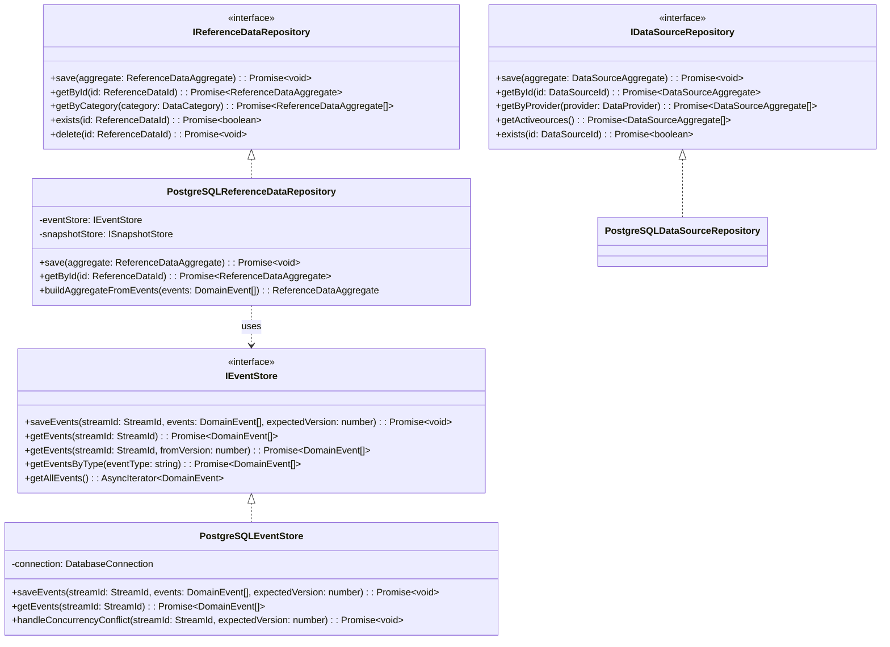
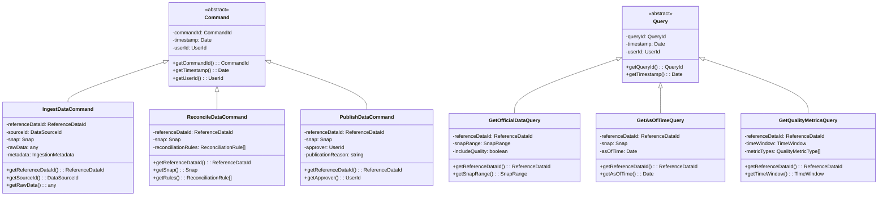
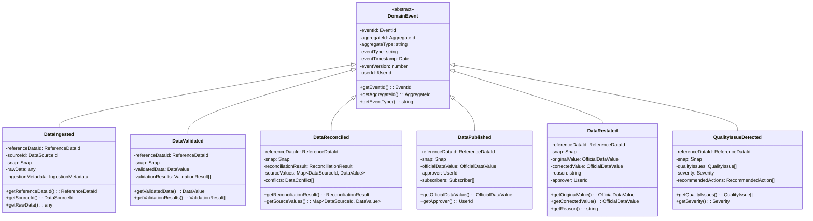
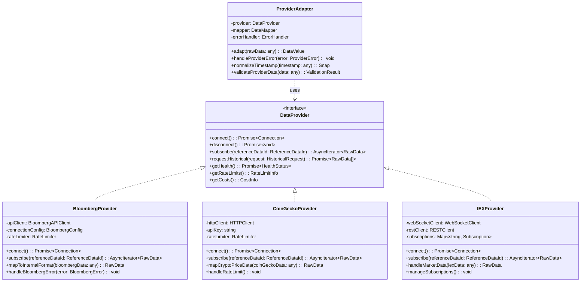

# QIS Data Management Domain - Class Diagrams

## Domain Model Class Diagram

```mermaid
classDiagram
    class ReferenceData {
        -referenceDataId: ReferenceDataId
        -dataSchema: DataSchema
        -sources: DataSource[]
        -publishedValues: Map~Snap, OfficialDataValue~
        -qualityMetrics: QualityMetrics
        -auditTrail: AuditTrail
        -publicationStatus: PublicationStatus
        -subscribers: Subscriber[]
        +ingestData(sourceId: DataSourceId, snap: Snap, rawData: any): void
        +reconcileData(snap: Snap): ReconciliationResult
        +publishData(snap: Snap, approver: UserId): void
        +restateData(snap: Snap, correctedValue: any, reason: string): void
        +getOfficialValue(snap: Snap): OfficialDataValue
        +getAsOfTimeValue(snap: Snap, asOfTime: Date): AsOfTimeValue
        +calculateQualityMetrics(timeWindow: TimeWindow): QualityMetrics
        +validateDataSchema(rawData: any): ValidationResult
    }

    class DataSource {
        -sourceId: DataSourceId
        -providerInfo: ProviderInfo
        -connectionConfig: ConnectionConfig
        -healthStatus: HealthStatus
        -costMetrics: CostMetrics
        -dataValues: Map~Snap, SourceDataValue~
        -rateLimits: RateLimitConfig
        +connect(): Connection
        +disconnect(): void
        +subscribe(referenceDataId: ReferenceDataId): AsyncIterator~RawData~
        +requestHistorical(request: HistoricalRequest): Promise~RawData[]~
        +validateConnection(): HealthCheckResult
        +updateHealthStatus(status: HealthStatus): void
        +trackCosts(usage: UsageMetrics): void
    }

    class OfficialDataValue {
        -value: DataValue~T~
        -snap: Snap
        -quality: QualityScore
        -publicationTime: Date
        -version: number
        -reconciliationDetails: ReconciliationDetails
        -approver: UserId
        +getValue(): T
        +getQualityScore(): QualityScore
        +isPublished(): boolean
        +getVersion(): number
        +getReconciliationSources(): DataSourceId[]
    }

    class DataValue~T~ {
        <<abstract>>
        -rawValue: T
        -dataType: DataType
        -precision: Precision
        -unit: Unit
        -currency: Currency
        -timezone: TimeZone
        +getValue(): T
        +getDataType(): DataType
        +validate(): ValidationResult
        +normalize(): NormalizedValue
        +convert(targetUnit: Unit): DataValue~T~
    }

    class PrimitiveDataValue~T~ {
        +getValue(): T
        +validate(): ValidationResult
        +compare(other: PrimitiveDataValue~T~): number
    }

    class ComplexDataValue~T~ {
        -schema: DataSchema
        -nestedValues: Map~string, DataValue~any~~
        +getValue(): T
        +getSchema(): DataSchema
        +getNestedValue(path: string): DataValue~any~
        +validateSchema(): ValidationResult
        +flatten(): Map~string, any~
    }

    class DoubleDataValue {
        +getValue(): number
        +getPrecision(): number
        +round(decimals: number): DoubleDataValue
    }

    class StringDataValue {
        +getValue(): string
        +getLength(): number
        +trim(): StringDataValue
    }

    class OptionsUniverseDataValue {
        -underlyingSymbol: string
        -expirationDate: Date
        -strikes: Strike[]
        -optionContracts: OptionContract[]
        +getUnderlyingSymbol(): string
        +getStrikes(): Strike[]
        +getOptionsForStrike(strike: number): OptionContract[]
        +getImpliedVolatilitySurface(): VolatilitySurface
    }

    ReferenceData ||--o{ DataSource : manages
    ReferenceData ||--o{ OfficialDataValue : publishes
    OfficialDataValue ||--|| DataValue : contains
    DataValue <|-- PrimitiveDataValue
    DataValue <|-- ComplexDataValue
    PrimitiveDataValue <|-- DoubleDataValue
    PrimitiveDataValue <|-- StringDataValue
    ComplexDataValue <|-- OptionsUniverseDataValue
```

## Value Objects Class Diagram

```mermaid
classDiagram
    class ReferenceDataId {
        -value: string
        -category: DataCategory
        -subcategory: string
        +toString(): string
        +equals(other: ReferenceDataId): boolean
        +getCategory(): DataCategory
        +validate(): ValidationResult
    }

    class Snap {
        -eventTime: Date
        -precision: TimePrecision
        -timezone: TimeZone
        +getEventTime(): Date
        +getTimestamp(): number
        +toISO(): string
        +toUTC(): Date
        +equals(other: Snap): boolean
        +isBefore(other: Snap): boolean
        +isAfter(other: Snap): boolean
    }

    class DataSchema {
        -schemaId: SchemaId
        -version: SchemaVersion
        -definition: JSONSchema
        -fields: SchemaField[]
        -constraints: SchemaConstraint[]
        +validate(data: any): ValidationResult
        +evolve(newDefinition: JSONSchema): DataSchema
        +getFields(): SchemaField[]
        +isCompatible(other: DataSchema): boolean
        +generateDocumentation(): SchemaDocumentation
    }

    class QualityScore {
        -accuracy: number
        -completeness: number
        -timeliness: number
        -consistency: number
        -overallScore: number
        +getOverallScore(): number
        +getComponentScores(): ComponentScores
        +isAcceptable(threshold: number): boolean
        +compare(other: QualityScore): number
    }

    class AuditEntry {
        -entryId: AuditEntryId
        -timestamp: Date
        -userId: UserId
        -action: AuditAction
        -resource: ResourceIdentifier
        -details: AuditDetails
        -result: ActionResult
        +getTimestamp(): Date
        +getUser(): UserId
        +getAction(): AuditAction
        +wasSuccessful(): boolean
    }

    class Price {
        -amount: number
        -currency: Currency
        -precision: number
        -priceType: PriceType
        +getAmount(): number
        +getCurrency(): Currency
        +convertTo(targetCurrency: Currency, exchangeRate: number): Price
        +add(other: Price): Price
        +multiply(factor: number): Price
    }

    class Volume {
        -quantity: number
        -unit: VolumeUnit
        -precision: number
        +getQuantity(): number
        +getUnit(): VolumeUnit
        +convertTo(targetUnit: VolumeUnit): Volume
        +add(other: Volume): Volume
    }

    class Strike {
        -strikePrice: Price
        -moneyness: Moneyness
        +getStrikePrice(): Price
        +getMoneyness(): Moneyness
        +isInTheMoney(spotPrice: Price): boolean
        +isOutOfTheMoney(spotPrice: Price): boolean
    }
```



## Aggregate and Entity Relationships

```mermaid
classDiagram
    class ReferenceDataAggregate {
        <<aggregate root>>
        -referenceData: ReferenceData
        -domainEvents: DomainEvent[]
        +handle(command: IngestDataCommand): void
        +handle(command: ReconcileDataCommand): void
        +handle(command: PublishDataCommand): void
        +handle(command: RestateDataCommand): void
        +getUncommittedEvents(): DomainEvent[]
        +markEventsAsCommitted(): void
        +applyEvent(event: DomainEvent): void
    }

    class DataSourceAggregate {
        <<aggregate root>>
        -dataSource: DataSource
        -domainEvents: DomainEvent[]
        +handle(command: RegisterSourceCommand): void
        +handle(command: UpdateSourceCommand): void
        +handle(command: DeactivateSourceCommand): void
        +getUncommittedEvents(): DomainEvent[]
        +markEventsAsCommitted(): void
    }

    class ReconciliationService {
        <<domain service>>
        -reconciliationRules: ReconciliationRule[]
        -conflictResolver: ConflictResolver
        +reconcileValues(sourceValues: SourceDataValue[]): ReconciliationResult
        +resolveConflicts(conflicts: DataConflict[]): ConflictResolution[]
        +calculateConfidence(reconciliationResult: ReconciliationResult): number
    }

    class QualityAssessmentService {
        <<domain service>>
        -qualityRules: QualityRule[]
        -benchmarkData: BenchmarkData
        +assessQuality(dataValue: DataValue, historicalData: DataValue[]): QualityScore
        +detectAnomalies(timeSeries: TimeSeries): Anomaly[]
        +generateQualityReport(referenceDataId: ReferenceDataId, timeWindow: TimeWindow): QualityReport
    }

    class PublicationService {
        <<domain service>>
        -publicationRules: PublicationRule[]
        -approvalWorkflow: ApprovalWorkflow
        +canPublish(officialDataValue: OfficialDataValue): boolean
        +publishData(officialDataValue: OfficialDataValue, approver: UserId): PublicationResult
        +schedulePublication(publicationRequest: PublicationRequest): void
    }

    ReferenceDataAggregate ||--|| ReferenceData
    DataSourceAggregate ||--|| DataSource
    ReferenceDataAggregate ..> ReconciliationService : uses
    ReferenceDataAggregate ..> QualityAssessmentService : uses
    ReferenceDataAggregate ..> PublicationService : uses
```

## Repository Interfaces



## Command and Query Models (CQRS)



## Event Model



## External Integration Models



These class diagrams provide a comprehensive view of the QIS Data Management domain's structure, showing the relationships between aggregates, entities, value objects, services, and external integrations. The design follows DDD principles with clear bounded contexts and strong encapsulation of business logic.