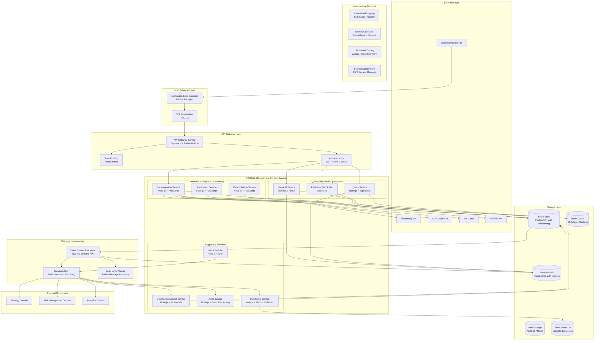

# QIS Data Management Domain - Deployment Design

## Executive Summary

The QIS Data Management domain deploys as a microservices architecture with event-driven communication, providing enterprise-grade data management capabilities with sub-100ms ingestion latency, 99.9% availability, and complete audit trail compliance.

## Deployment Architecture Overview

### Service Topology



## Interprocess Communication Architecture

### 1. Synchronous Communication Patterns

#### HTTP REST APIs (External Interface)

```typescript
// External API Gateway Routes
interface ExternalAPIRoutes {
  // Data retrieval endpoints
  'GET /api/v1/data/reference/{id}/official': {
    params: { id: string };
    query: { snap?: string; format?: 'json' | 'csv' };
    response: OfficialDataResponse;
    latency: '<50ms';
  };

  'GET /api/v1/data/reference/{id}/historical': {
    params: { id: string };
    query: { from: string; to: string; granularity?: string };
    response: HistoricalDataResponse;
    latency: '<200ms';
  };

  // Data ingestion endpoints
  'POST /api/v1/data/reference/{id}/ingest': {
    params: { id: string };
    body: IngestionRequest;
    response: IngestionResponse;
    latency: '<100ms';
  };

  // Quality and audit endpoints
  'GET /api/v1/data/reference/{id}/quality': {
    params: { id: string };
    query: { timeWindow?: string };
    response: QualityMetricsResponse;
    latency: '<100ms';
  };
}
```

#### Internal gRPC Services (High Performance)

```protobuf
// Internal service definitions for high-performance communication
service DataReconciliationService {
  // Reconcile data from multiple sources
  rpc ReconcileData(ReconciliationRequest) returns (ReconciliationResponse) {
    option (google.api.http) = {
      post: "/internal/reconcile"
      body: "*"
    };
  }

  // Resolve conflicts between sources
  rpc ResolveConflicts(ConflictResolutionRequest) returns (ConflictResolutionResponse) {
    option (google.api.http) = {
      post: "/internal/resolve-conflicts"
      body: "*"
    };
  }
}

service QualityAssessmentService {
  // Assess data quality
  rpc AssessQuality(QualityRequest) returns (QualityResponse) {
    option (google.api.http) = {
      post: "/internal/assess-quality"
      body: "*"
    };
  }

  // Validate data schema and business rules
  rpc ValidateData(ValidationRequest) returns (ValidationResponse) {
    option (google.api.http) = {
      post: "/internal/validate"
      body: "*"
    };
  }
}

message ReconciliationRequest {
  string reference_data_id = 1;
  string snap = 2;
  repeated SourceDataValue source_values = 3;
  ReconciliationRules rules = 4;
}

message QualityRequest {
  string reference_data_id = 1;
  string snap = 2;
  google.protobuf.Any data_value = 3;
  repeated HistoricalDataPoint history = 4;
}
```

#### Database Connection Pooling

```typescript
// High-performance database connections with pooling
interface DatabaseConnectionConfig {
  eventStore: {
    host: string;
    port: number;
    database: string;
    poolSize: {
      min: 10;
      max: 100;
      acquireTimeoutMillis: 30000;
      idleTimeoutMillis: 600000;
    };
    replication: {
      master: DatabaseConnection;
      replicas: DatabaseConnection[];
      readPreference: 'primary' | 'primaryPreferred' | 'secondary';
    };
  };

  readModels: {
    // Separate connection pool for read operations
    poolSize: {
      min: 20;
      max: 200;
    };
    caching: {
      enabled: true;
      ttl: 300; // 5 minutes
      maxSize: '1GB';
    };
  };
}
```

### 2. Asynchronous Communication Patterns

#### Event-Driven Architecture with Message Routing

```typescript
// Comprehensive event routing configuration
interface EventRoutingConfiguration {
  eventTypes: {
    DataIngested: {
      destinations: [
        'quality-assessment.data-received',
        'reconciliation.data-available',
        'audit.data-ingested',
        'monitoring.ingestion-metrics',
      ];
      deliveryMode: 'at-least-once';
      partitioning: {
        key: 'referenceDataId';
        strategy: 'hash';
      };
      retryPolicy: {
        maxRetries: 3;
        backoffStrategy: 'exponential';
        maxBackoffMs: 30000;
      };
    };

    DataReconciled: {
      destinations: [
        'publication.reconciliation-complete',
        'quality-assessment.reconciliation-available',
        'audit.reconciliation-completed',
      ];
      deliveryMode: 'exactly-once';
      ordering: {
        enabled: true;
        partitionKey: 'referenceDataId';
      };
      deadLetterQueue: {
        enabled: true;
        maxRedeliveries: 5;
        redeliveryDelay: 60000;
      };
    };

    DataPublished: {
      destinations: [
        'strategy-domain.data-updated',
        'risk-domain.data-refresh',
        'analytics-domain.data-available',
        'external-subscribers.notification',
      ];
      deliveryMode: 'at-least-once';
      broadcast: true;
      prioritization: {
        strategy: 'priority-queue';
        levels: ['critical', 'high', 'medium', 'low'];
      };
    };

    QualityIssueDetected: {
      destinations: [
        'operations.quality-alert',
        'notification-service.send-alert',
        'audit.quality-issue-logged',
      ];
      deliveryMode: 'at-least-once';
      urgency: 'immediate';
      escalation: {
        enabled: true;
        escalateAfterMs: 300000; // 5 minutes
      };
    };
  };
}
```

#### Message Bus Implementation

```typescript
// Redis Streams-based message bus for high throughput
class RedisStreamMessageBus implements MessageBus {
  private readonly redis: Redis;
  private readonly streams: Map<string, StreamInfo>;

  async publish<T extends DomainEvent>(event: T): Promise<void> {
    const streamKey = this.getStreamKey(event.eventType);
    const eventData = this.serializeEvent(event);

    await this.redis.xadd(
      streamKey,
      '*', // Auto-generate ID
      'eventType',
      event.eventType,
      'eventData',
      eventData,
      'timestamp',
      Date.now(),
      'correlationId',
      event.correlationId
    );

    // Update metrics
    await this.metricsCollector.increment('events_published', {
      eventType: event.eventType,
      stream: streamKey,
    });
  }

  async subscribe<T extends DomainEvent>(
    eventType: string,
    consumerGroup: string,
    handler: EventHandler<T>
  ): Promise<void> {
    const streamKey = this.getStreamKey(eventType);

    // Create consumer group if not exists
    await this.redis.xgroup(
      'CREATE',
      streamKey,
      consumerGroup,
      '$',
      'MKSTREAM'
    );

    // Start consuming
    while (this.isRunning) {
      try {
        const messages = await this.redis.xreadgroup(
          'GROUP',
          consumerGroup,
          this.consumerName,
          'COUNT',
          10,
          'BLOCK',
          1000,
          'STREAMS',
          streamKey,
          '>'
        );

        for (const message of messages) {
          await this.processMessage(message, handler);
          await this.redis.xack(streamKey, consumerGroup, message.id);
        }
      } catch (error) {
        await this.handleConsumerError(error, streamKey, consumerGroup);
      }
    }
  }
}
```

### 3. Stream Processing Architecture

#### Real-Time Data Processing Pipeline

```typescript
// High-throughput stream processing for real-time data
class DataStreamProcessor {
  private readonly streamConfig: StreamProcessingConfig;
  private readonly processors: Map<string, StreamProcessor>;

  async initializeStreams(): Promise<void> {
    // Input streams from external data providers
    this.processors.set(
      'bloomberg-stream',
      new BloombergStreamProcessor({
        throughput: 10000, // messages per second
        bufferSize: 1000,
        batchTimeout: 100, // milliseconds
        parallelism: 4,
      })
    );

    this.processors.set(
      'coingecko-stream',
      new CoinGeckoStreamProcessor({
        throughput: 5000,
        bufferSize: 500,
        batchTimeout: 200,
        parallelism: 2,
      })
    );

    // Processing stages
    await this.setupProcessingPipeline();
  }

  private async setupProcessingPipeline(): Promise<void> {
    // Stage 1: Data validation and normalization
    const validationStage = new ValidationStage({
      concurrency: 8,
      timeout: 50, // milliseconds
      retryPolicy: { maxRetries: 2 },
    });

    // Stage 2: Data enrichment and transformation
    const enrichmentStage = new EnrichmentStage({
      concurrency: 4,
      timeout: 100,
      cacheEnabled: true,
    });

    // Stage 3: Reconciliation trigger
    const reconciliationStage = new ReconciliationTriggerStage({
      concurrency: 2,
      batchSize: 100,
      timeout: 200,
    });

    // Connect pipeline stages
    await this.connectPipeline([
      validationStage,
      enrichmentStage,
      reconciliationStage,
    ]);
  }

  async processIncomingData(): Promise<void> {
    const inputStream = this.createInputStream();

    await inputStream
      .pipe(new ValidationTransform())
      .pipe(new EnrichmentTransform())
      .pipe(new ReconciliationTransform())
      .pipe(new OutputTransform())
      .on('data', async processedData => {
        await this.publishProcessedData(processedData);
      })
      .on('error', async error => {
        await this.handleStreamError(error);
      });
  }
}
```

## Container Orchestration & Deployment

### Kubernetes Deployment Configuration

#### Service Deployments

```yaml
# Data Ingestion Service
apiVersion: apps/v1
kind: Deployment
metadata:
  name: qis-data-ingestion
  namespace: qis-data-management
  labels:
    app: qis-data-ingestion
    version: v1.0.0
    component: ingestion
spec:
  replicas: 3
  strategy:
    type: RollingUpdate
    rollingUpdate:
      maxSurge: 1
      maxUnavailable: 0
  selector:
    matchLabels:
      app: qis-data-ingestion
  template:
    metadata:
      labels:
        app: qis-data-ingestion
        version: v1.0.0
    spec:
      containers:
        - name: data-ingestion
          image: qis/data-ingestion:1.0.0
          ports:
            - containerPort: 8080
              name: http
            - containerPort: 9090
              name: grpc
          env:
            - name: NODE_ENV
              value: 'production'
            - name: DATABASE_URL
              valueFrom:
                secretKeyRef:
                  name: database-credentials
                  key: event-store-url
            - name: REDIS_URL
              valueFrom:
                secretKeyRef:
                  name: redis-credentials
                  key: url
            - name: LOG_LEVEL
              value: 'info'
          resources:
            requests:
              memory: '512Mi'
              cpu: '250m'
            limits:
              memory: '1Gi'
              cpu: '500m'
          livenessProbe:
            httpGet:
              path: /health
              port: 8080
            initialDelaySeconds: 30
            periodSeconds: 10
          readinessProbe:
            httpGet:
              path: /ready
              port: 8080
            initialDelaySeconds: 5
            periodSeconds: 5
          volumeMounts:
            - name: config-volume
              mountPath: /app/config
              readOnly: true
      volumes:
        - name: config-volume
          configMap:
            name: qis-data-ingestion-config
      imagePullSecrets:
        - name: qis-registry-secret
---
apiVersion: v1
kind: Service
metadata:
  name: qis-data-ingestion-service
  namespace: qis-data-management
spec:
  selector:
    app: qis-data-ingestion
  ports:
    - name: http
      protocol: TCP
      port: 80
      targetPort: 8080
    - name: grpc
      protocol: TCP
      port: 9090
      targetPort: 9090
  type: ClusterIP
---
# Horizontal Pod Autoscaler
apiVersion: autoscaling/v2
kind: HorizontalPodAutoscaler
metadata:
  name: qis-data-ingestion-hpa
  namespace: qis-data-management
spec:
  scaleTargetRef:
    apiVersion: apps/v1
    kind: Deployment
    name: qis-data-ingestion
  minReplicas: 2
  maxReplicas: 10
  metrics:
    - type: Resource
      resource:
        name: cpu
        target:
          type: Utilization
          averageUtilization: 70
    - type: Resource
      resource:
        name: memory
        target:
          type: Utilization
          averageUtilization: 80
    - type: Pods
      pods:
        metric:
          name: ingestion_queue_depth
        target:
          type: AverageValue
          averageValue: '100'
```

#### Service Mesh Configuration (Istio)

```yaml
# Virtual Service for traffic routing
apiVersion: networking.istio.io/v1alpha3
kind: VirtualService
metadata:
  name: qis-data-management-routing
  namespace: qis-data-management
spec:
  hosts:
    - qis-data-api.internal
  gateways:
    - qis-data-gateway
  http:
    # Route ingestion requests to ingestion service
    - match:
        - uri:
            prefix: '/api/v1/data/ingest'
      route:
        - destination:
            host: qis-data-ingestion-service
            port:
              number: 80
          weight: 100
      timeout: 30s
      retries:
        attempts: 3
        perTryTimeout: 10s

    # Route query requests to query service with load balancing
    - match:
        - uri:
            prefix: '/api/v1/data/query'
      route:
        - destination:
            host: qis-data-query-service
            port:
              number: 80
          weight: 100
      timeout: 15s

    # Route real-time requests to WebSocket service
    - match:
        - uri:
            prefix: '/api/v1/data/realtime'
      route:
        - destination:
            host: qis-data-realtime-service
            port:
              number: 80
          weight: 100
      websocketUpgrade: true
---
# Destination Rule for circuit breaking
apiVersion: networking.istio.io/v1alpha3
kind: DestinationRule
metadata:
  name: qis-data-management-circuit-breaker
  namespace: qis-data-management
spec:
  host: '*.qis-data-management.svc.cluster.local'
  trafficPolicy:
    connectionPool:
      tcp:
        maxConnections: 100
      http:
        http1MaxPendingRequests: 50
        maxRequestsPerConnection: 10
    outlierDetection:
      consecutiveErrors: 3
      interval: 30s
      baseEjectionTime: 30s
      maxEjectionPercent: 50
    loadBalancer:
      simple: LEAST_CONN
---
# Network Policy for security
apiVersion: networking.k8s.io/v1
kind: NetworkPolicy
metadata:
  name: qis-data-management-network-policy
  namespace: qis-data-management
spec:
  podSelector:
    matchLabels:
      component: qis-data-management
  policyTypes:
    - Ingress
    - Egress
  ingress:
    - from:
        - namespaceSelector:
            matchLabels:
              name: qis-api-gateway
        - namespaceSelector:
            matchLabels:
              name: qis-strategy
        - namespaceSelector:
            matchLabels:
              name: qis-risk-management
      ports:
        - protocol: TCP
          port: 8080
        - protocol: TCP
          port: 9090
  egress:
    - to:
        - namespaceSelector:
            matchLabels:
              name: qis-infrastructure
      ports:
        - protocol: TCP
          port: 5432 # PostgreSQL
        - protocol: TCP
          port: 6379 # Redis
    - to: [] # External data providers
      ports:
        - protocol: TCP
          port: 443 # HTTPS
```

## Database and Storage Architecture

### Event Store Configuration

```sql
-- Event Store Partitioning Strategy
CREATE TABLE domain_events (
    event_id UUID PRIMARY KEY,
    stream_id UUID NOT NULL,
    event_type VARCHAR(100) NOT NULL,
    event_data JSONB NOT NULL,
    event_timestamp TIMESTAMP WITH TIME ZONE NOT NULL,
    event_version INTEGER NOT NULL,
    aggregate_type VARCHAR(100) NOT NULL,
    user_id UUID,
    correlation_id UUID,
    causation_id UUID
) PARTITION BY RANGE (event_timestamp);

-- Create monthly partitions for performance
CREATE TABLE domain_events_2025_01 PARTITION OF domain_events
    FOR VALUES FROM ('2025-01-01') TO ('2025-02-01');
CREATE TABLE domain_events_2025_02 PARTITION OF domain_events
    FOR VALUES FROM ('2025-02-01') TO ('2025-03-01');
-- ... continue for all months

-- Indexes for optimal query performance
CREATE INDEX CONCURRENTLY idx_domain_events_stream_version
    ON domain_events(stream_id, event_version);
CREATE INDEX CONCURRENTLY idx_domain_events_type_timestamp
    ON domain_events(event_type, event_timestamp);
CREATE INDEX CONCURRENTLY idx_domain_events_aggregate_type
    ON domain_events(aggregate_type, event_timestamp);
CREATE INDEX CONCURRENTLY idx_domain_events_correlation
    ON domain_events(correlation_id);

-- Read Model Tables with optimized structure
CREATE TABLE official_data_values (
    reference_data_id VARCHAR(255) NOT NULL,
    snap TIMESTAMP WITH TIME ZONE NOT NULL,
    value JSONB NOT NULL,
    data_type VARCHAR(100) NOT NULL,
    quality_score DECIMAL(5,4),
    publication_time TIMESTAMP WITH TIME ZONE,
    version INTEGER DEFAULT 1,
    source_count INTEGER,
    reconciliation_metadata JSONB,
    PRIMARY KEY (reference_data_id, snap, version)
) PARTITION BY HASH (reference_data_id);

-- Create 16 hash partitions for horizontal scaling
DO $$
BEGIN
    FOR i IN 0..15 LOOP
        EXECUTE format(
            'CREATE TABLE official_data_values_%s PARTITION OF official_data_values
             FOR VALUES WITH (modulus 16, remainder %s)',
            i, i
        );
    END LOOP;
END $$;
```

### Caching Strategy

```typescript
// Multi-layer caching configuration
interface CachingStrategy {
  layers: {
    // L1: In-memory cache (per service instance)
    memory: {
      maxSizeBytes: 512 * 1024 * 1024; // 512MB
      evictionPolicy: 'LRU';
      ttl: {
        officialData: 30; // seconds
        qualityMetrics: 300; // 5 minutes
        schemaDefinitions: 3600; // 1 hour
      };
    };

    // L2: Redis distributed cache
    distributed: {
      cluster: {
        nodes: ['redis-node-1:6379', 'redis-node-2:6379', 'redis-node-3:6379'];
        maxRetriesPerRequest: 3;
        retryDelayOnFailover: 100;
      };
      keyPatterns: {
        officialData: 'official:{referenceDataId}:{snap}';
        historicalData: 'historical:{referenceDataId}:{from}:{to}';
        qualityMetrics: 'quality:{referenceDataId}:{timeWindow}';
      };
      ttl: {
        officialData: 300; // 5 minutes
        historicalData: 1800; // 30 minutes
        qualityMetrics: 600; // 10 minutes
      };
    };

    // L3: Database read replicas
    readReplicas: {
      endpoints: [
        'postgres-read-1.internal:5432',
        'postgres-read-2.internal:5432'
      ];
      loadBalancing: 'round-robin';
      connectionPooling: {
        min: 10;
        max: 50;
        acquireTimeoutMillis: 30000;
      };
    };
  };

  invalidation: {
    strategies: ['event-driven', 'ttl-based', 'manual'];
    eventTriggers: [
      'DataPublished',
      'DataRestated',
      'QualityMetricsUpdated'
    ];
  };
}
```

## Performance and Monitoring

### Performance Targets and SLAs

```typescript
interface PerformanceSLAs {
  dataIngestion: {
    latencyP50: 50; // milliseconds
    latencyP95: 100;
    latencyP99: 200;
    throughput: 10000; // requests per second
    availabilityTarget: 99.95; // percent
  };

  dataQuery: {
    latencyP50: 25; // milliseconds
    latencyP95: 50;
    latencyP99: 100;
    throughput: 50000; // requests per second
    cacheHitRate: 85; // percent
  };

  reconciliation: {
    latencyP50: 200; // milliseconds
    latencyP95: 500;
    latencyP99: 1000;
    accuracyTarget: 99.99; // percent
    completionRate: 99.9; // percent
  };

  eventProcessing: {
    latencyP50: 10; // milliseconds
    latencyP95: 25;
    latencyP99: 50;
    throughput: 100000; // events per second
    orderingGuarantee: 99.99; // percent
  };
}
```

### Monitoring and Observability

```typescript
// Comprehensive monitoring configuration
interface MonitoringStack {
  metrics: {
    collection: {
      prometheus: {
        scrapeInterval: 15; // seconds
        evaluationInterval: 15;
        retention: '30d';
      };
      customMetrics: [
        'data_ingestion_rate',
        'reconciliation_success_rate',
        'quality_score_distribution',
        'publication_latency',
        'cache_hit_rate',
        'error_rate_by_source',
      ];
    };

    alerting: {
      rules: [
        {
          name: 'HighIngestionLatency';
          condition: 'ingestion_latency_p95 > 200ms for 5m';
          severity: 'warning';
          channels: ['slack', 'pagerduty'];
        },
        {
          name: 'LowDataQuality';
          condition: 'quality_score < 0.95 for 10m';
          severity: 'critical';
          channels: ['slack', 'pagerduty', 'email'];
        },
        {
          name: 'ReconciliationFailure';
          condition: 'reconciliation_error_rate > 1% for 5m';
          severity: 'critical';
          channels: ['pagerduty', 'sms'];
        },
      ];
    };
  };

  logging: {
    centralized: {
      stack: 'ELK'; // Elasticsearch, Logstash, Kibana
      retention: '90d';
      indexStrategy: 'daily';
    };

    logLevels: {
      production: 'info';
      staging: 'debug';
      development: 'trace';
    };

    structuredLogging: {
      format: 'json';
      fields: [
        'timestamp',
        'level',
        'service',
        'traceId',
        'spanId',
        'userId',
        'correlationId',
        'message',
        'metadata',
      ];
    };
  };

  tracing: {
    distributed: {
      system: 'Jaeger';
      samplingRate: 0.1; // 10% of requests
      retention: '7d';
    };

    instrumentation: {
      httpRequests: true;
      databaseQueries: true;
      externalApiCalls: true;
      messageProcessing: true;
      cacheOperations: true;
    };
  };
}
```

## Security and Compliance

### Security Architecture

```typescript
interface SecurityConfiguration {
  authentication: {
    jwt: {
      algorithm: 'RS256';
      expiration: '1h';
      refreshTokenExpiration: '30d';
      issuer: 'qis-auth-service';
    };

    cognito: {
      userPool: 'qis-user-pool';
      clientId: 'qis-data-management-client';
      scopes: ['read:data', 'write:data', 'admin:data'];
    };
  };

  authorization: {
    rbac: {
      roles: ['data-reader', 'data-writer', 'data-publisher', 'data-admin'];

      permissions: {
        'data-reader': ['read:official-data', 'read:quality-metrics'];
        'data-writer': ['read:official-data', 'write:data-ingestion'];
        'data-publisher': [
          'read:official-data',
          'write:data-ingestion',
          'publish:data',
        ];
        'data-admin': ['*'];
      };
    };

    resourceLevelSecurity: {
      enabled: true;
      granularity: 'reference-data-level';
      enforcement: 'service-level';
    };
  };

  encryption: {
    atRest: {
      algorithm: 'AES-256-GCM';
      keyManagement: 'AWS-KMS';
      rotationPeriod: '90d';
    };

    inTransit: {
      tls: 'TLS-1.3';
      cipherSuites: ['TLS_AES_256_GCM_SHA384', 'TLS_CHACHA20_POLY1305_SHA256'];
      certificateManagement: "Let's Encrypt + cert-manager";
    };
  };

  auditLogging: {
    events: [
      'data-access',
      'data-modification',
      'permission-changes',
      'authentication-events',
      'system-administration',
    ];

    retention: '7y'; // 7 years for compliance
    immutability: true;
    exportFormat: 'SIEM-compatible';
  };
}
```

## Disaster Recovery and Business Continuity

### Backup and Recovery Strategy

```typescript
interface DisasterRecoveryPlan {
  backups: {
    eventStore: {
      frequency: 'continuous'; // WAL-E for PostgreSQL
      retention: '1y';
      encryption: true;
      offSiteReplication: true;

      pointInTimeRecovery: {
        enabled: true;
        granularity: '1s';
        maxRecoveryTime: '24h';
      };
    };

    readModels: {
      frequency: 'hourly';
      retention: '30d';
      rebuildCapability: true; // Can rebuild from event store
    };

    configurations: {
      frequency: 'on-change';
      versionControl: 'git';
      deployment: 'gitops';
    };
  };

  replication: {
    crossRegion: {
      enabled: true;
      regions: ['us-east-1', 'eu-west-1'];
      replicationLag: '<5s';
      failoverTime: '<60s';
    };

    eventStore: {
      strategy: 'streaming-replication';
      consistency: 'eventual';
      conflictResolution: 'timestamp-based';
    };
  };

  failover: {
    automated: {
      healthChecks: ['database', 'api-gateway', 'message-bus'];
      failoverTriggers: ['availability < 95%', 'latency > 5s'];
      rollbackCriteria: ['data-inconsistency', 'manual-intervention'];
    };

    manual: {
      procedures: 'documented-runbooks';
      authorization: 'multi-person-approval';
      testingSchedule: 'quarterly';
    };
  };
}
```

This comprehensive deployment design document provides the complete technical architecture for deploying the QIS Data Management domain with enterprise-grade reliability, performance, and security requirements.
