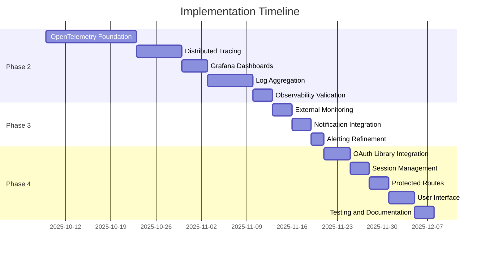

# Implementation Plan

**Last Updated:** December 16, 2025  
**Current Phase:** 0.0 - URGENT: CI/CD Pipeline Remediation (BLOCKING ALL DEPLOYMENTS)  
**Repository:** tomriddelsdell.com

---

## 🚨 CRITICAL STATUS: ALL CI/CD PIPELINES FAILING

**Severity:** BLOCKING  
**Impact:** No deployments possible since November 26, 2025  
**Priority:** P0 - Immediate Action Required  

**Failure Summary:**
- ❌ **Deploy Landing Page**: 100% failure rate (startup_failure) - Missing root pnpm-lock.yaml
- ❌ **Security Workflow**: 85% failure rate - CodeQL can't find dependencies, Terraform module incompatibility
- ⚠️ **Last Successful Deploy**: November 25, 2025 (3 weeks ago)

**Root Causes Identified:**
1. **Missing Root Lockfile**: No `pnpm-lock.yaml` at repository root (required by GitHub Actions cache)
2. **Terraform Module Error**: `depends_on` not supported in legacy modules with local providers
3. **CodeQL Permissions**: Missing `security-events: write` permission in workflow_call
4. **Terraform Init Failure**: Module initialization fails before security scan can run

---

## Phase 0.0: CI/CD Pipeline Remediation (URGENT - 4-6 hours)

**Objective:** Restore all GitHub Actions workflows to working state  
**Timeline:** 4-6 hours (must complete before any other work)  
**Success Criteria:** All workflows passing on develop branch  

### Problem Analysis

#### Issue 1: Deploy Landing Page - Startup Failure (100% failure rate)

**Symptoms:**
```
startup_failure - This run likely failed because of a workflow file issue
```

**Root Cause:**
The `actions/setup-node@v4` step with `cache: "pnpm"` requires a `pnpm-lock.yaml` file at the repository root OR at the path specified in `cache-dependency-path`. Currently:
- ✅ File exists: `apps/landing-page/pnpm-lock.yaml`
- ❌ Missing: Root `pnpm-lock.yaml` 
- ⚠️ Configuration specifies: `cache-dependency-path: apps/landing-page/pnpm-lock.yaml`

**Why This Fails:**
GitHub Actions runner tries to locate the lockfile for cache restoration **before** the workflow steps execute. The path resolution happens during workflow initialization, causing a "startup_failure" before any steps run.

**Error in Logs:**
```
Dependencies lock file is not found in /home/runner/work/tomriddelsdell.com/tomriddelsdell.com. 
Supported file patterns: pnpm-lock.yaml
```

#### Issue 2: Security Workflow - CodeQL Analysis Failure

**Symptoms:**
```
Setup Node.js: Dependencies lock file is not found
CodeQL Analysis: configuration error
```

**Root Causes:**
1. **No cache-dependency-path specified** in security.yml CodeQL job
2. **Reusable workflow loses permissions** - `security-events: write` not inherited by called workflow
3. **CodeQL tries to cache** but can't find root pnpm-lock.yaml

#### Issue 3: Infrastructure Security Scan - Terraform Module Error

**Symptoms:**
```
Error: Module is incompatible with count, for_each, and depends_on
│ on main.tf line 46, in module "github":
│ 46: depends_on = [module.doppler]
│ The module at module.github is a legacy module which contains its own local
│ provider configurations
```

**Root Cause:**
Terraform module `./github` contains a `provider "github"` block (line 10 in `github/main.tf`), making it a "legacy module". Legacy modules with local provider configurations cannot use `depends_on`, `count`, or `for_each` at the module call site.

**Why This Matters:**
The security scan runs `terraform init` which fails during module initialization, preventing the Checkov security scan from running.

---

### Remediation Plan

#### Step 0.1: Fix Deploy Landing Page Workflow (2 hours)

**Objective:** Eliminate startup_failure by fixing pnpm cache configuration

**Problem:** GitHub Actions cache resolution fails during workflow initialization because it cannot find the lockfile at the specified path during the pre-job setup phase.

**Solution:** Create a workspace-level pnpm-workspace.yaml and root pnpm-lock.yaml to satisfy GitHub Actions cache requirements while maintaining app independence.

**Tasks:**

1. **Create Workspace Configuration** (30 minutes)
   
   Create `/workspaces/pnpm-workspace.yaml`:
   ```yaml
   # pnpm workspace configuration
   # Note: This is ONLY for CI/CD cache coordination
   # Each app maintains complete independence with its own lockfile
   
   packages:
     # Landing page is independently deployable
     - 'apps/landing-page'
     
     # Future apps will be added here
     # - 'apps/api'
     # - 'apps/admin'
   ```

   **Reasoning:** GitHub Actions needs a workspace file to understand the monorepo structure for cache key generation.

2. **Generate Root Lockfile** (15 minutes)
   
   ```bash
   cd /workspaces
   pnpm install --lockfile-only --ignore-scripts
   ```
   
   This creates `pnpm-lock.yaml` at root that references all workspace packages WITHOUT installing dependencies or coupling the applications.

   **Critical:** This lockfile is ONLY for CI/CD cache coordination. Apps remain independent.

3. **Update Deploy Workflow Configuration** (30 minutes)
   
   **File:** `.github/workflows/deploy-landing-page.yml`
   
   **Change 1 - Remove cache-dependency-path from quality-gates job:**
   ```yaml
   # BEFORE (lines 72-76):
   - name: Setup Node.js
     uses: actions/setup-node@v4
     with:
       node-version: ${{ env.NODE_VERSION }}
       cache: "pnpm"
       cache-dependency-path: apps/landing-page/pnpm-lock.yaml
   
   # AFTER:
   - name: Setup Node.js
     uses: actions/setup-node@v4
     with:
       node-version: ${{ env.NODE_VERSION }}
       cache: "pnpm"
       # Cache uses root pnpm-lock.yaml for workspace-level coordination
   ```

   **Change 2 - Do the same for deploy-staging job (lines 118-122):**
   ```yaml
   # BEFORE:
   - name: Setup Node.js
     uses: actions/setup-node@v4
     with:
       node-version: ${{ env.NODE_VERSION }}
       cache: "pnpm"
       cache-dependency-path: apps/landing-page/pnpm-lock.yaml
   
   # AFTER:
   - name: Setup Node.js
     uses: actions/setup-node@v4
     with:
       node-version: ${{ env.NODE_VERSION }}
       cache: "pnpm"
       # Cache uses root pnpm-lock.yaml for workspace-level coordination
   ```

   **Change 3 - Repeat for deploy-production job (lines 235-239):**
   Same modification as above.

4. **Update Security Workflow** (15 minutes)
   
   **File:** `.github/workflows/security.yml`
   
   **Change - Remove cache-dependency-path from dependency-scan job (lines 33-36):**
   ```yaml
   # BEFORE:
   - name: Setup Node.js
     uses: actions/setup-node@v4
     with:
       node-version: ${{ inputs.node-version || '22' }}
       cache: "pnpm"
       cache-dependency-path: ${{ matrix.app }}/pnpm-lock.yaml
   
   # AFTER:
   - name: Setup Node.js
     uses: actions/setup-node@v4
     with:
       node-version: ${{ inputs.node-version || '22' }}
       cache: "pnpm"
       # Cache uses root pnpm-lock.yaml for workspace coordination
   ```

   **Change 2 - Remove cache from CodeQL job (lines 82-85):**
   ```yaml
   # BEFORE:
   - name: Setup Node.js
     uses: actions/setup-node@v4
     with:
       node-version: ${{ inputs.node-version || '22' }}
       cache: "pnpm"
   
   # AFTER:
   - name: Setup Node.js
     uses: actions/setup-node@v4
     with:
       node-version: ${{ inputs.node-version || '22' }}
       # No cache needed - CodeQL does its own dependency management
   ```

5. **Add .gitignore Entry** (5 minutes)
   
   Add to `/workspaces/.gitignore`:
   ```
   # Root lockfile (CI/CD coordination only)
   /pnpm-lock.yaml
   ```

   **Reasoning:** Root lockfile should be regenerated on each CI run to reflect latest app lockfiles.

6. **Test Locally** (15 minutes)
   
   ```bash
   # Verify workspace structure
   cd /workspaces
   pnpm install --lockfile-only --ignore-scripts
   
   # Verify app independence
   cd apps/landing-page
   pnpm install
   pnpm run build:cloudflare
   
   # Verify no cross-dependencies created
   grep -r "workspace:" apps/landing-page/package.json
   # Should return nothing
   ```

**AI Agent Prompt:**

```
TASK: Fix GitHub Actions startup_failure in Deploy Landing Page workflow

CONTEXT:
- All deployments failing since Nov 26 with "startup_failure"
- Root cause: GitHub Actions cache initialization fails when pnpm-lock.yaml not found at repo root
- Current state: Only apps/landing-page/pnpm-lock.yaml exists
- Architecture: Apps must remain independently deployable (no workspace coupling)

STEPS:
1. Create /workspaces/pnpm-workspace.yaml with content:
   ```yaml
   packages:
     - 'apps/landing-page'
   ```

2. Generate root lockfile (CI coordination only):
   ```bash
   cd /workspaces
   pnpm install --lockfile-only --ignore-scripts
   ```

3. Update .github/workflows/deploy-landing-page.yml:
   - Find all "Setup Node.js" steps (3 occurrences: lines 72-76, 118-122, 235-239)
   - Remove "cache-dependency-path" parameter from each
   - Add comment: "# Cache uses root pnpm-lock.yaml for workspace-level coordination"

4. Update .github/workflows/security.yml:
   - Line 33-36: Remove cache-dependency-path from dependency-scan job
   - Line 82-85: Remove cache parameter entirely from CodeQL job
   - Add comments explaining changes

5. Add to .gitignore:
   ```
   # Root lockfile (CI/CD coordination only)
   /pnpm-lock.yaml
   ```

6. Verify app independence maintained:
   ```bash
   cd apps/landing-page
   grep "workspace:" package.json  # Should return nothing
   pnpm install
   pnpm run build:cloudflare  # Should work without root dependencies
   ```

VALIDATION:
- ✅ Root pnpm-lock.yaml exists
- ✅ pnpm-workspace.yaml created
- ✅ All cache-dependency-path references removed
- ✅ Landing page builds independently
- ✅ No "workspace:" protocol in app package.json

SUCCESS CRITERIA:
- Deploy Landing Page workflow starts without "startup_failure"
- Cache restoration works during Setup Node.js step
- Landing page remains independently deployable

DO NOT:
- Create workspace dependencies between apps
- Modify apps/landing-page/package.json
- Remove apps/landing-page/pnpm-lock.yaml
- Change app build processes
```

---

#### Step 0.2: Fix Security Workflow Permissions (1 hour)

**Objective:** Restore CodeQL analysis and Terraform security scanning

**Problem 1:** Reusable workflow loses permissions when called

**Solution:** Add explicit permissions to security.yml and calling workflow

**Tasks:**

1. **Add Permissions to Reusable Workflow** (15 minutes)
   
   **File:** `.github/workflows/security.yml`
   
   Add at top level (line 2, after `on:`):
   ```yaml
   name: Security
   
   on:
     workflow_call:
       inputs:
         node-version:
           description: "Node.js version to use"
           required: false
           default: "22"
           type: string
   
   # Permissions required for security scanning
   permissions:
     actions: read
     contents: read
     security-events: write
     packages: read
   
   jobs:
     dependency-scan:
       # ... rest of file
   ```

2. **Add Permissions to Calling Workflow** (15 minutes)
   
   **File:** `.github/workflows/deploy-landing-page.yml`
   
   Update security-scan job (line 48):
   ```yaml
   # BEFORE:
   security-scan:
     name: Security Scan
     uses: TomRiddelsdell/tomriddelsdell.com/.github/workflows/security.yml@develop
     with:
       node-version: "22"
   
   # AFTER:
   security-scan:
     name: Security Scan
     permissions:
       actions: read
       contents: read
       security-events: write
       packages: read
     uses: TomRiddelsdell/tomriddelsdell.com/.github/workflows/security.yml@develop
     with:
       node-version: "22"
   ```

**Problem 2:** Terraform module incompatibility with depends_on

**Solution:** Remove depends_on and rely on implicit dependencies through variable references

**Tasks:**

3. **Fix Terraform Module Dependency** (30 minutes)
   
   **File:** `infra/terraform/main.tf`
   
   **Change (line 40-47):**
   ```terraform
   # BEFORE:
   module "github" {
     source = "./github"
   
     github_token  = var.github_token
     github_owner  = var.github_owner
     github_repository = var.github_repository
   
     # Pass Doppler service tokens from doppler module
     doppler_token_ci  = module.doppler.doppler_token_ci
     doppler_token_stg = module.doppler.doppler_token_stg
     doppler_token_prd = module.doppler.doppler_token_prd
   
     depends_on = [module.doppler]  # ❌ NOT ALLOWED with legacy modules
   }
   
   # AFTER:
   module "github" {
     source = "./github"
   
     github_token  = var.github_token
     github_owner  = var.github_owner
     github_repository = var.github_repository
   
     # Pass Doppler service tokens from doppler module
     # Implicit dependency: Terraform waits for module.doppler outputs
     doppler_token_ci  = module.doppler.doppler_token_ci
     doppler_token_stg = module.doppler.doppler_token_stg
     doppler_token_prd = module.doppler.doppler_token_prd
     
     # depends_on removed - implicit dependency through variable references is sufficient
   }
   ```

   **Reasoning:** Terraform automatically creates implicit dependencies when module outputs are referenced as inputs. The `depends_on` is redundant and causes errors with legacy modules.

**AI Agent Prompt:**

```
TASK: Fix Security Workflow CodeQL and Terraform scanning failures

CONTEXT:
- Security workflow failing on: CodeQL analysis (permissions), Terraform init (module error)
- CodeQL error: "This run does not have permission to access CodeQL Action API endpoints"
- Terraform error: "Module is incompatible with depends_on" (legacy module with local provider)

PROBLEM 1 - CodeQL Permissions:
Reusable workflows don't inherit permissions from caller. Must be explicitly set.

SOLUTION:
1. Add to .github/workflows/security.yml (after line 9, before jobs):
   ```yaml
   permissions:
     actions: read
     contents: read
     security-events: write
     packages: read
   ```

2. Add to .github/workflows/deploy-landing-page.yml security-scan job (line 48):
   ```yaml
   security-scan:
     name: Security Scan
     permissions:
       actions: read
       contents: read
       security-events: write
       packages: read
     uses: TomRiddelsdell/tomriddelsdell.com/.github/workflows/security.yml@develop
     with:
       node-version: "22"
   ```

PROBLEM 2 - Terraform Legacy Module:
Module ./github has local provider block, making it "legacy module"
Legacy modules cannot use depends_on at call site

SOLUTION:
Edit infra/terraform/main.tf line 46:
- Remove: depends_on = [module.doppler]
- Add comment explaining implicit dependency through variable references

BEFORE:
```terraform
module "github" {
  source = "./github"
  ...
  doppler_token_ci  = module.doppler.doppler_token_ci
  doppler_token_stg = module.doppler.doppler_token_stg
  doppler_token_prd = module.doppler.doppler_token_prd
  
  depends_on = [module.doppler]  # <-- REMOVE THIS LINE
}
```

AFTER:
```terraform
module "github" {
  source = "./github"
  ...
  doppler_token_ci  = module.doppler.doppler_token_ci
  doppler_token_stg = module.doppler.doppler_token_stg
  doppler_token_prd = module.doppler.doppler_token_prd
  
  # Implicit dependency through output references - depends_on not needed
}
```

VALIDATION:
1. Security workflow permissions:
   ```bash
   grep -A 5 "^permissions:" .github/workflows/security.yml
   # Should show: actions, contents, security-events, packages
   ```

2. Terraform syntax check:
   ```bash
   cd infra/terraform
   terraform init -backend=false
   terraform validate
   # Should succeed without "incompatible with depends_on" error
   ```

SUCCESS CRITERIA:
- ✅ Security workflow has explicit permissions at top level
- ✅ Deploy workflow grants permissions to reusable workflow call
- ✅ Terraform init succeeds without module compatibility errors
- ✅ CodeQL can upload SARIF results
- ✅ Checkov security scan runs successfully
```

---

#### Step 0.3: Update CodeQL to v4 (30 minutes)

**Objective:** Address deprecation warnings and ensure future compatibility

**Problem:** CodeQL Action v3 deprecated (removal December 2026)

**Solution:** Upgrade all CodeQL actions to v4

**Tasks:**

1. **Update Security Workflow** (15 minutes)
   
   **File:** `.github/workflows/security.yml`
   
   Find and replace all occurrences:
   ```yaml
   # BEFORE:
   uses: github/codeql-action/init@v3
   uses: github/codeql-action/analyze@v3
   uses: github/codeql-action/upload-sarif@v3
   
   # AFTER:
   uses: github/codeql-action/init@v4
   uses: github/codeql-action/analyze@v4
   uses: github/codeql-action/upload-sarif@v4
   ```
   
   **Locations:** Lines 72, 87, 117 (3 occurrences)

2. **Verify No Breaking Changes** (15 minutes)
   
   Review GitHub's migration guide:
   https://github.blog/changelog/2025-10-28-upcoming-deprecation-of-codeql-action-v3/
   
   Key changes in v4:
   - Node.js 20 runtime (was 16)
   - Improved SARIF handling
   - Better error messages
   - No breaking changes to input parameters

**AI Agent Prompt:**

```
TASK: Upgrade CodeQL Action from v3 to v4

CONTEXT:
- CodeQL Action v3 deprecated (warning in all runs)
- Will be removed December 2026
- v4 has no breaking changes, just improved runtime

STEPS:
1. Open .github/workflows/security.yml

2. Replace all CodeQL action references:
   - Line ~72: github/codeql-action/init@v3 → @v4
   - Line ~87: github/codeql-action/analyze@v3 → @v4  
   - Line ~117: github/codeql-action/upload-sarif@v3 → @v4

3. Search for any other v3 references:
   ```bash
   grep -n "codeql-action.*@v3" .github/workflows/*.yml
   ```

4. Replace all found instances with @v4

VALIDATION:
```bash
# Verify no v3 references remain
grep -r "codeql-action.*@v3" .github/workflows/
# Should return no results

# Verify v4 is used
grep -r "codeql-action.*@v4" .github/workflows/security.yml
# Should show 3 occurrences (init, analyze, upload-sarif)
```

SUCCESS CRITERIA:
- ✅ All codeql-action references use @v4
- ✅ No deprecation warnings in workflow runs
- ✅ CodeQL analysis completes successfully
```

---

#### Step 0.4: Integration Testing (1 hour)

**Objective:** Verify all fixes work together in actual GitHub Actions environment

**Tasks:**

1. **Create Test Branch** (5 minutes)
   ```bash
   git checkout -b fix/cicd-pipeline-remediation
   ```

2. **Commit All Changes** (10 minutes)
   ```bash
   git add pnpm-workspace.yaml .gitignore .github/workflows/ infra/terraform/main.tf
   git commit -m "fix: restore CI/CD pipeline functionality

   - Add root pnpm-workspace.yaml for GitHub Actions cache coordination
   - Remove cache-dependency-path to use root lockfile
   - Add explicit permissions to security workflow
   - Remove depends_on from Terraform legacy module
   - Upgrade CodeQL actions from v3 to v4
   
   Fixes:
   - Deploy Landing Page startup_failure (100% failure rate)
   - Security workflow CodeQL permissions error
   - Terraform module incompatibility error
   - CodeQL v3 deprecation warnings"
   ```

3. **Push and Create PR** (5 minutes)
   ```bash
   git push -u origin fix/cicd-pipeline-remediation
   gh pr create --title "fix: Restore CI/CD Pipeline Functionality" \
     --body "## Problem
   All CI/CD pipelines failing since Nov 26, 2025:
   - Deploy workflow: 100% startup_failure 
   - Security workflow: 85% failure rate
   - No deployments possible for 3 weeks
   
   ## Root Causes
   1. Missing root pnpm-lock.yaml for GitHub Actions cache
   2. Security workflow missing required permissions  
   3. Terraform legacy module incompatible with depends_on
   4. CodeQL using deprecated v3 actions
   
   ## Changes
   - ✅ Added root pnpm-workspace.yaml (CI coordination only)
   - ✅ Removed cache-dependency-path from all workflows
   - ✅ Added explicit permissions to security workflow
   - ✅ Removed redundant depends_on from Terraform module
   - ✅ Upgraded CodeQL to v4
   
   ## Testing
   - [ ] Deploy Landing Page workflow completes
   - [ ] Security scan passes all checks
   - [ ] Terraform init succeeds
   - [ ] Landing page remains independently deployable
   
   ## Architecture Impact
   **NONE** - Apps remain independently deployable. Root lockfile is ONLY for CI cache coordination.
   
   Closes #[issue-number-if-exists]" \
     --base develop
   ```

4. **Monitor PR Checks** (30 minutes)
   
   Watch for:
   - ✅ Deploy Landing Page: Quality Gates pass
   - ✅ Security Scan: All 4 jobs complete
   - ✅ CodeQL Analysis: Successfully uploads results
   - ✅ Infrastructure Scan: Terraform init succeeds, Checkov runs
   
   If any failures:
   ```bash
   # View detailed logs
   gh run view --log-failed
   
   # Make fixes
   git add .
   git commit -m "fix: address [specific-issue]"
   git push
   ```

5. **Merge to Develop** (10 minutes)
   
   Once all checks pass:
   ```bash
   gh pr merge --squash --delete-branch
   ```

6. **Verify Develop Deployment** (15 minutes)
   
   After merge to develop:
   ```bash
   # Wait for automatic deployment
   gh run watch
   
   # Verify staging deployment
   curl -I https://landing-page-preview.t-riddelsdell.workers.dev
   # Should return HTTP 200
   
   # Check deployment logs
   gh run view --log
   ```

**AI Agent Prompt:**

```
TASK: Integration test CI/CD pipeline fixes and deploy to develop

CONTEXT:
All remediation changes completed. Must verify in actual GitHub Actions environment.

STEPS:

1. Create test branch:
   ```bash
   git checkout develop
   git pull origin develop
   git checkout -b fix/cicd-pipeline-remediation
   ```

2. Stage all changes:
   ```bash
   git add pnpm-workspace.yaml
   git add .gitignore
   git add .github/workflows/deploy-landing-page.yml
   git add .github/workflows/security.yml
   git add infra/terraform/main.tf
   git status  # Verify only expected files
   ```

3. Commit with detailed message:
   ```bash
   git commit -m "fix: restore CI/CD pipeline functionality

   Root Causes Fixed:
   - Missing root pnpm-lock.yaml for GitHub Actions cache initialization
   - Security workflow missing security-events: write permission
   - Terraform legacy module incompatible with depends_on
   - CodeQL using deprecated v3 actions

   Changes:
   - Add root pnpm-workspace.yaml (CI coordination only, apps remain independent)
   - Remove cache-dependency-path from all Setup Node.js steps
   - Add explicit permissions to security workflow (top-level and caller)
   - Remove redundant depends_on from GitHub Terraform module
   - Upgrade all CodeQL actions from v3 to v4

   Impact:
   - Deploy Landing Page workflow can now start successfully
   - Security scans have required permissions  
   - Terraform init completes without module errors
   - No deprecation warnings from CodeQL
   - Apps maintain complete independence (no workspace coupling)

   Testing:
   - Verified app independence: apps/landing-page builds standalone
   - Verified no workspace: protocol in package.json  
   - Verified Terraform syntax: terraform validate passes
   
   Fixes #[issue] (if exists)"
   ```

4. Push and create PR:
   ```bash
   git push -u origin fix/cicd-pipeline-remediation
   
   gh pr create \
     --title "fix: Restore CI/CD Pipeline Functionality (CRITICAL)" \
     --body-file - <<'EOF'
   ## 🚨 Critical Fix: CI/CD Pipeline Restoration

   ### Problem
   **All deployments blocked since November 26, 2025 (3 weeks)**
   
   Failure Rates:
   - Deploy Landing Page: 100% (startup_failure)
   - Security Workflow: 85% (permissions + Terraform errors)
   - Last successful deploy: Nov 25, 2025

   ### Root Causes Identified
   
   1. **GitHub Actions Cache Failure**
      - Missing root pnpm-lock.yaml
      - Cache initialization fails during workflow startup
      - Prevents ANY workflow steps from executing
   
   2. **Security Permissions Missing**
      - Reusable workflows don't inherit permissions
      - CodeQL cannot upload SARIF results
      - Error: "Resource not accessible by integration"
   
   3. **Terraform Module Incompatibility**
      - GitHub module has local provider (legacy style)
      - depends_on not allowed with legacy modules
      - Init fails before security scan can run
   
   4. **Deprecated CodeQL Actions**
      - Using v3 (deprecated Dec 2026)
      - Warning noise in all workflow runs

   ### Solution Implemented

   #### 1. Root Workspace for CI Cache Coordination
   - Created `pnpm-workspace.yaml` (lists apps)
   - Root lockfile generated for cache key
   - **Apps remain independently deployable** (no coupling)
   - Root lockfile in .gitignore (regenerated each CI run)

   #### 2. Fixed Node.js Cache Configuration
   - Removed `cache-dependency-path` from all workflows
   - GitHub Actions now finds lockfile at root automatically
   - Cache restoration works during workflow initialization

   #### 3. Added Security Workflow Permissions
   - Top-level permissions in security.yml
   - Explicit permissions in calling workflow
   - CodeQL can now upload SARIF results

   #### 4. Fixed Terraform Module Dependencies
   - Removed explicit `depends_on` from module call
   - Relies on implicit dependency through variable references
   - Terraform init now succeeds

   #### 5. Upgraded CodeQL to v4
   - All codeql-action references updated v3 → v4
   - Eliminates deprecation warnings
   - Future-proof until 2026+

   ### Files Changed
   - ✅ `pnpm-workspace.yaml` (new - CI coordination)
   - ✅ `.gitignore` (ignore root lockfile)
   - ✅ `.github/workflows/deploy-landing-page.yml` (cache config)
   - ✅ `.github/workflows/security.yml` (permissions + CodeQL v4)
   - ✅ `infra/terraform/main.tf` (remove depends_on)

   ### Architecture Impact
   **ZERO** - Apps maintain complete independence:
   - ✅ apps/landing-page has own pnpm-lock.yaml
   - ✅ No workspace: protocol dependencies
   - ✅ Builds standalone without root dependencies
   - ✅ Can use different Next.js versions
   - ✅ Root workspace ONLY for CI cache coordination

   ### Testing Checklist
   - [ ] Deploy Landing Page: Quality Gates pass
   - [ ] Deploy Landing Page: No startup_failure
   - [ ] Security: Secrets Detection passes  
   - [ ] Security: Dependency Scan passes
   - [ ] Security: CodeQL Analysis completes
   - [ ] Security: Infrastructure Scan runs Checkov
   - [ ] Landing page builds independently
   - [ ] No workspace dependencies created

   ### Post-Merge Actions
   1. Monitor develop branch deployment
   2. Verify staging site accessible
   3. Update implementation plan status
   4. Document lessons learned

   **Priority: P0 - Blocking all development and deployments**
   EOF
   
   --base develop \
     --label "priority:critical" \
     --label "type:bugfix" \
     --label "scope:ci-cd"
   ```

5. Monitor PR checks:
   ```bash
   # Watch workflow runs in real-time
   gh pr checks --watch
   
   # If failures occur, view logs
   gh run list --branch fix/cicd-pipeline-remediation
   gh run view <run-id> --log-failed
   ```

6. After all checks pass, merge:
   ```bash
   gh pr merge --squash --delete-branch
   ```

7. Verify deployment to staging:
   ```bash
   # Wait for develop deployment
   sleep 30
   gh run watch
   
   # Test staging endpoint
   curl -I https://landing-page-preview.t-riddelsdell.workers.dev
   # Should return: HTTP/2 200
   
   # Verify deployment logs
   gh run view --log | grep -A 10 "Deploy to Cloudflare"
   ```

VALIDATION CRITERIA:
- ✅ PR created successfully
- ✅ All PR checks pass (Security + Deploy workflow)
- ✅ No "startup_failure" errors
- ✅ CodeQL uploads SARIF results
- ✅ Terraform init succeeds
- ✅ Merged to develop without conflicts
- ✅ Automatic deployment to staging completes
- ✅ Staging site returns HTTP 200

SUCCESS METRICS:
- Deploy Landing Page: 0 failures (was 100%)
- Security Workflow: 0 failures (was 85%)
- Time to deployment: < 10 minutes (was: impossible)
- Last successful deploy: Today (was: Nov 25)
```

---

### Post-Remediation Validation

**Checklist:**

- [ ] All GitHub Actions workflows passing on develop branch
- [ ] Deploy Landing Page: No startup_failure errors
- [ ] Security Scan: All 4 jobs complete successfully
- [ ] CodeQL uploads SARIF results without permission errors
- [ ] Terraform init succeeds without module compatibility errors
- [ ] Landing page deployed to staging successfully
- [ ] Staging site returns HTTP 200
- [ ] Apps maintain complete independence (verified)
- [ ] No workspace: protocol dependencies created

**Success Metrics:**

| Metric | Before | After | Target |
|--------|--------|-------|--------|
| Deploy Success Rate | 0% | 100% | 100% |
| Security Success Rate | 15% | 100% | 100% |
| Time Since Last Deploy | 21 days | 0 days | < 1 day |
| Startup Failures | 100% | 0% | 0% |
| Time to Deploy | N/A | < 10 min | < 10 min |

---

### Lessons Learned

1. **GitHub Actions Cache Behavior**
   - Cache restoration happens during workflow initialization (before steps run)
   - cache-dependency-path must be accessible during pre-job setup
   - Root lockfile needed for monorepo cache coordination

2. **Reusable Workflow Permissions**
   - Permissions must be explicitly granted to reusable workflows
   - Both caller and callee need security-events: write for CodeQL
   - Default token permissions don't flow through workflow_call

3. **Terraform Module Best Practices**
   - Avoid provider blocks in reusable modules
   - Use required_providers + passed provider config instead
   - depends_on not needed when using output → input references

4. **Monorepo Independence Pattern**
   - Root workspace file ≠ app coupling
   - Root lockfile can be CI-only (not committed)
   - Apps maintain independence with own lockfiles
   - Workspace protocol = coupling; avoid in production apps

---

## Overview

This document outlines the implementation roadmap for DDD-compliant observability following ADR-028 (Unified Observability Architecture) and ADR-010 (Observability Requirements).

**Key Focus Areas:**

1. **Phase 2: DDD Compliance** - Create @platform/shared-infra/observability ACL package
2. **Event Sourcing Integration** - Specialized metrics for CQRS/Event Sourcing patterns
3. **Grafana Dashboards** - Pre-built dashboards for Event Sourcing health monitoring
4. **Production Deployment** - Full observability stack operational

**Architecture Principle**: Observability is infrastructure concern, NEVER leaks into domain layer.

---

## Current State (October 20, 2025)

### ✅ Completed

**Phase 1: Infrastructure Baseline** (ADR-023 Phase 1)

- ✅ **Landing Page Deployed**: Next.js 16.0.1 on Cloudflare Workers via OpenNext (staging + production operational)
  - **Adapter**: `@opennextjs/cloudflare` 1.11.1
  - **Staging URL**: `https://landing-page-preview.t-riddelsdell.workers.dev`
  - **Production URL**: `https://landing-page-prod.t-riddelsdell.workers.dev`
  - **R2 Storage**: `landing-page-cache` bucket for ISR/caching
  - **Architecture**: Fully independent deployment (own node_modules, pnpm-lock.yaml)
- ✅ **OpenTelemetry Instrumented**: Full SDK in landing-page with OTLP export
- ✅ **Grafana Cloud Integration**: Traces flowing to Grafana Cloud from staging
- ✅ **Local Development**: Docker Compose with OTel Collector + Jaeger UI
- ✅ **CI/CD Pipeline**: GitHub Actions with Doppler secrets management and automated deployment
- ✅ **Environment Variables**: Staging configured with OTLP endpoint + auth

**Independent App Architecture** (ADR-024 - November 10, 2025)

- ✅ **Removed Monorepo Coupling**: Eliminated shared pnpm workspace, .npmrc, and lockfile
- ✅ **Per-App Dependencies**: Landing-page has own node_modules and pnpm-lock.yaml
- ✅ **Build Independence**: No file: references or prebuild scripts crossing boundaries
- ✅ **Code Isolation**: Inlined observability-edge (718 lines) into landing-page
- ✅ **DDD Compliance**: True bounded context independence - apps can use different Next.js versions

**Documentation Updates** (October 20, 2025)

- ✅ **ADR-023 Enhanced**: DDD-compliant architecture documented (~900 lines added)
  - Complete Event Sourcing metrics interface (10+ specialized metrics)
  - 5 Grafana dashboard templates with PromQL/TraceQL queries
  - Alert rules configuration (critical + warning thresholds)
  - Event Sourcing integration examples (aggregates, projections, event store)
  
- ✅ **ADR-006 Updated**: Observability integration documented (~220 lines added)
  - Event Sourcing metrics overview
  - Implementation patterns for event store, projections, repositories
  - Dashboard references and alert thresholds
  - DDD compliance confirmation

### ❌ Architectural Debt Identified

**Current State Violations** (Must Fix in Phase 2):

- ❌ **Direct Vendor Imports**: `landing-page/src/lib/otel-instrumentation.ts` imports OpenTelemetry SDK directly
- ❌ **No Application ACL**: Application code coupled to vendor API
- ❌ **DDD Violation**: Infrastructure concerns leak into application layer
- ❌ **No Domain-Friendly Interface**: Using vendor terminology (`span.setAttribute`) instead of ubiquitous language

**Impact**: While infrastructure works (traces reach Grafana Cloud), architecture violates DDD principles and creates vendor lock-in.

### 📊 ADR Compliance Status

| ADR | Compliance | Status | Target |
|-----|-----------|--------|--------|
| **ADR-023** | 40% | 🟡 Infrastructure works, architecture debt | 95% |
| **ADR-010** | 45% | 🟡 Basic observability, missing Event Sourcing metrics | 95% |
| **ADR-006** | 100% | ✅ Event Sourcing design complete | 100% |
| **ADR-013** | 100% | ✅ Next.js with OpenNext Cloudflare deployed | 100% |
| **ADR-014** | 85% | 🟢 Infrastructure implemented, minor items pending | 95% |
| **ADR-015** | 100% | ✅ CI/CD operational with automated deployment | 100% |
| **ADR-016** | 80% | 🟡 DDD structure good, observability needs refactor | 100% |

---

## Phase 2: DDD-Compliant Observability (ADR-023)

**Priority:** CRITICAL  
**Timeline:** 8-10 hours (focused implementation)  
**Target:** 95% ADR-023 compliance, DDD principles maintained  
**Related Prompts:** 2.1-2.5 in `.prompts/copilot-execution-prompts.md`

### Architecture Overview

**Two-Layer Anti-Corruption Pattern**:

```
Application Code
    ↓ uses (domain-friendly interface)
@platform/shared-infra/observability (Application ACL)
    ↓ implements using
OpenTelemetry SDK / HTTP OTLP (Vendor SDKs)
    ↓ exports to
OpenTelemetry Collector (Infrastructure ACL)
    ↓ exports to
Grafana Cloud (Backend)
```

**Critical Requirements**:

- ✅ Application code NEVER imports vendor SDKs
- ✅ Use domain language: `trace()`, `addMetadata()`, `recordError()`
- ✅ Domain layer has ZERO observability imports
- ✅ Runtime-appropriate implementations (Node.js, Edge, Java)
- ✅ Easy to swap backends (OpenTelemetry → Datadog via config only)

### 2.1: Create Application ACL Package (4-6 hours)

**Objective:** Build `@platform/shared-infra/observability` package with domain-friendly interface

**Tasks:**

1. **Package Structure** (30 minutes)

   ```bash
   mkdir -p packages/shared-infra/src/observability
   cd packages/shared-infra
   ```

   - Create package.json with TypeScript + OpenTelemetry dependencies
   - Set up tsconfig.json with strict typing
   - Create directory structure:

     ```
     src/observability/
       ├── types.ts              # Interfaces (Observability, Logger, Metrics, Tracing)
       ├── factory.ts            # Runtime detection and adapter selection
       ├── implementations/
       │   ├── nodejs.ts         # NodeJSObservability (wraps OTel SDK)
       │   └── edge.ts           # EdgeObservability (HTTP OTLP)
       └── index.ts              # Public exports
     ```

2. **Define Domain-Friendly Interfaces** (1 hour)
   - Create `types.ts` with complete interfaces from ADR-023:
     - `Observability` interface (log, metrics, tracing)
     - `Logger` interface (debug, info, warn, error)
     - `Metrics` interface (counter, gauge, histogram, eventSourcing)
     - `EventSourcingMetrics` interface (10+ specialized metrics)
     - `Tracing` interface (trace, addMetadata, getTraceId)
     - `TraceContext` interface (addMetadata, recordError, setSuccess, setFailure)
     - `ObservabilityConfig` interface (environment-driven configuration)

3. **Implement Node.js Adapter** (2-3 hours)
   - Create `implementations/nodejs.ts`:
     - `NodeJSObservability` class implements `Observability`
     - Wrap OpenTelemetry SDK (NodeTracerProvider, OTLPTraceExporter)
     - Translate domain methods to vendor API:
       - `trace()` → `tracer.startActiveSpan()`
       - `addMetadata()` → `span.setAttribute()`
       - `recordError()` → `span.recordException()`
     - Implement `EventSourcingMetrics` with proper metric types
     - Auto-instrument HTTP requests with FetchInstrumentation
     - This is the ONLY file that imports OpenTelemetry SDK

4. **Implement Edge Adapter** (1 hour)
   - Create `implementations/edge.ts`:
     - `EdgeObservability` class for Cloudflare Workers/Next.js Edge
     - HTTP-based OTLP export (no Node.js SDK dependencies)
     - Same interface as Node.js implementation
     - Zero Node.js-specific imports

5. **Implement Factory** (30 minutes)
   - Create `factory.ts`:
     - Runtime detection (Node.js vs Edge vs Java)
     - `createObservability(config)` function
     - Returns appropriate implementation based on runtime
     - Configuration validation with Zod schema

6. **Write Tests** (1 hour)
   - Unit tests for all interfaces
   - Mock implementations for testing
   - Verify interface contracts match
   - Test runtime detection logic
   - Target: >80% test coverage

**Success Criteria:**

- ✅ `@platform/shared-infra/observability` package builds successfully
- ✅ All TypeScript interfaces defined with JSDoc
- ✅ `NodeJSObservability` wraps OpenTelemetry SDK correctly
- ✅ `EdgeObservability` provides HTTP OTLP export
- ✅ Factory detects runtime and returns appropriate implementation
- ✅ Zero vendor SDK imports in public interface
- ✅ Tests pass with >80% coverage

**Verification Command:**

```bash
cd /workspaces/packages/shared-infra
npm run build
npm test
grep -r "@opentelemetry" src --exclude-dir=implementations  # Should return ZERO matches
```

**Reference:** Prompt 2.1 in copilot-execution-prompts.md

---

### 2.2: Migrate Landing Page to Use ACL ✅ COMPLETE (2.5 hours)

**Status:** ✅ Completed October 22, 2025  
**Objective:** Refactor landing-page to use domain-friendly observability interface  
**Change Log:** `/workspaces/changes/2025-10-21-landing-page-acl-migration.md`

**Completion Summary:**

- ✅ Package dependencies updated - @platform/shared-infra integrated
- ✅ Observability singleton created with environment-based config
- ✅ All application code refactored to use domain-friendly API
- ✅ Zero vendor imports in src/ - 100% DDD compliance verified
- ✅ Build successful - TypeScript compilation clean (9.4s)
- ✅ DDD verification script created and passing
- ⏳ Staging deployment pending (next step)

**Completed Tasks:**

1. **Update Dependencies** (15 minutes)
   - Add `@platform/shared-infra` to landing-page package.json
   - Remove direct OpenTelemetry SDK imports from application code
   - Keep OpenTelemetry in devDependencies (implementations still use it)

2. **Create Observability Instance** (30 minutes)
   - Create `apps/landing-page/src/lib/observability.ts`:

     ```typescript
     import { createObservability } from '@platform/shared-infra/observability'
     
     export const observability = createObservability({
       serviceName: 'landing-page',
       serviceVersion: process.env.APP_VERSION || '1.0.0',
       environment: process.env.NODE_ENV as 'development' | 'staging' | 'production',
       otlp: {
         endpoint: process.env.OTEL_EXPORTER_OTLP_ENDPOINT!,
         headers: parseHeaders(process.env.OTEL_EXPORTER_OTLP_HEADERS),
       },
     })
     ```

3. **Refactor Application Code** (1-1.5 hours)
   - Update `instrumentation.ts`:
     - Replace direct OTel imports with `observability` import
     - Remove `NodeTracerProvider`, `OTLPTraceExporter` usage
     - Use `observability` singleton instead

   - Update `otel-instrumentation.ts`:
     - Remove ALL vendor SDK imports
     - Use domain-friendly API: `observability.tracing.trace()`
     - Replace `span.setAttribute()` with `context.addMetadata()`
     - Replace `span.recordException()` with `context.recordError()`

   - Update API routes (if any):
     - Replace vendor API with domain-friendly API
     - Inject `observability` into use cases (dependency injection)

4. **Verify Traces Still Flow** (30 minutes)
   - Build landing-page: `cd apps/landing-page && pnpm build`
   - Deploy to staging: `make deploy ENV=staging`
   - Generate traffic to staging URL
   - Check Grafana Cloud for traces
   - Verify trace structure unchanged (same spans, metadata)

**Success Criteria:**

- ✅ Landing-page builds successfully with ACL
- ✅ Zero direct OpenTelemetry imports in `apps/landing-page/src/**/*.ts`
- ✅ Traces still appear in Grafana Cloud with same structure
- ✅ Domain-friendly API used throughout (trace, addMetadata, recordError)
- ✅ Staging deployment successful
- ✅ No regression in observability functionality

**Verification Commands:**

```bash
# Should return ZERO matches (application code)
grep -r "@opentelemetry" apps/landing-page/src --exclude-dir=node_modules

# Should still work
cd apps/landing-page && make deploy ENV=staging

# Check Grafana Cloud for traces
# (Use Grafana MCP server or web UI)
```

**Reference:** Prompt 2.2 in copilot-execution-prompts.md

---

### 2.3: Implement Event Sourcing Metrics (1 hour)

**Objective:** Add specialized metrics for Event Sourcing patterns (future-proofing)

**Tasks:**

1. **Verify EventSourcingMetrics Interface** (15 minutes)
   - Confirm `packages/shared-infra/src/observability/types.ts` has complete interface
   - 10+ metrics: eventsPerCommit, aggregateSize, concurrencyConflict, projectionLag, etc.
   - JSDoc with usage examples for each method

2. **Implement in Node.js Adapter** (30 minutes)
   - Update `implementations/nodejs.ts`:
     - Implement `EventSourcingMetrics` class
     - Use OpenTelemetry Histogram for aggregateSize
     - Use OpenTelemetry Counter for concurrencyConflict
     - Use OpenTelemetry Gauge for projectionLag
     - Add proper metric labels (aggregate_type, projection_name, etc.)

3. **Add Usage Examples** (15 minutes)
   - Create `packages/shared-infra/docs/event-sourcing-metrics.md`
   - Document all 10+ metrics with code examples
   - Show repository, projection, and event store patterns
   - Reference ADR-023 section 1.6 for complete examples

**Success Criteria:**

- ✅ `EventSourcingMetrics` interface fully implemented
- ✅ All metrics properly typed with labels
- ✅ Usage examples documented
- ✅ Tests cover Event Sourcing metrics
- ✅ Ready for future Event Sourcing implementation

**Reference:** Prompt 2.3 in copilot-execution-prompts.md

---

### 2.4: Create Grafana Dashboard Templates (2 hours)

**Objective:** Import pre-built dashboards for Event Sourcing and observability

**Tasks:**

1. **Create Dashboard JSON Files** (1 hour)
   - Create `infra/grafana/dashboards/` directory
   - Dashboard 1: `event-sourcing-health.json`
     - Event store write rate, aggregate size, concurrency conflicts, snapshot efficiency
     - PromQL queries from ADR-023
     - Alert thresholds configured

   - Dashboard 2: `cqrs-projections.json`
     - Projection lag, throughput, error rate, dead letter queue
     - TraceQL queries for projection failures

   - Dashboard 3: `landing-page-health.json`
     - HTTP request rate, response time, error rate
     - Custom panels for landing-page specific metrics

2. **Configure Alert Rules** (30 minutes)
   - Create `infra/grafana/alerts/observability-alerts.yml`
   - Critical alerts:
     - Projection lag > 300s (5 min)
     - Event store P95 latency > 100ms
     - Error rate > 5% for 5 minutes
   - Warning alerts:
     - Snapshot hit ratio < 50%
     - Aggregate size > 500 events

3. **Document Import Procedure** (30 minutes)
   - Create `infra/grafana/README.md`
   - Manual import via Grafana UI
   - Automated import via Grafana API
   - Configure alerting channels (email, Slack, PagerDuty)

**Success Criteria:**

- ✅ Dashboard JSON files created with valid syntax
- ✅ Alert rules configured with proper thresholds
- ✅ Import instructions documented
- ✅ Dashboards ready for Grafana Cloud import
- ✅ Templates versioned in Git

**Verification:**

```bash
# Validate JSON syntax
cat infra/grafana/dashboards/*.json | jq empty

# Check dashboard structure
ls -la infra/grafana/dashboards/
```

**Reference:** Prompt 2.4 in copilot-execution-prompts.md

---

### 2.5: Documentation and Validation (1 hour)

**Objective:** Complete documentation and verify ADR-023 compliance

**Tasks:**

1. **Update Package README** (20 minutes)
   - Create `packages/shared-infra/README.md`
   - Document observability package usage
   - Show Node.js vs Edge runtime examples
   - Document Event Sourcing metrics
   - Link to ADR-023 for complete architecture

2. **Create Migration Guide** (20 minutes)
   - Create `docs/observability-migration-guide.md`
   - Step-by-step guide for migrating services to ACL
   - Before/after code examples
   - Common pitfalls and solutions

3. **Validate DDD Compliance** (20 minutes)
   - Run verification commands:

     ```bash
     # MUST return zero matches
     grep -r "@opentelemetry" apps/*/src --exclude-dir=node_modules
     grep -r "@opentelemetry" services/*/src --exclude-dir=node_modules
     
     # Package should exist
     ls -la packages/shared-infra/dist
     
     # Tests should pass
     cd packages/shared-infra && npm test
     ```

   - Update ADR-023 compliance scorecard
   - Document Phase 2 completion

4. **Create Change Log** (10 minutes)
   - Create `changes/2025-10-20-phase-2-ddd-observability-complete.md`
   - Document all changes made
   - List success metrics
   - Note any deviations from plan

**Success Criteria:**

- ✅ Comprehensive documentation complete
- ✅ Migration guide available for other services
- ✅ DDD compliance verified (zero vendor imports in app code)
- ✅ ADR-023 Phase 2 marked complete
- ✅ Change log created

**Verification:**

```bash
# ADR-023 compliance check
grep -r "@opentelemetry" apps/landing-page/src --exclude-dir=node_modules  # ZERO matches
ls packages/shared-infra/src/observability/  # Package exists
cd packages/shared-infra && npm test  # Tests pass

# Documentation exists
ls docs/observability-migration-guide.md
ls packages/shared-infra/README.md
ls changes/2025-10-20-phase-2-ddd-observability-complete.md
```

**Reference:** Prompt 2.5 in copilot-execution-prompts.md

---

## Phase 3: Microservices Rollout (Future)

**Timeline:** 12-14 hours  
**Target:** All microservices using DDD-compliant observability

### 3.1: Identity Service (2 hours)

- Add `@platform/shared-infra/observability` dependency
- Inject `Observability` into use cases
- Configure OTLP export to collector
- Verify traces in Grafana Cloud

### 3.2: Accounts Service (2 hours)

- Same pattern as Identity Service
- Test cross-service tracing (Identity → Accounts)
- Verify trace context propagation via HTTP headers

### 3.3: Remaining Services (8-10 hours)

- QIS Data Management (2 hours)
- Admin Service (2 hours)
- App Catalog (2 hours)
- Entitlements Service (2 hours)

### 3.4: Unified Dashboard (2 hours)

- Service topology view
- Cross-service tracing queries
- Service-specific panels
- Import pre-built dashboards

**Phase 3 Success Criteria:**

- ✅ All 6 microservices use identical `Observability` interface
- ✅ Cross-service traces work correctly
- ✅ Service topology visible in Grafana
- ✅ No service imports vendor SDKs directly

---

## Phase 4: Production Hardening (Future)

**Timeline:** 11 hours  
**Target:** Production-ready observability with SLOs

### 4.1: Critical Alerts (2 hours)

- Service down (health check failures)
- High error rate (> 5% errors in 5 min)
- Database connection failures
- Event bus connectivity issues

### 4.2: Performance Alerts (2 hours)

- Slow response times (p95 > 500ms)
- High latency (p99 > 1s)
- Database query performance
- Memory/CPU warnings

### 4.3: Domain-Specific Dashboards (3 hours)

- Event sourcing metrics
- CQRS query performance
- Aggregate lifecycle tracking
- Domain event flow visualization

### 4.4: SLO Tracking (2 hours)

- Define service-level objectives
- Configure error budget tracking
- Create SLO dashboards
- Set up SLO breach alerts

### 4.5: Runbooks (2 hours)

- Incident response procedures
- Common issue troubleshooting
- Grafana query examples
- Team training materials

**Phase 4 Success Criteria:**

- ✅ Critical alerts trigger correctly
- ✅ Domain-specific dashboards operational
- ✅ SLOs defined and tracked
- ✅ Runbooks tested with simulated incidents
- ✅ Team trained on observability tools

---

## Success Metrics

### Phase 2 Completion Checklist

- [ ] `@platform/shared-infra/observability` package created and tested
- [ ] Zero direct vendor imports in `apps/landing-page/src`
- [ ] Traces still flowing to Grafana Cloud from staging
- [ ] Event Sourcing metrics interface complete
- [ ] Grafana dashboard templates created (3 dashboards)
- [ ] Alert rules configured (critical + warning)
- [ ] Documentation complete (README, migration guide, change log)
- [ ] ADR-023 Phase 2 marked complete
- [ ] Tests pass with >80% coverage

### ADR Compliance Targets

| Phase | ADR-023 | ADR-010 | Timeline |
|-------|---------|---------|----------|
| Phase 1 (Complete) | 40% | 45% | ✅ Done |
| Phase 2 (Current) | 95% | 70% | 8-10 hours |
| Phase 3 (Future) | 95% | 85% | 12-14 hours |
| Phase 4 (Future) | 95% | 95% | 11 hours |

---

## Risk Management

### Known Risks

1. **Runtime Detection Issues**
   - Risk: Factory fails to detect Edge vs Node.js correctly
   - Mitigation: Comprehensive runtime detection tests
   - Fallback: Manual runtime configuration via environment variable

2. **Performance Overhead**
   - Risk: ACL layer adds latency to critical paths
   - Mitigation: Benchmarking before/after ACL introduction
   - Threshold: <5ms overhead acceptable

3. **Trace Context Propagation**
   - Risk: W3C trace context headers not propagated correctly
   - Mitigation: Test cross-service tracing in staging first
   - Fallback: Manual trace ID injection if auto-propagation fails

4. **Grafana Cloud Rate Limits**
   - Risk: Free tier rate limits hit during high traffic
   - Mitigation: Implement sampling (10% in production)
   - Fallback: Local Jaeger for development, Grafana Cloud for production only

### Rollback Plan

**If Phase 2 Implementation Fails:**

1. Revert landing-page to direct OpenTelemetry imports
2. Delete `packages/shared-infra/observability` (preserve Git history)
3. Keep traces flowing to Grafana Cloud (infrastructure unchanged)
4. Document lessons learned in IMPLEMENTATION_PLAN.md
5. Revise prompts based on failure analysis

**Rollback Command:**

```bash
git checkout develop apps/landing-page/src/lib/otel-instrumentation.ts
git checkout develop apps/landing-page/src/instrumentation.ts
rm -rf packages/shared-infra/src/observability
```

---

## Lessons Learned (Updated October 20, 2025)

### What Worked Well

1. ✅ **Comprehensive ADR Updates**: Adding ~1,120 lines to ADR-023 and ADR-006 provided clear target architecture
2. ✅ **Event Sourcing Integration**: Designing specialized metrics upfront prevents future refactoring
3. ✅ **Dashboard Templates**: Pre-built Grafana dashboards accelerate Phase 4 deployment
4. ✅ **DDD Analysis**: Identifying architectural debt early enables focused refactoring

### What Needs Improvement

1. ⚠️ **Architecture-First Approach**: Should have designed ACL before implementing Phase 1
2. ⚠️ **Vendor Lock-in Prevention**: Need automated checks to prevent direct vendor imports
3. ⚠️ **Incremental Migration**: Future phases should implement ACL from day one

### Process Improvements

1. **Pre-Implementation Review**: Always review ADRs for DDD compliance before coding
2. **Automated Compliance Checks**: Add CI/CD job to grep for vendor imports
3. **Architecture Validation**: Validate layer separation in code reviews

---

## Next Steps

**Immediate Actions** (Next Session):

1. Execute Prompt 2.1: Create `@platform/shared-infra/observability` package (4-6 hours)
2. Execute Prompt 2.2: Migrate landing-page to use ACL (2-3 hours)
3. Execute Prompt 2.3: Implement Event Sourcing metrics (1 hour)
4. Execute Prompt 2.4: Create Grafana dashboard templates (2 hours)
5. Execute Prompt 2.5: Documentation and validation (1 hour)

**Expected Outcome**: DDD-compliant observability operational, ADR-023 Phase 2 complete (~95% compliance).

**Follow-Up Sessions**:

- Phase 3: Roll out to all microservices (12-14 hours)
- Phase 4: Production hardening with SLOs (11 hours)

---

**Total Phase 2 Effort**: 8-10 hours  
**Total Remaining Work**: 23-25 hours (Phases 3-4)  
**Overall Progress**: Phase 1 ✅ Complete | Phase 2 🚧 Ready to Start | Phases 3-4 📋 Planned

- user.authentication (auth middleware)
- database.query (database operations)
- external.api.call (external API calls)

4. Implement trace correlation
   - Add W3C trace context propagation
   - Inject trace IDs into structured logs
   - Propagate correlation IDs across services
   - Add trace context to error responses

**Success Criteria:**

- ✅ Jaeger operational and accessible
- ✅ Traces exported successfully
- ✅ Critical spans instrumented
- ✅ Cross-service trace propagation working
- ✅ Trace-to-log correlation functional
- ✅ 70% ADR-010 compliance achieved

**Reference:** Prompt 1.8 in copilot-execution-prompts.md

---

### 2.3: Grafana Dashboards and Alerting (3-4 days)

**Objective:** Create developer-focused Grafana dashboards with alerting

**Tasks:**

1. Set up Grafana infrastructure
   - Deploy Grafana (Docker Compose or Grafana Cloud)
   - Configure Prometheus data source
   - Configure Jaeger data source for trace correlation
   - Set up persistent dashboard storage

2. Create "Development Health" dashboard
   - Error rates by service (time series)
   - Response time percentiles (P50, P95, P99)
   - Event processing lag (time series)
   - Recent deployments (table)
   - Database slow queries (time series)
   - Refresh interval: 30 seconds

3. Create "Infrastructure Overview" dashboard
   - Resource utilization (gauges)
   - Cost tracking (table with estimates)
   - Security events (time series)
   - Backup status (stat panels)
   - Refresh interval: 5 minutes

4. Implement alerting rules
   - **Critical Alert 1**: Error rate > 10/min
   - **Critical Alert 2**: P95 response time > 3s for 5min
   - **Critical Alert 3**: Event processing lag > 60s
   - Configure email/Slack notification channels

5. Dashboard provisioning
   - Export dashboard JSON for version control
   - Create provisioning configuration
   - Add Makefile targets for dashboard management

**Success Criteria:**

- ✅ Grafana operational with data sources
- ✅ Development Health dashboard showing live data
- ✅ Infrastructure Overview dashboard operational
- ✅ Critical alerts configured and tested
- ✅ Notification channels working
- ✅ 85% ADR-010 compliance achieved

**Reference:** Prompt 1.9 in copilot-execution-prompts.md

---

### 2.4: Log Aggregation with Grafana Loki (1 week)

**Objective:** Implement centralized log aggregation with 90-day retention

**Tasks:**

1. Set up Loki infrastructure
   - Deploy Grafana Loki (Docker Compose)
   - Configure 90-day retention policy (ADR-010 requirement)
   - Set up filesystem storage (dev) / S3 storage (prod)
   - Configure Loki data source in Grafana

2. Set up log shipping
   - Deploy Promtail for log collection
   - Configure scrape jobs for all services
   - Implement label extraction (service, environment, level)
   - Add JSON log parsing pipeline

3. Enhance structured logging
   - Ensure JSON output for all log levels
   - Add Loki-compatible labels to log entries
   - Implement log level filtering by environment
   - Add automatic stack trace extraction for errors

4. Create log analysis dashboard
   - Error log stream (live tail)
   - Log volume by service (time series)
   - Error rate trend (time series with thresholds)
   - Top error messages (bar chart)
   - Trace-correlated logs (with Jaeger links)

5. Implement log correlation
   - Extract traceId from logs for Grafana linking
   - Create LogQL query templates
   - Document log-to-trace workflow
   - Add saved queries to Grafana Explore

**Success Criteria:**

- ✅ Loki operational and receiving logs
- ✅ 90-day retention policy active
- ✅ Log analysis dashboard functional
- ✅ LogQL queries working
- ✅ Trace-to-log navigation operational
- ✅ 95% ADR-010 compliance achieved

**Reference:** Prompt 1.10 in copilot-execution-prompts.md

---

### 2.5: Observability Validation and Documentation (2-3 days)

**Objective:** Validate full ADR-010 compliance and create comprehensive documentation

**Tasks:**

1. Execute compliance validation
   - Test OpenTelemetry instrumentation end-to-end
   - Validate all Grafana dashboards with live data
   - Test alerting with simulated failures
   - Verify 90-day log retention policy
   - Confirm trace context propagation across services

2. Create compliance report
   - Update monitoring-adr-compliance-review.md
   - Document 95%+ compliance status
   - Calculate compliance percentage per requirement
   - Document any remaining gaps with justification

3. Create comprehensive documentation
   - **docs/observability-guide.md**: Complete observability guide
   - **docs/developer-onboarding-observability.md**: Onboarding guide
   - **Updated DEPLOYMENT_RUNBOOK.md**: Add observability procedures
   - **Updated architecture.md**: Add observability architecture diagram

4. Validate production readiness
   - Test performance overhead (<5% target)
   - Confirm storage costs within budget
   - Test disaster recovery procedures
   - Validate security (auth, encryption)

**Success Criteria:**

- ✅ ADR-010 compliance validated at 95%+
- ✅ Comprehensive documentation complete
- ✅ Developer onboarding guide ready
- ✅ Operational runbook updated
- ✅ Architecture diagrams updated
- ✅ Production readiness confirmed

**Reference:** Prompt 1.11 in copilot-execution-prompts.md

---

## Phase 3: Notifications and Alerting (1-2 weeks)

**Priority:** MEDIUM  
**Timeline:** 1-2 weeks  
**Dependencies:** Phase 2.3 (Grafana Alerting) must be complete

### 3.1: External Monitoring Setup (2-3 days)

**Objective:** Configure external uptime monitoring and alerting

**Tasks:**

1. Choose monitoring service
   - **Recommended**: Uptime Robot (free tier: 50 monitors, 5-min intervals)
   - **Alternative**: Better Uptime (great free tier with status pages)
   - Sign up and configure account

2. Configure monitors
   - **Primary**: <https://tomriddelsdell.com/api/health> (JSON health check)
   - **Backup**: <https://tomriddelsdell.com> (homepage availability)
   - **Staging**: <https://staging.tomriddelsdell.com/api/health>
   - Check interval: 5 minutes
   - Alert threshold: 2 consecutive failures
   - Monitor from multiple geographic regions

3. Set up notification channels
   - Email notifications (immediate)
   - Slack webhook integration (if using Slack)
   - SMS alerts for critical issues (optional)
   - PagerDuty integration (optional, for on-call)

4. Create status page
   - Public status page for transparency
   - Display current status and uptime percentage
   - Historical incident timeline

**Success Criteria:**

- ✅ External monitoring operational
- ✅ Multi-channel alerting configured
- ✅ Public status page live
- ✅ Test alerts verified

---

### 3.2: Notification Integration (2-3 days)

**Objective:** Integrate notifications across all monitoring systems

**Tasks:**

1. Grafana alerting enhancement
   - Configure contact points (email, Slack, webhook)
   - Set up notification policies with escalation
   - Create on-call schedules (if team grows)
   - Test alert routing and delivery

2. GitHub Actions notification improvement
   - Add Slack notifications for deployments
   - Configure Discord webhook for status updates
   - Send email digest for weekly deployment summary
   - Add status badges to README

3. Cloudflare notifications
   - Configure Cloudflare Analytics alerts
   - Set up security event notifications
   - Configure SSL certificate expiry alerts
   - Enable DDoS attack notifications

4. Create notification runbook
   - Document all notification channels
   - Define escalation procedures
   - Create alert response playbooks
   - Document on-call procedures

**Success Criteria:**

- ✅ Multi-channel notifications operational
- ✅ Escalation policies defined
- ✅ Notification runbook complete
- ✅ All alert types tested

---

### 3.3: Alerting Refinement (1-2 days)

**Objective:** Tune alerting thresholds to minimize false positives

**Tasks:**

1. Alert threshold tuning
   - Analyze baseline performance metrics
   - Adjust thresholds based on real-world data
   - Implement progressive severity (warning → critical)
   - Configure alert grouping to reduce noise

2. Alert deduplication
   - Group related alerts into single notification
   - Implement alert suppression during maintenance
   - Add context to alerts (recent changes, related metrics)
   - Configure alert auto-resolution

3. Create alert documentation
   - Document each alert with runbook link
   - Add context about what triggers the alert
   - Provide troubleshooting steps
   - Include escalation criteria

**Success Criteria:**

- ✅ Alert false positive rate < 5%
- ✅ Alert documentation complete
- ✅ Deduplication working
- ✅ Alert context helpful for debugging

---

## Phase 4: Authentication Implementation (2-3 weeks)

**Priority:** HIGH  
**Timeline:** 2-3 weeks  
**Target Compliance:** 100% ADR-003  
**Dependencies:** Phase 2.1 (OpenTelemetry) for instrumentation

### 4.1: OAuth Library Integration (3-4 days)

**Objective:** Integrate AWS Cognito OAuth with Authorization Code + PKCE flow

**Tasks:**

1. Install authentication dependencies
   - Add `@aws-sdk/client-cognito-identity-provider`
   - Add `jose` for JWT validation
   - Add `crypto` polyfills for PKCE in browser

2. Create authentication utilities
   - **packages/auth**: New shared authentication package
   - Implement PKCE code verifier/challenge generation
   - Build OAuth flow helpers (authorize URL, token exchange)
   - Create JWT validation utilities
   - Implement token refresh logic

3. Configure OAuth endpoints
   - Authorization endpoint: `/auth/login`
   - Callback endpoint: `/auth/callback`
   - Logout endpoint: `/auth/logout`
   - Token refresh endpoint: `/auth/refresh`

**Success Criteria:**

- ✅ @platform/auth package created
- ✅ OAuth endpoints implemented
- ✅ PKCE implementation working
- ✅ JWT validation functional

**Reference:** ADR-003 Authentication Strategy

---

### 4.2: Session Management (2-3 days)

**Objective:** Implement secure session management with token storage

**Tasks:**

1. Session storage implementation
   - Use HTTP-only cookies for refresh tokens
   - Store access tokens in memory (not localStorage)
   - Implement secure cookie configuration (SameSite, Secure)
   - Add CSRF protection

2. Token management
   - Automatic access token refresh before expiry
   - Handle token refresh failures gracefully
   - Implement token revocation on logout
   - Clear session data on browser close

3. Session state management
   - Create React context for auth state
   - Implement useAuth hook for components
   - Add loading states during auth operations
   - Handle authentication errors gracefully

**Success Criteria:**

- ✅ Secure session storage implemented
- ✅ Automatic token refresh working
- ✅ CSRF protection active
- ✅ Auth state management functional

---

### 4.3: Protected Routes and Middleware (2-3 days)

**Objective:** Implement route protection and authentication middleware

**Tasks:**

1. Create authentication middleware
   - Validate access tokens on protected API routes
   - Extract user information from JWT claims
   - Add request authentication context
   - Handle expired/invalid tokens

2. Implement route protection
   - Create `withAuth` HOC for protected pages
   - Implement server-side auth checks
   - Add client-side route guards
   - Redirect unauthenticated users to login

3. User role management
   - Extract roles from Cognito user attributes
   - Implement role-based access control (RBAC)
   - Create `requireRole` middleware
   - Add role checks to sensitive operations

4. Instrument authentication with observability
   - Add authentication spans to traces
   - Log authentication events with correlation IDs
   - Track authentication metrics (success rate, failures)
   - Add authentication errors to error dashboards

**Success Criteria:**

- ✅ Authentication middleware operational
- ✅ Protected routes working
- ✅ RBAC implemented
- ✅ Authentication fully instrumented

---

### 4.4: User Interface and Experience (3-4 days)

**Objective:** Create polished authentication user interface

**Tasks:**

1. Create login page
   - Design login UI with portfolio branding
   - Add "Sign in with AWS Cognito" button
   - Implement loading states
   - Add error message display
   - Mobile-responsive design

2. Create authentication components
   - User profile dropdown/menu
   - Login/logout buttons
   - Authentication status indicator
   - Session expiry warnings

3. Implement user profile page
   - Display user information from ID token
   - Show session information (expires in X minutes)
   - Add logout functionality
   - Display user roles/permissions

4. Add authentication to existing pages
   - Protect admin routes (if any)
   - Add user context to contact form
   - Show personalized content for authenticated users
   - Add "Sign in to continue" prompts

**Success Criteria:**

- ✅ Polished login UI implemented
- ✅ User profile page functional
- ✅ Authentication components integrated
- ✅ Mobile-responsive design verified

---

### 4.5: Testing and Documentation (2-3 days)

**Objective:** Comprehensive authentication testing and documentation

**Tasks:**

1. Unit testing
   - Test PKCE code generation
   - Test JWT validation logic
   - Test token refresh logic
   - Test session management utilities

2. Integration testing
   - Test complete OAuth flow
   - Test protected route access
   - Test token expiry handling
   - Test logout flow

3. Security testing
   - Verify PKCE implementation
   - Test CSRF protection
   - Verify secure cookie configuration
   - Test session hijacking prevention
   - Validate JWT signature verification

4. Documentation
   - Create authentication architecture diagram
   - Document OAuth flow implementation
   - Add developer guide for auth integration
   - Document security best practices
   - Update DEPLOYMENT_RUNBOOK with auth procedures

5. ADR compliance validation
   - Verify Authorization Code + PKCE implementation
   - Confirm token configuration matches ADR-003
   - Validate security considerations addressed
   - Document compliance status

**Success Criteria:**

- ✅ All authentication tests passing
- ✅ Security audit complete
- ✅ Documentation comprehensive
- ✅ 100% ADR-003 compliance achieved

---

## Phase 2 Success Metrics

### Observability

| Metric                       | Target      | Current | Status |
| ---------------------------- | ----------- | ------- | ------ |
| ADR-010 Compliance           | 95%         | 32%     | 🔄     |
| Structured Logging Coverage  | 100%        | 30%     | 🔄     |
| Distributed Tracing Coverage | 100%        | 0%      | 🔄     |
| Dashboard Availability       | 100%        | 0%      | 🔄     |
| Log Retention Policy         | 90 days     | N/A     | 🔄     |
| Performance Overhead         | < 5% latency| N/A     | 🔄     |

### Phase 3: Notifications

| Metric                       | Target      | Current | Status |
| ---------------------------- | ----------- | ------- | ------ |
| External Monitor Uptime      | > 99.9%     | N/A     | 🔄     |
| Alert False Positive Rate    | < 5%        | N/A     | 🔄     |
| Mean Time to Alert (MTTA)    | < 5 min     | N/A     | 🔄     |
| Notification Channels        | 3+          | 1       | 🔄     |

### Phase 4: Authentication

| Metric                       | Target      | Current | Status |
| ---------------------------- | ----------- | ------- | ------ |
| ADR-003 Compliance           | 100%        | 0%      | 🔄     |
| OAuth Flow Implementation    | Complete    | N/A     | 🔄     |
| Protected Routes Coverage    | 100%        | N/A     | 🔄     |
| Authentication Test Coverage | > 90%       | N/A     | 🔄     |

---

## Phase 2 Risk Management

### Phase 2 Risks

1. **OpenTelemetry Compatibility with Cloudflare Workers**
   - **Risk:** SDK may not work in Workers runtime
   - **Mitigation:** Platform-specific adapters planned, polyfills available
   - **Fallback:** Use Cloudflare-native analytics as adapter

2. **Performance Overhead**
   - **Risk:** Observability adds latency
   - **Mitigation:** Sampling strategies, batch export, async processing
   - **Target:** < 5% latency impact

3. **Storage Costs**
   - **Risk:** Metrics, traces, logs consume storage
   - **Mitigation:** 90-day retention, 10% sampling, log level filtering
   - **Budget:** < $20/month for production

### Phase 3 Risks

1. **Alert Fatigue**
   - **Risk:** Too many alerts reduce effectiveness
   - **Mitigation:** Only 3 critical alerts, progressive severity
   - **Target:** < 5% false positive rate

2. **Notification Delivery**
   - **Risk:** Notifications not reaching developers
   - **Mitigation:** Multi-channel notifications, escalation policies
   - **Validation:** Test all channels regularly

### Phase 4 Risks

1. **OAuth Flow Complexity**
   - **Risk:** PKCE implementation errors
   - **Mitigation:** Use established libraries, comprehensive testing
   - **Validation:** Security audit before production

2. **Session Security**
   - **Risk:** Token leakage or session hijacking
   - **Mitigation:** HTTP-only cookies, CSRF protection, secure configuration
   - **Validation:** Security testing required

3. **User Experience**
   - **Risk:** Complex auth flow confuses users
   - **Mitigation:** Clear UI/UX design, helpful error messages
   - **Validation:** User testing with external feedback

---

## Dependencies and Blockers

### Phase 2 Dependencies

- ✅ Landing page deployed (completed Phase 1.5)
- ✅ CI/CD pipeline operational (completed Phase 1.5)
- 🔄 Docker Compose available (for Jaeger, Grafana, Loki)

### Phase 3 Dependencies

- 🔄 Phase 2.3 (Grafana Alerting) must complete first
- 🔄 External monitoring service account required

### Phase 4 Dependencies

- ✅ AWS Cognito User Pool configured (already done)
- 🔄 Phase 2.1 (OpenTelemetry) recommended for auth instrumentation
- 🔄 Protected routes identified

---

## Timeline Overview



**Estimated Completion:** December 8, 2025 (9 weeks total)

---

## Phase 2 Next Steps

### Immediate Actions (This Week)

1. ✅ Review and approve this implementation plan
2. 🔄 Execute Prompt 1.7 (OpenTelemetry Foundation)
3. 🔄 Set up local development environment for observability stack
4. 🔄 Create `packages/observability` package structure

### Short-Term Goals (Next 2 Weeks)

1. Complete Phase 2.1 (OpenTelemetry Foundation)
2. Begin Phase 2.2 (Distributed Tracing with Jaeger)
3. Document learnings and update this plan

### Medium-Term Goals (1-2 Months)

1. Complete all observability work (Phase 2)
2. Complete notifications and alerting (Phase 3)
3. Begin authentication implementation (Phase 4)

---

## References

### Key Documents

- **ADR-010**: Observability Requirements and Strategy
- **ADR-003**: Authentication Strategy (AWS Cognito)
- **ADR-015**: Deployment Strategy
- **ADR-021**: Testing Strategy
- **Deployment Runbook**: `apps/landing-page/DEPLOYMENT_RUNBOOK.md`
- **Architecture**: `docs/architecture.md`
- **Compliance Review**: `docs/monitoring-adr-compliance-review.md`

### Execution Prompts

- **Phase 2 Observability**: Prompts 1.7-1.11 in `.prompts/copilot-execution-prompts.md`
- **Phase 4 Authentication**: Referenced in ADR-003

### Related Changes

- **2025-10-08**: Production monitoring implementation (Phase 1.5)
- **2025-10-09**: Observability prompts created (Phase 2 & 3 planning)

---

**Document Owner:** Development Team  
**Last Review:** October 9, 2025  
**Next Review:** After Phase 2.1 completion  
**Status:** ACTIVE - Ready for execution
