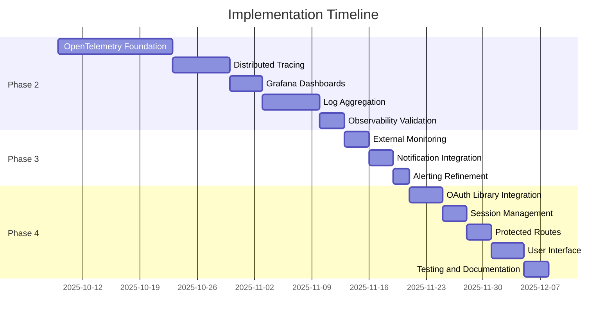

# Implementation Plan

**Last Updated:** October 9, 2025  
**Current Phase:** 1.6 - Observability and Authentication  
**Repository:** tomriddelsdell.com

---

## Overview

This document outlines the implementation roadmap for the personal portfolio platform, focusing on upcoming priorities:

1. **Observability Foundation** - OpenTelemetry, distributed tracing, dashboards (ADR-010)
2. **Notifications and Alerting** - Comprehensive alerting infrastructure
3. **Authentication** - AWS Cognito OAuth integration (ADR-003)

---

## Current State

### ✅ Completed (Phase 1.5)

- **Landing Page Deployed**: Next.js 15.5.4 on Cloudflare Pages
- **CI/CD Pipeline**: GitHub Actions with change detection
- **Health Checks**: Comprehensive health check scripts (staging & production)
- **Performance Monitoring**: Response time tracking (baseline: 103ms)
- **Deployment Runbook**: Operational procedures documented

### 📊 ADR Compliance Status

- **ADR-010 (Observability)**: 32% compliant - basic health checks only
- **ADR-003 (Authentication)**: 0% compliant - OAuth not yet implemented
- **ADR-015 (Deployment)**: 100% compliant - CI/CD operational
- **ADR-021 (Testing)**: 80% compliant - unit tests present, integration tests pending

---

## Phase 2: Observability Foundation (ADR-010)

**Priority:** HIGH  
**Timeline:** 4-6 weeks  
**Target Compliance:** 95% ADR-010  
**Related Prompts:** 1.7-1.11 in `.prompts/copilot-execution-prompts.md`

### 2.1: OpenTelemetry Foundation (1-2 weeks)

**Objective:** Implement OpenTelemetry SDK with platform-agnostic observability wrapper

**Tasks:**

1. Create `packages/observability` package
   - Install OpenTelemetry SDK dependencies
   - Implement PortableTelemetry class with NodeSDK
   - Create platform adapters (Cloudflare, AWS, Prometheus)
   - Build structured logging interface with correlation IDs
   - Implement metrics collection interface (counter, histogram, gauge)
   - Build distributed tracing interface

2. Integrate with landing page
   - Replace console.log with structured logging
   - Add correlation ID generation to API routes
   - Instrument `/api/health` with tracing spans
   - Create `/api/metrics` Prometheus endpoint
   - Add trace context propagation middleware

3. Documentation
   - Create observability package README
   - Document migration from console.log
   - Add usage examples for logging, metrics, tracing

**Success Criteria:**
- ✅ @platform/observability package operational
- ✅ Structured logging with JSON format
- ✅ Prometheus metrics endpoint responding
- ✅ Landing page fully instrumented
- ✅ 60% ADR-010 compliance achieved

**Reference:** Prompt 1.7 in copilot-execution-prompts.md

---

### 2.2: Distributed Tracing with Jaeger (1 week)

**Objective:** Implement distributed tracing with Jaeger following OpenTelemetry standards

**Tasks:**

1. Set up Jaeger infrastructure
   - Deploy Jaeger All-in-One (Docker Compose)
   - Configure OTLP collector endpoint
   - Set up Jaeger UI (http://localhost:16686)

2. Configure trace export
   - Add OTLPTraceExporter to observability package
   - Implement sampling strategies (100% dev, 10% prod)
   - Configure batch span processor
   - Add retry logic for export failures

3. Instrument critical spans
   - event.published (event bus operations)
   - projection.updated (projection handlers)
   - user.authentication (auth middleware)
   - database.query (database operations)
   - external.api.call (external API calls)

4. Implement trace correlation
   - Add W3C trace context propagation
   - Inject trace IDs into structured logs
   - Propagate correlation IDs across services
   - Add trace context to error responses

**Success Criteria:**
- ✅ Jaeger operational and accessible
- ✅ Traces exported successfully
- ✅ Critical spans instrumented
- ✅ Cross-service trace propagation working
- ✅ Trace-to-log correlation functional
- ✅ 70% ADR-010 compliance achieved

**Reference:** Prompt 1.8 in copilot-execution-prompts.md

---

### 2.3: Grafana Dashboards and Alerting (3-4 days)

**Objective:** Create developer-focused Grafana dashboards with alerting

**Tasks:**

1. Set up Grafana infrastructure
   - Deploy Grafana (Docker Compose or Grafana Cloud)
   - Configure Prometheus data source
   - Configure Jaeger data source for trace correlation
   - Set up persistent dashboard storage

2. Create "Development Health" dashboard
   - Error rates by service (time series)
   - Response time percentiles (P50, P95, P99)
   - Event processing lag (time series)
   - Recent deployments (table)
   - Database slow queries (time series)
   - Refresh interval: 30 seconds

3. Create "Infrastructure Overview" dashboard
   - Resource utilization (gauges)
   - Cost tracking (table with estimates)
   - Security events (time series)
   - Backup status (stat panels)
   - Refresh interval: 5 minutes

4. Implement alerting rules
   - **Critical Alert 1**: Error rate > 10/min
   - **Critical Alert 2**: P95 response time > 3s for 5min
   - **Critical Alert 3**: Event processing lag > 60s
   - Configure email/Slack notification channels

5. Dashboard provisioning
   - Export dashboard JSON for version control
   - Create provisioning configuration
   - Add Makefile targets for dashboard management

**Success Criteria:**
- ✅ Grafana operational with data sources
- ✅ Development Health dashboard showing live data
- ✅ Infrastructure Overview dashboard operational
- ✅ Critical alerts configured and tested
- ✅ Notification channels working
- ✅ 85% ADR-010 compliance achieved

**Reference:** Prompt 1.9 in copilot-execution-prompts.md

---

### 2.4: Log Aggregation with Grafana Loki (1 week)

**Objective:** Implement centralized log aggregation with 90-day retention

**Tasks:**

1. Set up Loki infrastructure
   - Deploy Grafana Loki (Docker Compose)
   - Configure 90-day retention policy (ADR-010 requirement)
   - Set up filesystem storage (dev) / S3 storage (prod)
   - Configure Loki data source in Grafana

2. Set up log shipping
   - Deploy Promtail for log collection
   - Configure scrape jobs for all services
   - Implement label extraction (service, environment, level)
   - Add JSON log parsing pipeline

3. Enhance structured logging
   - Ensure JSON output for all log levels
   - Add Loki-compatible labels to log entries
   - Implement log level filtering by environment
   - Add automatic stack trace extraction for errors

4. Create log analysis dashboard
   - Error log stream (live tail)
   - Log volume by service (time series)
   - Error rate trend (time series with thresholds)
   - Top error messages (bar chart)
   - Trace-correlated logs (with Jaeger links)

5. Implement log correlation
   - Extract traceId from logs for Grafana linking
   - Create LogQL query templates
   - Document log-to-trace workflow
   - Add saved queries to Grafana Explore

**Success Criteria:**
- ✅ Loki operational and receiving logs
- ✅ 90-day retention policy active
- ✅ Log analysis dashboard functional
- ✅ LogQL queries working
- ✅ Trace-to-log navigation operational
- ✅ 95% ADR-010 compliance achieved

**Reference:** Prompt 1.10 in copilot-execution-prompts.md

---

### 2.5: Observability Validation and Documentation (2-3 days)

**Objective:** Validate full ADR-010 compliance and create comprehensive documentation

**Tasks:**

1. Execute compliance validation
   - Test OpenTelemetry instrumentation end-to-end
   - Validate all Grafana dashboards with live data
   - Test alerting with simulated failures
   - Verify 90-day log retention policy
   - Confirm trace context propagation across services

2. Create compliance report
   - Update monitoring-adr-compliance-review.md
   - Document 95%+ compliance status
   - Calculate compliance percentage per requirement
   - Document any remaining gaps with justification

3. Create comprehensive documentation
   - **docs/observability-guide.md**: Complete observability guide
   - **docs/developer-onboarding-observability.md**: Onboarding guide
   - **Updated DEPLOYMENT_RUNBOOK.md**: Add observability procedures
   - **Updated architecture.md**: Add observability architecture diagram

4. Validate production readiness
   - Test performance overhead (<5% target)
   - Confirm storage costs within budget
   - Test disaster recovery procedures
   - Validate security (auth, encryption)

**Success Criteria:**
- ✅ ADR-010 compliance validated at 95%+
- ✅ Comprehensive documentation complete
- ✅ Developer onboarding guide ready
- ✅ Operational runbook updated
- ✅ Architecture diagrams updated
- ✅ Production readiness confirmed

**Reference:** Prompt 1.11 in copilot-execution-prompts.md

---

## Phase 3: Notifications and Alerting (1-2 weeks)

**Priority:** MEDIUM  
**Timeline:** 1-2 weeks  
**Dependencies:** Phase 2.3 (Grafana Alerting) must be complete

### 3.1: External Monitoring Setup (2-3 days)

**Objective:** Configure external uptime monitoring and alerting

**Tasks:**

1. Choose monitoring service
   - **Recommended**: Uptime Robot (free tier: 50 monitors, 5-min intervals)
   - **Alternative**: Better Uptime (great free tier with status pages)
   - Sign up and configure account

2. Configure monitors
   - **Primary**: https://tomriddelsdell.com/api/health (JSON health check)
   - **Backup**: https://tomriddelsdell.com (homepage availability)
   - **Staging**: https://staging.tomriddelsdell.com/api/health
   - Check interval: 5 minutes
   - Alert threshold: 2 consecutive failures
   - Monitor from multiple geographic regions

3. Set up notification channels
   - Email notifications (immediate)
   - Slack webhook integration (if using Slack)
   - SMS alerts for critical issues (optional)
   - PagerDuty integration (optional, for on-call)

4. Create status page
   - Public status page for transparency
   - Display current status and uptime percentage
   - Historical incident timeline

**Success Criteria:**
- ✅ External monitoring operational
- ✅ Multi-channel alerting configured
- ✅ Public status page live
- ✅ Test alerts verified

---

### 3.2: Notification Integration (2-3 days)

**Objective:** Integrate notifications across all monitoring systems

**Tasks:**

1. Grafana alerting enhancement
   - Configure contact points (email, Slack, webhook)
   - Set up notification policies with escalation
   - Create on-call schedules (if team grows)
   - Test alert routing and delivery

2. GitHub Actions notification improvement
   - Add Slack notifications for deployments
   - Configure Discord webhook for status updates
   - Send email digest for weekly deployment summary
   - Add status badges to README

3. Cloudflare notifications
   - Configure Cloudflare Analytics alerts
   - Set up security event notifications
   - Configure SSL certificate expiry alerts
   - Enable DDoS attack notifications

4. Create notification runbook
   - Document all notification channels
   - Define escalation procedures
   - Create alert response playbooks
   - Document on-call procedures

**Success Criteria:**
- ✅ Multi-channel notifications operational
- ✅ Escalation policies defined
- ✅ Notification runbook complete
- ✅ All alert types tested

---

### 3.3: Alerting Refinement (1-2 days)

**Objective:** Tune alerting thresholds to minimize false positives

**Tasks:**

1. Alert threshold tuning
   - Analyze baseline performance metrics
   - Adjust thresholds based on real-world data
   - Implement progressive severity (warning → critical)
   - Configure alert grouping to reduce noise

2. Alert deduplication
   - Group related alerts into single notification
   - Implement alert suppression during maintenance
   - Add context to alerts (recent changes, related metrics)
   - Configure alert auto-resolution

3. Create alert documentation
   - Document each alert with runbook link
   - Add context about what triggers the alert
   - Provide troubleshooting steps
   - Include escalation criteria

**Success Criteria:**
- ✅ Alert false positive rate < 5%
- ✅ Alert documentation complete
- ✅ Deduplication working
- ✅ Alert context helpful for debugging

---

## Phase 4: Authentication Implementation (2-3 weeks)

**Priority:** HIGH  
**Timeline:** 2-3 weeks  
**Target Compliance:** 100% ADR-003  
**Dependencies:** Phase 2.1 (OpenTelemetry) for instrumentation

### 4.1: OAuth Library Integration (3-4 days)

**Objective:** Integrate AWS Cognito OAuth with Authorization Code + PKCE flow

**Tasks:**

1. Install authentication dependencies
   - Add `@aws-sdk/client-cognito-identity-provider`
   - Add `jose` for JWT validation
   - Add `crypto` polyfills for PKCE in browser

2. Create authentication utilities
   - **packages/auth**: New shared authentication package
   - Implement PKCE code verifier/challenge generation
   - Build OAuth flow helpers (authorize URL, token exchange)
   - Create JWT validation utilities
   - Implement token refresh logic

3. Configure OAuth endpoints
   - Authorization endpoint: `/auth/login`
   - Callback endpoint: `/auth/callback`
   - Logout endpoint: `/auth/logout`
   - Token refresh endpoint: `/auth/refresh`

**Success Criteria:**
- ✅ @platform/auth package created
- ✅ OAuth endpoints implemented
- ✅ PKCE implementation working
- ✅ JWT validation functional

**Reference:** ADR-003 Authentication Strategy

---

### 4.2: Session Management (2-3 days)

**Objective:** Implement secure session management with token storage

**Tasks:**

1. Session storage implementation
   - Use HTTP-only cookies for refresh tokens
   - Store access tokens in memory (not localStorage)
   - Implement secure cookie configuration (SameSite, Secure)
   - Add CSRF protection

2. Token management
   - Automatic access token refresh before expiry
   - Handle token refresh failures gracefully
   - Implement token revocation on logout
   - Clear session data on browser close

3. Session state management
   - Create React context for auth state
   - Implement useAuth hook for components
   - Add loading states during auth operations
   - Handle authentication errors gracefully

**Success Criteria:**
- ✅ Secure session storage implemented
- ✅ Automatic token refresh working
- ✅ CSRF protection active
- ✅ Auth state management functional

---

### 4.3: Protected Routes and Middleware (2-3 days)

**Objective:** Implement route protection and authentication middleware

**Tasks:**

1. Create authentication middleware
   - Validate access tokens on protected API routes
   - Extract user information from JWT claims
   - Add request authentication context
   - Handle expired/invalid tokens

2. Implement route protection
   - Create `withAuth` HOC for protected pages
   - Implement server-side auth checks
   - Add client-side route guards
   - Redirect unauthenticated users to login

3. User role management
   - Extract roles from Cognito user attributes
   - Implement role-based access control (RBAC)
   - Create `requireRole` middleware
   - Add role checks to sensitive operations

4. Instrument authentication with observability
   - Add authentication spans to traces
   - Log authentication events with correlation IDs
   - Track authentication metrics (success rate, failures)
   - Add authentication errors to error dashboards

**Success Criteria:**
- ✅ Authentication middleware operational
- ✅ Protected routes working
- ✅ RBAC implemented
- ✅ Authentication fully instrumented

---

### 4.4: User Interface and Experience (3-4 days)

**Objective:** Create polished authentication user interface

**Tasks:**

1. Create login page
   - Design login UI with portfolio branding
   - Add "Sign in with AWS Cognito" button
   - Implement loading states
   - Add error message display
   - Mobile-responsive design

2. Create authentication components
   - User profile dropdown/menu
   - Login/logout buttons
   - Authentication status indicator
   - Session expiry warnings

3. Implement user profile page
   - Display user information from ID token
   - Show session information (expires in X minutes)
   - Add logout functionality
   - Display user roles/permissions

4. Add authentication to existing pages
   - Protect admin routes (if any)
   - Add user context to contact form
   - Show personalized content for authenticated users
   - Add "Sign in to continue" prompts

**Success Criteria:**
- ✅ Polished login UI implemented
- ✅ User profile page functional
- ✅ Authentication components integrated
- ✅ Mobile-responsive design verified

---

### 4.5: Testing and Documentation (2-3 days)

**Objective:** Comprehensive authentication testing and documentation

**Tasks:**

1. Unit testing
   - Test PKCE code generation
   - Test JWT validation logic
   - Test token refresh logic
   - Test session management utilities

2. Integration testing
   - Test complete OAuth flow
   - Test protected route access
   - Test token expiry handling
   - Test logout flow

3. Security testing
   - Verify PKCE implementation
   - Test CSRF protection
   - Verify secure cookie configuration
   - Test session hijacking prevention
   - Validate JWT signature verification

4. Documentation
   - Create authentication architecture diagram
   - Document OAuth flow implementation
   - Add developer guide for auth integration
   - Document security best practices
   - Update DEPLOYMENT_RUNBOOK with auth procedures

5. ADR compliance validation
   - Verify Authorization Code + PKCE implementation
   - Confirm token configuration matches ADR-003
   - Validate security considerations addressed
   - Document compliance status

**Success Criteria:**
- ✅ All authentication tests passing
- ✅ Security audit complete
- ✅ Documentation comprehensive
- ✅ 100% ADR-003 compliance achieved

---

## Success Metrics

### Phase 2: Observability

| Metric                       | Target      | Current | Status |
| ---------------------------- | ----------- | ------- | ------ |
| ADR-010 Compliance           | 95%         | 32%     | 🔄     |
| Structured Logging Coverage  | 100%        | 30%     | 🔄     |
| Distributed Tracing Coverage | 100%        | 0%      | 🔄     |
| Dashboard Availability       | 100%        | 0%      | 🔄     |
| Log Retention Policy         | 90 days     | N/A     | 🔄     |
| Performance Overhead         | < 5% latency| N/A     | 🔄     |

### Phase 3: Notifications

| Metric                       | Target      | Current | Status |
| ---------------------------- | ----------- | ------- | ------ |
| External Monitor Uptime      | > 99.9%     | N/A     | 🔄     |
| Alert False Positive Rate    | < 5%        | N/A     | 🔄     |
| Mean Time to Alert (MTTA)    | < 5 min     | N/A     | 🔄     |
| Notification Channels        | 3+          | 1       | 🔄     |

### Phase 4: Authentication

| Metric                       | Target      | Current | Status |
| ---------------------------- | ----------- | ------- | ------ |
| ADR-003 Compliance           | 100%        | 0%      | 🔄     |
| OAuth Flow Implementation    | Complete    | N/A     | 🔄     |
| Protected Routes Coverage    | 100%        | N/A     | 🔄     |
| Authentication Test Coverage | > 90%       | N/A     | 🔄     |

---

## Risk Management

### Phase 2 Risks

1. **OpenTelemetry Compatibility with Cloudflare Workers**
   - **Risk:** SDK may not work in Workers runtime
   - **Mitigation:** Platform-specific adapters planned, polyfills available
   - **Fallback:** Use Cloudflare-native analytics as adapter

2. **Performance Overhead**
   - **Risk:** Observability adds latency
   - **Mitigation:** Sampling strategies, batch export, async processing
   - **Target:** < 5% latency impact

3. **Storage Costs**
   - **Risk:** Metrics, traces, logs consume storage
   - **Mitigation:** 90-day retention, 10% sampling, log level filtering
   - **Budget:** < $20/month for production

### Phase 3 Risks

1. **Alert Fatigue**
   - **Risk:** Too many alerts reduce effectiveness
   - **Mitigation:** Only 3 critical alerts, progressive severity
   - **Target:** < 5% false positive rate

2. **Notification Delivery**
   - **Risk:** Notifications not reaching developers
   - **Mitigation:** Multi-channel notifications, escalation policies
   - **Validation:** Test all channels regularly

### Phase 4 Risks

1. **OAuth Flow Complexity**
   - **Risk:** PKCE implementation errors
   - **Mitigation:** Use established libraries, comprehensive testing
   - **Validation:** Security audit before production

2. **Session Security**
   - **Risk:** Token leakage or session hijacking
   - **Mitigation:** HTTP-only cookies, CSRF protection, secure configuration
   - **Validation:** Security testing required

3. **User Experience**
   - **Risk:** Complex auth flow confuses users
   - **Mitigation:** Clear UI/UX design, helpful error messages
   - **Validation:** User testing with external feedback

---

## Dependencies and Blockers

### Phase 2 Dependencies
- ✅ Landing page deployed (completed Phase 1.5)
- ✅ CI/CD pipeline operational (completed Phase 1.5)
- 🔄 Docker Compose available (for Jaeger, Grafana, Loki)

### Phase 3 Dependencies
- 🔄 Phase 2.3 (Grafana Alerting) must complete first
- 🔄 External monitoring service account required

### Phase 4 Dependencies
- ✅ AWS Cognito User Pool configured (already done)
- 🔄 Phase 2.1 (OpenTelemetry) recommended for auth instrumentation
- 🔄 Protected routes identified

---

## Timeline Overview

**Estimated Completion:** December 8, 2025 (9 weeks total)

---

## Next Steps

### Immediate Actions (This Week)

1. ✅ Review and approve this implementation plan
2. 🔄 Execute Prompt 1.7 (OpenTelemetry Foundation)
3. 🔄 Set up local development environment for observability stack
4. 🔄 Create `packages/observability` package structure

### Short-Term Goals (Next 2 Weeks)

1. Complete Phase 2.1 (OpenTelemetry Foundation)
2. Begin Phase 2.2 (Distributed Tracing with Jaeger)
3. Document learnings and update this plan

### Medium-Term Goals (1-2 Months)

1. Complete all observability work (Phase 2)
2. Complete notifications and alerting (Phase 3)
3. Begin authentication implementation (Phase 4)

---

## References

### Key Documents
- **ADR-010**: Observability Requirements and Strategy
- **ADR-003**: Authentication Strategy (AWS Cognito)
- **ADR-015**: Deployment Strategy
- **ADR-021**: Testing Strategy
- **Deployment Runbook**: `apps/landing-page/DEPLOYMENT_RUNBOOK.md`
- **Architecture**: `docs/architecture.md`
- **Compliance Review**: `docs/monitoring-adr-compliance-review.md`

### Execution Prompts
- **Phase 2 Observability**: Prompts 1.7-1.11 in `.prompts/copilot-execution-prompts.md`
- **Phase 4 Authentication**: Referenced in ADR-003

### Related Changes
- **2025-10-08**: Production monitoring implementation (Phase 1.5)
- **2025-10-09**: Observability prompts created (Phase 2 & 3 planning)

---

**Document Owner:** Development Team  
**Last Review:** October 9, 2025  
**Next Review:** After Phase 2.1 completion  
**Status:** ACTIVE - Ready for execution
