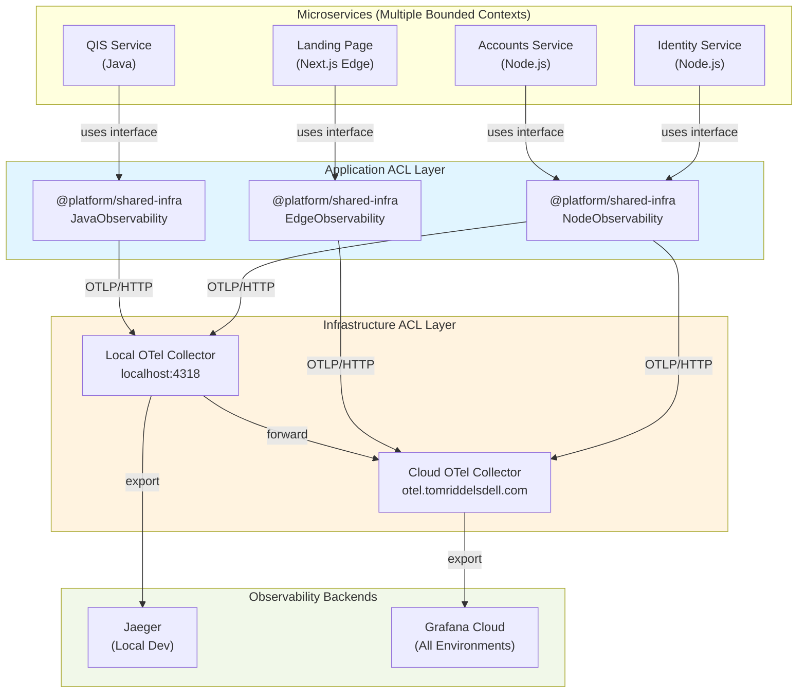

# ADR-028: Unified Observability Architecture Across All Environments

## Status

**Accepted** - October 19, 2025  
**Last Updated**: October 20, 2025  
**Implementation**: Phase 1 Complete, Phase 2 Planned

### Implementation Roadmap

**✅ Phase 1 Complete (Infrastructure):**

- Local OTel Collector running in Docker
- Collector forwards to both Jaeger (local) and Grafana Cloud
- Landing page instrumented with OpenTelemetry SDK (temporary)
- Environment configuration via Doppler
- Basic unified visibility achieved

**🚧 Phase 2 In Progress (DDD Compliance):**

- ⏳ Create `@platform/shared-infra` Anti-Corruption Layer
- ⏳ Extract OpenTelemetry implementation behind domain interface
- ⏳ Migrate landing page to use ACL
- ⏳ Document observability patterns for all services

**📋 Phase 3 Planned (Service Rollout):**

- Deploy OTLP proxy worker (optional enhancement)
- Instrument remaining microservices with ACL
- Create domain-specific dashboards
- Set up alerting and SLOs

## Context

### Problem Statement (Original)

Prior to this ADR, we had a **split observability architecture**:

- **Local Development**: Jaeger + Prometheus + Grafana (Docker containers)
- **Staging/Production**: Cloudflare Analytics + Logs (separate system)

This created several problems:

1. **Inconsistent Developer Experience**: Different tools for local vs deployed environments
2. **Limited Production Debugging**: Cannot correlate production issues with local testing
3. **No Unified View**: Cannot compare metrics across environments
4. **Architectural Misalignment**: Violates ADR-010's goal of "vendor-neutral, portable observability"
5. **DDD Violation**: Observability concerns leak into deployment environment rather than being treated as a cross-cutting concern

### DDD Principles at Stake

Per our architecture documentation and DDD best practices:

> **Anti-Corruption Layer**: A thin internal package (`@platform/shared-infra/observability`) wraps observability concerns to provide consistent interface across all environments and runtimes.

> **Keep observability code out of domain logic** - instrumentation only in application/infrastructure layer, never in domain layer.

> **Vendor-neutral, portable observability strategy** that enforces consistency and supports migration between providers without changes to application code.

**Current Reality vs Target State:**

| Aspect | Current (Phase 1) | Target (DDD-Compliant) |
|--------|-------------------|------------------------|
| **Application Imports** | Direct OpenTelemetry SDK | `@platform/shared-infra/observability` |
| **Vendor Exposure** | `NodeTracerProvider`, `OTLPTraceExporter` visible | Hidden behind domain interface |
| **Bounded Context** | Infrastructure leaks into app layer | Clean separation via ACL |
| **Swappable Backends** | Requires code changes | Config-only changes |
| **Domain Language** | `span.setAttribute()` (vendor terms) | `context.addMetadata()` (domain terms) |

**Why This Matters:**

1. **Vendor Lock-in Risk**: Direct OpenTelemetry imports make it hard to swap providers
2. **Bounded Context Violation**: Infrastructure concerns pollute application code
3. **Microservices Inconsistency**: Each service might implement differently without ACL
4. **Testing Difficulty**: Hard to mock vendor SDKs in tests
5. **Evolution Constraint**: Changes to observability affect all application code

## Decision

### Target Architecture: Multi-Layer Anti-Corruption Strategy

Implement a **DDD-compliant observability architecture** that maintains clean bounded contexts across our microservices while providing unified visibility. This architecture uses **two Anti-Corruption Layers** to protect domain code from infrastructure concerns:

**Layer 1: Application ACL** (`@platform/shared-infra/observability`)

- Domain-friendly observability interface
- Hides all vendor-specific concepts
- Works identically across all microservices
- Enables easy vendor swapping

**Layer 2: Infrastructure ACL** (OpenTelemetry Collector)

- Translates OTLP to vendor-specific formats
- Centralizes backend integration
- Provides buffering and reliability
- Enables multi-backend export

### Key DDD Principles Applied

1. **Bounded Context Separation**: Observability is a separate infrastructure bounded context, never mixed with domain logic
2. **Anti-Corruption Layer**: Application code never depends on vendor SDKs directly
3. **Ubiquitous Language**: Use domain-friendly terms (`trace`, `addMetadata`) not vendor terms (`span`, `setAttribute`)
4. **Dependency Inversion**: Domain/application depends on interfaces, infrastructure implements them
5. **Single Responsibility**: Each layer has one responsibility and hides implementation details

### Target Architecture Overview



### Architecture Layers Explained

**Layer 1: Domain/Application Code**

- Business logic and use cases
- Zero observability dependencies
- Completely vendor-agnostic
- Uses domain language only

**Layer 2: Application ACL** (`@platform/shared-infra/observability`)

- Domain-friendly observability interface
- Runtime detection (Node.js vs Edge vs Java)
- Hides all vendor SDKs
- Provides consistent API across all services

**Layer 3: Vendor Implementation** (OpenTelemetry, Datadog, etc.)

- Specific SDK implementations
- Only imported by ACL package
- Never visible to application code
- Swappable via configuration

**Layer 4: Infrastructure ACL** (OTel Collector)

- Protocol translation (OTLP → vendor formats)
- Buffering and reliability
- Multi-backend export
- Centralized configuration

**Layer 5: Observability Backends** (Grafana, Jaeger, etc.)

- Data storage and visualization
- Completely abstracted from application
- Swappable without code changes
- Configuration-driven selection

## Implementation Strategy

### Phase 1: Application Anti-Corruption Layer (Target State)

**Goal**: Create DDD-compliant observability interface that works across all microservices and runtimes

#### 1.1 Define Domain-Friendly Interface

Create a shared package that provides vendor-agnostic observability:

```typescript
// packages/shared-infra/src/observability/types.ts
/**
 * Domain-Friendly Observability Interface
 * 
 * This interface uses ubiquitous language from our domain,
 * not vendor-specific terminology.
 */
export interface Observability {
  /**
   * Structured logging with correlation
   */
  log: Logger
  
  /**
   * Business and technical metrics
   */
  metrics: Metrics
  
  /**
   * Distributed tracing across services
   */
  tracing: Tracing
}

export interface Logger {
  debug(message: string, context?: Record<string, unknown>): void
  info(message: string, context?: Record<string, unknown>): void
  warn(message: string, context?: Record<string, unknown>): void
  error(message: string, error?: Error, context?: Record<string, unknown>): void
}

export interface Metrics {
  /**
   * Increment a counter (e.g., requests, events processed)
   */
  counter(name: string, value: number, labels?: Record<string, string>): void
  
  /**
   * Set a gauge value (e.g., queue depth, active connections)
   */
  gauge(name: string, value: number, labels?: Record<string, string>): void
  
  /**
   * Record a histogram value (e.g., request duration, payload size)
   */
  histogram(name: string, value: number, labels?: Record<string, string>): void
  
  /**
   * Event Sourcing-specific metrics for CQRS architectures
   */
  eventSourcing: EventSourcingMetrics
}

/**
 * Specialized metrics for Event Sourcing and CQRS patterns
 * Tracks aggregate health, projection performance, and event store operations
 */
export interface EventSourcingMetrics {
  /**
   * Track number of events appended to event store per commit
   * Helps identify large aggregates that may need refactoring
   * 
   * @example
   * metrics.eventSourcing.eventsPerCommit(3, { aggregate_type: 'Project' })
   */
  eventsPerCommit(count: number, labels: { aggregate_type: string }): void
  
  /**
   * Track total aggregate size (event count)
   * Triggers snapshot recommendations when exceeds threshold
   * 
   * @example
   * metrics.eventSourcing.aggregateSize(150, { 
   *   aggregate_id: 'proj-123',
   *   aggregate_type: 'Project' 
   * })
   */
  aggregateSize(eventCount: number, labels: { aggregate_id: string; aggregate_type: string }): void
  
  /**
   * Track optimistic concurrency conflicts (version mismatches)
   * High rate indicates contention on specific aggregates
   * 
   * @example
   * metrics.eventSourcing.concurrencyConflict({ 
   *   aggregate_id: 'proj-123',
   *   expected_version: 10,
   *   actual_version: 12
   * })
   */
  concurrencyConflict(labels: { 
    aggregate_id: string
    expected_version: number
    actual_version: number
  }): void
  
  /**
   * Track projection lag (time between event timestamp and projection update)
   * Critical for monitoring eventual consistency SLAs
   * 
   * @example
   * metrics.eventSourcing.projectionLag(2.5, {
   *   projection_name: 'UserProfile',
   *   event_type: 'UserRegistered'
   * })
   */
  projectionLag(seconds: number, labels: { projection_name: string; event_type: string }): void
  
  /**
   * Track projection throughput (events processed per second)
   * 
   * @example
   * metrics.eventSourcing.projectionThroughput(150, {
   *   projection_name: 'UserProfile'
   * })
   */
  projectionThroughput(eventsPerSecond: number, labels: { projection_name: string }): void
  
  /**
   * Track projection errors and dead letter queue size
   * 
   * @example
   * metrics.eventSourcing.projectionError({
   *   projection_name: 'UserProfile',
   *   error_type: 'DatabaseTimeout'
   * })
   */
  projectionError(labels: { projection_name: string; error_type: string }): void
  
  /**
   * Track snapshot operations (creation and loading)
   * 
   * @example
   * metrics.eventSourcing.snapshotOperation('created', {
   *   aggregate_type: 'Project',
   *   aggregate_version: 100,
   *   snapshot_size_bytes: 4096
   * })
   */
  snapshotOperation(
    operation: 'created' | 'loaded' | 'skipped',
    labels: { 
      aggregate_type: string
      aggregate_version: number
      snapshot_size_bytes?: number
    }
  ): void
  
  /**
   * Track snapshot hit ratio (loaded from snapshot vs full replay)
   * High hit ratio indicates effective snapshot strategy
   * 
   * @example
   * metrics.eventSourcing.snapshotHitRatio(0.85, {
   *   aggregate_type: 'Project'
   * })
   */
  snapshotHitRatio(ratio: number, labels: { aggregate_type: string }): void
  
  /**
   * Track event replay performance (events replayed after snapshot)
   * 
   * @example
   * metrics.eventSourcing.eventsReplayed(15, {
   *   aggregate_id: 'proj-123',
   *   load_source: 'snapshot'
   * })
   */
  eventsReplayed(count: number, labels: { 
    aggregate_id: string
    load_source: 'snapshot' | 'full_replay'
  }): void
  
  /**
   * Track event store write latency
   * 
   * @example
   * metrics.eventSourcing.eventStoreWriteLatency(45.2, {
   *   operation: 'append',
   *   events_count: 3
   * })
   */
  eventStoreWriteLatency(milliseconds: number, labels: {
    operation: 'append' | 'load' | 'snapshot'
    events_count?: number
  }): void
}

export interface Tracing {
  /**
   * Trace an operation with automatic span management
   * Uses domain-friendly language, not vendor terminology
   * 
   * @example
   * await tracing.trace('processUserRegistration', async (ctx) => {
   *   ctx.addMetadata('userId', user.id)
   *   await registerUser(user)
   * })
   */
  trace<T>(
    operationName: string,
    fn: (context: TraceContext) => Promise<T>,
    metadata?: Record<string, string | number | boolean>
  ): Promise<T>
  
  /**
   * Add metadata to current trace context
   */
  addMetadata(key: string, value: string | number | boolean): void
  
  /**
   * Get current trace ID for correlation
   */
  getTraceId(): string | undefined
}

export interface TraceContext {
  /**
   * Add operation-specific metadata
   * Domain-friendly: "addMetadata" not vendor-specific "span.setAttribute"
   */
  addMetadata(key: string, value: string | number | boolean): void
  
  /**
   * Record an error in current operation
   * Domain-friendly: "recordError" not vendor-specific "span.recordException"
   */
  recordError(error: Error): void
  
  /**
   * Mark operation as successful
   */
  setSuccess(): void
  
  /**
   * Mark operation as failed with reason
   */
  setFailure(reason: string): void
}

/**
 * Configuration for observability setup
 * Environment-driven, not hardcoded
 */
export interface ObservabilityConfig {
  serviceName: string
  serviceVersion: string
  environment: 'development' | 'staging' | 'production'
  
  // OTLP endpoint configuration (for all runtimes)
  otlp: {
    endpoint: string
    headers?: Record<string, string>
  }
  
  // Sampling configuration
  sampling?: {
    rate: number  // 0.0 to 1.0
  }
  
  // Runtime hints (optional, auto-detected if not provided)
  runtime?: 'nodejs' | 'edge' | 'java' | 'python'
}
```

#### 1.2 Implement Runtime-Specific Adapters

Create implementations that hide vendor SDKs completely:

```typescript
// packages/shared-infra/src/observability/implementations/nodejs.ts
/**
 * Node.js Implementation using OpenTelemetry
 * 
 * This is the ONLY file that imports OpenTelemetry SDK.
 * Application code NEVER sees these imports.
 */
import { trace, Span, SpanStatusCode } from '@opentelemetry/api'
import { Resource } from '@opentelemetry/resources'
import { SEMRESATTRS_SERVICE_NAME, SEMRESATTRS_SERVICE_VERSION } from '@opentelemetry/semantic-conventions'
import { NodeTracerProvider } from '@opentelemetry/sdk-trace-node'
import { BatchSpanProcessor } from '@opentelemetry/sdk-trace-base'
import { OTLPTraceExporter } from '@opentelemetry/exporter-trace-otlp-http'
import { registerInstrumentations } from '@opentelemetry/instrumentation'
import { FetchInstrumentation } from '@opentelemetry/instrumentation-fetch'

import type { Observability, ObservabilityConfig, Logger, Metrics, Tracing, TraceContext } from '../types'

/**
 * OpenTelemetry implementation for Node.js runtime
 * Implements domain interface, hides vendor specifics
 */
export class NodeJSObservability implements Observability {
  private tracer: any
  private logger: Logger
  private metricsCollector: Metrics
  private tracingManager: Tracing
  
  constructor(config: ObservabilityConfig) {
    this.initializeOpenTelemetry(config)
    this.tracer = trace.getTracer(config.serviceName, config.serviceVersion)
    this.logger = new NodeJSLogger(config)
    this.metricsCollector = new NodeJSMetrics(config)
    this.tracingManager = new NodeJSTracing(this.tracer)
  }
  
  private initializeOpenTelemetry(config: ObservabilityConfig): void {
    const resource = new Resource({
      [SEMRESATTRS_SERVICE_NAME]: config.serviceName,
      [SEMRESATTRS_SERVICE_VERSION]: config.serviceVersion,
      'deployment.environment': config.environment,
      'service.namespace': 'tomriddelsdell.com',
    })
    
    const exporter = new OTLPTraceExporter({
      url: config.otlp.endpoint,
      headers: config.otlp.headers,
    })
    
    const provider = new NodeTracerProvider({ resource })
    provider.addSpanProcessor(new BatchSpanProcessor(exporter, {
      maxQueueSize: 100,
      maxExportBatchSize: 10,
      scheduledDelayMillis: 500,
    }))
    
    provider.register()
    
    // Auto-instrument HTTP clients
    registerInstrumentations({
      instrumentations: [
        new FetchInstrumentation({
          ignoreUrls: [/\/health/, /\/metrics/],
          propagateTraceHeaderCorsUrls: [/.*/],
        }),
      ],
    })
  }
  
  get log(): Logger {
    return this.logger
  }
  
  get metrics(): Metrics {
    return this.metricsCollector
  }
  
  get tracing(): Tracing {
    return this.tracingManager
  }
}

/**
 * Tracing implementation that wraps OpenTelemetry spans
 * Translates domain interface to vendor API
 */
class NodeJSTracing implements Tracing {
  constructor(private tracer: any) {}
  
  async trace<T>(
    operationName: string,
    fn: (context: TraceContext) => Promise<T>,
    metadata?: Record<string, string | number | boolean>
  ): Promise<T> {
    return this.tracer.startActiveSpan(operationName, async (span: Span) => {
      try {
        // Wrap vendor span in domain-friendly context
        const context = new NodeJSTraceContext(span)
        
        // Add initial metadata if provided
        if (metadata) {
          Object.entries(metadata).forEach(([key, value]) => {
            context.addMetadata(key, value)
          })
        }
        
        const result = await fn(context)
        span.setStatus({ code: SpanStatusCode.OK })
        return result
      } catch (error) {
        span.setStatus({
          code: SpanStatusCode.ERROR,
          message: error instanceof Error ? error.message : 'Unknown error',
        })
        span.recordException(error as Error)
        throw error
      } finally {
        span.end()
      }
    })
  }
  
  addMetadata(key: string, value: string | number | boolean): void {
    const span = trace.getActiveSpan()
    if (span) {
      span.setAttribute(key, value)
    }
  }
  
  getTraceId(): string | undefined {
    const span = trace.getActiveSpan()
    return span?.spanContext().traceId
  }
}

/**
 * Trace context that hides OpenTelemetry Span API
 * Provides domain-friendly interface
 */
class NodeJSTraceContext implements TraceContext {
  constructor(private span: Span) {}
  
  addMetadata(key: string, value: string | number | boolean): void {
    this.span.setAttribute(key, value)
  }
  
  recordError(error: Error): void {
    this.span.recordException(error)
  }
  
  setSuccess(): void {
    this.span.setStatus({ code: SpanStatusCode.OK })
  }
  
  setFailure(reason: string): void {
    this.span.setStatus({ code: SpanStatusCode.ERROR, message: reason })
  }
}

// Logger and Metrics implementations follow similar pattern...
```

```typescript
// packages/shared-infra/src/observability/implementations/edge.ts
/**
 * Edge Runtime Implementation (Cloudflare Workers, Next.js Edge)
 * 
 * Uses HTTP-based OTLP export since OpenTelemetry NodeSDK
 * is incompatible with V8 isolate runtimes.
 */
import type { Observability, ObservabilityConfig, Logger, Metrics, Tracing, TraceContext } from '../types'

/**
 * Edge-compatible observability implementation
 * Zero Node.js dependencies
 */
export class EdgeObservability implements Observability {
  private logger: Logger
  private metricsCollector: Metrics
  private tracingManager: Tracing
  
  constructor(config: ObservabilityConfig) {
    this.logger = new EdgeLogger(config)
    this.metricsCollector = new EdgeMetrics(config)
    this.tracingManager = new EdgeTracing(config)
  }
  
  get log(): Logger {
    return this.logger
  }
  
  get metrics(): Metrics {
    return this.metricsCollector
  }
  
  get tracing(): Tracing {
    return this.tracingManager
  }
}

/**
 * Edge tracing using correlation IDs and structured logging
 * Simulates spans via JSON logs with trace context
 */
class EdgeTracing implements Tracing {
  constructor(private config: ObservabilityConfig) {}
  
  async trace<T>(
    operationName: string,
    fn: (context: TraceContext) => Promise<T>,
    metadata?: Record<string, string | number | boolean>
  ): Promise<T> {
    const traceId = this.generateTraceId()
    const spanId = this.generateSpanId()
    const startTime = Date.now()
    
    const context = new EdgeTraceContext(traceId, spanId, operationName)
    
    // Add initial metadata
    if (metadata) {
      Object.entries(metadata).forEach(([key, value]) => {
        context.addMetadata(key, value)
      })
    }
    
    try {
      const result = await fn(context)
      
      // Log span completion (will be collected by OTel Collector)
      console.log(JSON.stringify({
        traceId,
        spanId,
        operationName,
        duration: Date.now() - startTime,
        status: 'OK',
        metadata: context.getMetadata(),
      }))
      
      return result
    } catch (error) {
      console.error(JSON.stringify({
        traceId,
        spanId,
        operationName,
        duration: Date.now() - startTime,
        status: 'ERROR',
        error: error instanceof Error ? error.message : 'Unknown error',
        metadata: context.getMetadata(),
      }))
      throw error
    }
  }
  
  addMetadata(key: string, value: string | number | boolean): void {
    // Store in async context if available
  }
  
  getTraceId(): string | undefined {
    // Get from async context if available
    return undefined
  }
  
  private generateTraceId(): string {
    return `${Date.now()}-${Math.random().toString(36).substr(2, 9)}`
  }
  
  private generateSpanId(): string {
    return Math.random().toString(36).substr(2, 9)
  }
}

class EdgeTraceContext implements TraceContext {
  private metadata: Record<string, string | number | boolean> = {}
  
  constructor(
    private traceId: string,
    private spanId: string,
    private operationName: string
  ) {}
  
  addMetadata(key: string, value: string | number | boolean): void {
    this.metadata[key] = value
  }
  
  recordError(error: Error): void {
    this.metadata['error.message'] = error.message
    this.metadata['error.name'] = error.name
  }
  
  setSuccess(): void {
    this.metadata['status'] = 'success'
  }
  
  setFailure(reason: string): void {
    this.metadata['status'] = 'failure'
    this.metadata['failure.reason'] = reason
  }
  
  getMetadata(): Record<string, string | number | boolean> {
    return { ...this.metadata }
  }
}

// Logger and Metrics implementations...
```

#### 1.3 Factory for Runtime Detection

```typescript
// packages/shared-infra/src/observability/factory.ts
/**
 * Factory for creating runtime-appropriate observability instance
 * Application code only calls this, never imports vendor SDKs
 */
import type { Observability, ObservabilityConfig } from './types'
import { NodeJSObservability } from './implementations/nodejs'
import { EdgeObservability } from './implementations/edge'

/**
 * Detect current JavaScript runtime
 */
function detectRuntime(): 'nodejs' | 'edge' {
  // Check for Node.js-specific globals
  if (typeof process !== 'undefined' && process.versions?.node) {
    return 'nodejs'
  }
  
  // Edge runtime (Cloudflare Workers, Next.js Edge)
  if (typeof EdgeRuntime !== 'undefined') {
    return 'edge'
  }
  
  // Default to edge (safer for unknown runtimes)
  return 'edge'
}

/**
 * Create observability instance appropriate for current runtime
 * 
 * This is the ONLY export that application code uses:
 * 
 * @example
 * import { createObservability } from '@platform/shared-infra/observability'
 * 
 * const observability = createObservability({
 *   serviceName: 'my-service',
 *   serviceVersion: '1.0.0',
 *   environment: process.env.NODE_ENV,
 *   otlp: {
 *     endpoint: process.env.OTEL_EXPORTER_OTLP_ENDPOINT,
 *     headers: parseHeaders(process.env.OTEL_EXPORTER_OTLP_HEADERS),
 *   },
 * })
 */
export function createObservability(config: ObservabilityConfig): Observability {
  const runtime = config.runtime || detectRuntime()
  
  switch (runtime) {
    case 'nodejs':
      return new NodeJSObservability(config)
    
    case 'edge':
      return new EdgeObservability(config)
    
    default:
      throw new Error(`Unsupported runtime: ${runtime}`)
  }
}

/**
 * Parse OTLP headers from environment variable format
 */
function parseHeaders(headersString?: string): Record<string, string> {
  if (!headersString) return {}
  
  const headers: Record<string, string> = {}
  headersString.split(',').forEach(pair => {
    const [key, value] = pair.split('=')
    if (key && value) {
      headers[key.trim()] = value.trim()
    }
  })
  
  return headers
}

// Export types for application use
export type { Observability, Logger, Metrics, Tracing, TraceContext, ObservabilityConfig } from './types'
```

#### 1.4 Package Structure

```
packages/shared-infra/
├── package.json
├── tsconfig.json
├── src/
│   ├── observability/
│   │   ├── index.ts                    # Public API exports
│   │   ├── types.ts                    # Domain interfaces
│   │   ├── factory.ts                  # Runtime detection & creation
│   │   ├── implementations/
│   │   │   ├── nodejs.ts               # Full OTel SDK (Node.js)
│   │   │   ├── edge.ts                 # HTTP-based (Edge runtime)
│   │   │   └── noop.ts                 # No-op (testing)
│   │   └── __tests__/
│   │       ├── nodejs.test.ts
│   │       ├── edge.test.ts
│   │       └── integration.test.ts
│   └── index.ts                        # Package exports
└── README.md
```

**DDD Compliance**:

- ✅ Single bounded context for observability
- ✅ Implementation details hidden behind interface
- ✅ Runtime detection is infrastructure concern, not domain concern
- ✅ Ubiquitous language in API (trace, log, metrics - not span, setAttribute)
- ✅ All vendor SDKs isolated in implementations/ directory
      headers: { 'Content-Type': 'application/json' },
      body: JSON.stringify({ resourceMetrics: metrics }),
    });
  }
}

```

**DDD Compliance**:
- ✅ Single bounded context for observability
- ✅ Implementation details hidden behind interface
- ✅ Runtime detection is infrastructure concern, not domain concern

#### 1.5 Application Usage (Clean, DDD-Compliant)

**All microservices use identical code pattern:**

```typescript
// services/identity/src/lib/observability.ts
// OR apps/landing-page/src/lib/observability.ts
// OR services/accounts/src/lib/observability.ts
// SAME CODE FOR ALL SERVICES

import { createObservability } from '@platform/shared-infra/observability'

/**
 * Create observability instance for this service
 * Configuration-driven, no hardcoded backends
 */
export const observability = createObservability({
  serviceName: 'identity-service',  // Or 'landing-page', 'accounts-service', etc.
  serviceVersion: process.env.APP_VERSION || '1.0.0',
  environment: (process.env.NODE_ENV || 'development') as 'development' | 'staging' | 'production',
  
  // Environment-specific configuration (via Doppler)
  otlp: {
    endpoint: process.env.OTEL_EXPORTER_OTLP_ENDPOINT || 'http://localhost:4318/v1/traces',
    headers: process.env.OTEL_EXPORTER_OTLP_HEADERS 
      ? parseHeaders(process.env.OTEL_EXPORTER_OTLP_HEADERS)
      : undefined,
  },
  
  sampling: {
    rate: process.env.NODE_ENV === 'production' ? 0.1 : 1.0,
  },
})

function parseHeaders(str: string): Record<string, string> {
  const headers: Record<string, string> = {}
  str.split(',').forEach(pair => {
    const [key, value] = pair.split('=')
    if (key && value) headers[key.trim()] = value.trim()
  })
  return headers
}
```

**Domain Code Uses Clean API:**

```typescript
// services/identity/src/application/use-cases/register-user.ts
// ✅ DDD-COMPLIANT: Domain logic separate from infrastructure

import { observability } from '../../lib/observability'
import type { User } from '../../domain/aggregates/user'

/**
 * Register new user use case
 * 
 * Domain logic is clean, observability is infrastructure concern
 */
export class RegisterUserUseCase {
  async execute(userData: UserData): Promise<User> {
    // ✅ Domain-friendly API, no vendor concepts
    return observability.tracing.trace(
      'registerUser',
      async (context) => {
        // ✅ Domain language: "addMetadata" not "span.setAttribute"
        context.addMetadata('user.email', userData.email)
        context.addMetadata('registration.source', userData.source)
        
        try {
          // Domain logic here - zero observability concerns
          const user = await this.userRepository.create(userData)
          
          // Structured logging with context
          observability.log.info('User registered successfully', {
            userId: user.id,
            email: user.email,
            source: userData.source,
          })
          
          // Business metrics
          observability.metrics.counter('user.registration.success', 1, {
            source: userData.source,
          })
          
          context.setSuccess()
          return user
          
        } catch (error) {
          // ✅ Domain-friendly error handling
          context.recordError(error as Error)
          
          observability.log.error('User registration failed', error as Error, {
            email: userData.email,
            source: userData.source,
          })
          
          observability.metrics.counter('user.registration.failure', 1, {
            source: userData.source,
            errorType: error instanceof Error ? error.name : 'Unknown',
          })
          
          throw error
        }
      },
      {
        'operation.type': 'user.registration',
        'service': 'identity',
      }
    )
  }
}

// ✅ To switch from OpenTelemetry to Datadog:
// 1. Create DatadogObservability implementation
// 2. Update factory.ts to return DatadogObservability for 'datadog' runtime
// 3. Set config.runtime = 'datadog'
// 4. ZERO APPLICATION CODE CHANGES!
```

**HTTP Endpoint Example:**

```typescript
// services/identity/src/interfaces/http/routes/auth.ts
// ✅ DDD-COMPLIANT: Infrastructure layer uses observability

import { observability } from '../../../lib/observability'
import { RegisterUserUseCase } from '../../../application/use-cases/register-user'

export async function registerUserHandler(request: Request): Promise<Response> {
  return observability.tracing.trace(
    'POST /auth/register',
    async (context) => {
      const traceId = observability.tracing.getTraceId()
      context.addMetadata('http.method', 'POST')
      context.addMetadata('http.path', '/auth/register')
      
      try {
        const userData = await request.json()
        
        const useCase = new RegisterUserUseCase()
        const user = await useCase.execute(userData)
        
        observability.metrics.histogram('http.request.duration', Date.now() - startTime, {
          method: 'POST',
          path: '/auth/register',
          status: '201',
        })
        
        return new Response(JSON.stringify(user), {
          status: 201,
          headers: {
            'Content-Type': 'application/json',
            'X-Trace-ID': traceId || 'unknown',
          },
        })
        
      } catch (error) {
        context.recordError(error as Error)
        
        return new Response(JSON.stringify({ 
          error: 'Registration failed',
          traceId,
        }), {
          status: 500,
          headers: { 'Content-Type': 'application/json' },
        })
      }
    }
  )
}
```

**Benefits Demonstrated:**

| Aspect | Before (Phase 1) | After (DDD-Compliant) |
|--------|------------------|------------------------|
| **Imports** | `import { NodeTracerProvider } from '@opentelemetry/sdk-trace-node'` | `import { observability } from '@platform/shared-infra/observability'` |
| **API** | `span.setAttribute('user.id', userId)` | `context.addMetadata('user.id', userId)` |
| **Vendor Exposure** | OpenTelemetry concepts throughout code | Zero vendor concepts in application |
| **Swapping** | Change all application code | Change config only |
| **Testing** | Mock OpenTelemetry SDK | Mock clean interface |
| **Bounded Context** | Infrastructure leaks | Clean separation |

#### 1.6 Event Sourcing Integration (CQRS Architecture)

**Event-Sourced Aggregate with Observability:**

```typescript
// domain/aggregates/project.ts
// ✅ PURE DOMAIN LAYER: Zero observability imports

export class ProjectAggregate extends AggregateRoot {
  private uncommittedEvents: DomainEvent[] = []
  
  // Pure business logic - no infrastructure concerns
  handle(command: CreateProjectCommand): void {
    this.validateInvariants(command)
    
    const event = new ProjectCreatedEvent({
      projectId: command.projectId,
      ownerId: command.ownerId,
      title: command.title,
      description: command.description,
    })
    
    this.apply(event)
    this.addEvent(event)
  }
  
  private addEvent(event: DomainEvent): void {
    this.uncommittedEvents.push(event)
  }
  
  getUncommittedEvents(): DomainEvent[] {
    return [...this.uncommittedEvents]
  }
}
```

**Repository with Event Sourcing Metrics:**

```typescript
// infrastructure/repositories/project-repository.ts
// ✅ INFRASTRUCTURE LAYER: Uses observability for Event Sourcing metrics

import { observability } from '../../lib/observability'
import type { ProjectAggregate } from '../../domain/aggregates/project'
import type { EventStore, SnapshotStore } from '@platform/shared-infra'

export class ProjectRepository {
  constructor(
    private eventStore: EventStore,
    private snapshotStore: SnapshotStore
  ) {}
  
  async save(aggregate: ProjectAggregate): Promise<void> {
    return observability.tracing.trace('repository.save', async (ctx) => {
      const events = aggregate.getUncommittedEvents()
      
      ctx.addMetadata('aggregate.id', aggregate.id)
      ctx.addMetadata('aggregate.type', 'Project')
      ctx.addMetadata('aggregate.version', aggregate.version)
      ctx.addMetadata('events.count', events.length)
      
      // ✅ Event Sourcing Metrics: Events per commit
      observability.metrics.eventSourcing.eventsPerCommit(events.length, {
        aggregate_type: 'Project',
      })
      
      try {
        // Append events to event store with optimistic locking
        await this.eventStore.append(aggregate.id, events, aggregate.version)
        
        // ✅ Track total aggregate size
        const totalEvents = await this.eventStore.countEvents(aggregate.id)
        observability.metrics.eventSourcing.aggregateSize(totalEvents, {
          aggregate_id: aggregate.id,
          aggregate_type: 'Project',
        })
        
        ctx.addMetadata('aggregate.total_events', totalEvents)
        
        // ✅ Recommend snapshot if aggregate is large
        if (totalEvents >= 100 && totalEvents % 100 === 0) {
          ctx.addMetadata('snapshot.recommended', true)
          observability.log.info('Aggregate snapshot recommended', {
            aggregateId: aggregate.id,
            totalEvents,
          })
        }
        
        ctx.setSuccess()
        
      } catch (error) {
        // ✅ Track concurrency conflicts
        if (error.code === 'CONCURRENCY_CONFLICT') {
          observability.metrics.eventSourcing.concurrencyConflict({
            aggregate_id: aggregate.id,
            expected_version: aggregate.version,
            actual_version: error.actualVersion,
          })
          
          ctx.addMetadata('conflict.type', 'optimistic_locking')
          ctx.addMetadata('conflict.expected_version', aggregate.version)
          ctx.addMetadata('conflict.actual_version', error.actualVersion)
        }
        
        ctx.recordError(error)
        throw error
      }
    })
  }
  
  async getById(projectId: ProjectId): Promise<ProjectAggregate> {
    return observability.tracing.trace('repository.load', async (ctx) => {
      ctx.addMetadata('aggregate.id', projectId)
      ctx.addMetadata('aggregate.type', 'Project')
      
      // Try loading from snapshot first
      const snapshot = await this.snapshotStore.getSnapshot(projectId)
      
      if (snapshot) {
        // ✅ Snapshot loaded
        ctx.addMetadata('load.source', 'snapshot')
        ctx.addMetadata('snapshot.version', snapshot.version)
        
        observability.metrics.eventSourcing.snapshotOperation('loaded', {
          aggregate_type: 'Project',
          aggregate_version: snapshot.version,
          snapshot_size_bytes: JSON.stringify(snapshot.state).length,
        })
        
        // Replay events after snapshot
        const events = await this.eventStore.getEvents(projectId, snapshot.version + 1)
        ctx.addMetadata('events.replayed', events.length)
        
        // ✅ Track replay performance
        observability.metrics.eventSourcing.eventsReplayed(events.length, {
          aggregate_id: projectId,
          load_source: 'snapshot',
        })
        
        return ProjectAggregate.fromSnapshot(snapshot, events)
        
      } else {
        // ✅ Full replay from event store
        ctx.addMetadata('load.source', 'full_replay')
        
        const events = await this.eventStore.getEvents(projectId)
        ctx.addMetadata('events.replayed', events.length)
        
        observability.metrics.eventSourcing.snapshotOperation('skipped', {
          aggregate_type: 'Project',
          aggregate_version: events.length,
        })
        
        // ✅ Track full replay
        observability.metrics.eventSourcing.eventsReplayed(events.length, {
          aggregate_id: projectId,
          load_source: 'full_replay',
        })
        
        return ProjectAggregate.fromEvents(events)
      }
    })
  }
}
```

**Projection Worker with Observability:**

```typescript
// infrastructure/projections/user-profile-projection.ts
// ✅ PROJECTION: Tracks lag, throughput, and errors

import { observability } from '../../lib/observability'
import type { ProjectionHandler, DomainEvent } from '@platform/shared-infra'

export class UserProfileProjectionHandler implements ProjectionHandler {
  async handle(event: DomainEvent): Promise<void> {
    return observability.tracing.trace('projection.handle', async (ctx) => {
      ctx.addMetadata('projection.name', 'UserProfile')
      ctx.addMetadata('event.type', event.eventType)
      ctx.addMetadata('event.version', event.version)
      ctx.addMetadata('aggregate.id', event.aggregateId)
      
      // ✅ Calculate and track projection lag
      const eventTimestamp = new Date(event.occurredAt).getTime()
      const now = Date.now()
      const lagSeconds = (now - eventTimestamp) / 1000
      
      observability.metrics.eventSourcing.projectionLag(lagSeconds, {
        projection_name: 'UserProfile',
        event_type: event.eventType,
      })
      
      ctx.addMetadata('projection.lag.seconds', lagSeconds)
      
      try {
        // Handle specific event types
        switch (event.eventType) {
          case 'UserRegistered':
            await this.handleUserRegistered(event as UserRegisteredEvent)
            break
          case 'UserProfileUpdated':
            await this.handleUserProfileUpdated(event as UserProfileUpdatedEvent)
            break
        }
        
        // ✅ Track successful projection
        observability.metrics.eventSourcing.projectionThroughput(1, {
          projection_name: 'UserProfile',
        })
        
        ctx.setSuccess()
        
      } catch (error) {
        // ✅ Track projection errors for dead letter queue
        observability.metrics.eventSourcing.projectionError({
          projection_name: 'UserProfile',
          error_type: error instanceof Error ? error.name : 'Unknown',
        })
        
        observability.log.error('Projection failed', error as Error, {
          projectionName: 'UserProfile',
          eventType: event.eventType,
          eventId: event.eventId,
          aggregateId: event.aggregateId,
        })
        
        ctx.recordError(error as Error)
        throw error  // Send to dead letter queue
      }
    })
  }
}
```

**Event Store with Performance Tracking:**

```typescript
// infrastructure/event-store/neon-event-store.ts
// ✅ EVENT STORE: Tracks write latency and operation performance

import { observability } from '../../lib/observability'
import type { EventStore, DomainEvent } from '@platform/shared-infra'

export class NeonEventStore implements EventStore {
  async append(streamId: string, events: DomainEvent[], expectedVersion: number): Promise<void> {
    return observability.tracing.trace('eventStore.append', async (ctx) => {
      const startTime = Date.now()
      
      ctx.addMetadata('stream.id', streamId)
      ctx.addMetadata('events.count', events.length)
      ctx.addMetadata('expected.version', expectedVersion)
      
      const client = await this.pool.connect()
      try {
        await client.query('BEGIN')
        
        for (const event of events) {
          await client.query(
            'INSERT INTO events (stream_id, event_type, event_data, version) VALUES ($1, $2, $3, $4)',
            [streamId, event.eventType, JSON.stringify(event), event.version]
          )
        }
        
        await client.query('COMMIT')
        
        // ✅ Track write latency
        const latency = Date.now() - startTime
        observability.metrics.eventSourcing.eventStoreWriteLatency(latency, {
          operation: 'append',
          events_count: events.length,
        })
        
        ctx.addMetadata('write.latency.ms', latency)
        ctx.addMetadata('result', 'committed')
        ctx.setSuccess()
        
      } catch (error) {
        await client.query('ROLLBACK')
        ctx.recordError(error as Error)
        throw error
      } finally {
        client.release()
      }
    })
  }
}
```

**Event Sourcing Observability Benefits:**

| Metric | Purpose | Alert Threshold |
|--------|---------|-----------------|
| `aggregate_size` | Identify large aggregates needing refactoring | > 500 events |
| `concurrency_conflict` | Detect contention on hot aggregates | > 10 conflicts/min |
| `projection_lag` | Monitor eventual consistency SLA | > 30 seconds |
| `projection_error` | Dead letter queue health | > 5 errors/min |
| `snapshot_hit_ratio` | Snapshot strategy effectiveness | < 60% hit rate |
| `events_replayed` | Aggregate load performance | > 100 events replayed |
| `event_store_write_latency` | Database performance | > 100ms p95 |

### Phase 2: Deploy OpenTelemetry Collector (Low Cost)

**Goal**: Centralized collector for all environments

#### 2.1 Local Collector (Docker Compose)

```yaml
# infra/docker-compose.otel.yml
version: '3.8'

services:
  otel-collector:
    image: otel/opentelemetry-collector-contrib:0.91.0
    container_name: otel-collector
    command: ["--config=/etc/otel-collector-config.yaml"]
    volumes:
      - ./otel-collector-config.yaml:/etc/otel-collector-config.yaml
    ports:
      - "4318:4318"  # OTLP HTTP receiver
      - "4317:4317"  # OTLP gRPC receiver
      - "8888:8888"  # Prometheus metrics (collector self-monitoring)
      - "13133:13133"  # Health check
    depends_on:
      - jaeger
      - prometheus
    networks:
      - observability

  jaeger:
    # ... existing Jaeger config
    
  prometheus:
    # ... existing Prometheus config
    
  grafana:
    # ... existing Grafana config

networks:
  observability:
    driver: bridge
```

```yaml
# infra/otel-collector-config.yaml
receivers:
  otlp:
    protocols:
      http:
        endpoint: 0.0.0.0:4318
      grpc:
        endpoint: 0.0.0.0:4317

processors:
  batch:
    timeout: 10s
    send_batch_size: 1024
  
  # Add environment labels
  resource:
    attributes:
      - key: deployment.environment
        value: ${OTEL_ENVIRONMENT}
        action: upsert

exporters:
  # Local exporters
  jaeger:
    endpoint: jaeger:14250
    tls:
      insecure: true
  
  prometheus:
    endpoint: "0.0.0.0:8889"
    namespace: platform
  
  logging:
    loglevel: debug
  
  # Forward to cloud (optional)
  otlphttp/cloud:
    endpoint: ${GRAFANA_CLOUD_OTLP_ENDPOINT}
    headers:
      Authorization: "Basic ${GRAFANA_CLOUD_API_KEY}"

service:
  pipelines:
    traces:
      receivers: [otlp]
      processors: [batch, resource]
      exporters: [jaeger, logging, otlphttp/cloud]
    
    metrics:
      receivers: [otlp]
      processors: [batch, resource]
      exporters: [prometheus, logging, otlphttp/cloud]
    
    logs:
      receivers: [otlp]
      processors: [batch, resource]
      exporters: [logging, otlphttp/cloud]
```

**Start Command**:

```bash
docker-compose -f infra/docker-compose.otel.yml up -d
```

**Cost**: $0 (runs locally)

#### 2.2 Cloud Collector (Cloudflare Workers or Fly.io)

**Option A: Cloudflare Worker (Proxy)**

```typescript
// infra/workers/otel-collector-proxy/src/index.ts
export default {
  async fetch(request: Request, env: Env): Promise<Response> {
    const url = new URL(request.url);
    
    // Validate authentication
    const authHeader = request.headers.get('Authorization');
    if (authHeader !== `Bearer ${env.OTEL_API_KEY}`) {
      return new Response('Unauthorized', { status: 401 });
    }
    
    // Forward to Grafana Cloud OTLP endpoint
    const upstreamUrl = `${env.GRAFANA_CLOUD_OTLP_ENDPOINT}${url.pathname}`;
    
    return fetch(upstreamUrl, {
      method: request.method,
      headers: {
        'Content-Type': 'application/json',
        'Authorization': `Basic ${env.GRAFANA_CLOUD_API_KEY}`,
      },
      body: request.body,
    });
  },
};
```

**Deploy**:

```bash
wrangler deploy --name otel-collector-proxy
```

**Endpoint**: `https://otel.yourdomain.com`

**Cost**: $0 (Cloudflare Workers free tier: 100k req/day)

**Option B: Self-Hosted Collector on Fly.io** (More control)

```dockerfile
# infra/docker/otel-collector.Dockerfile
FROM otel/opentelemetry-collector-contrib:0.91.0

COPY otel-collector-cloud-config.yaml /etc/otel-collector-config.yaml

EXPOSE 4318 4317 8888

CMD ["--config=/etc/otel-collector-config.yaml"]
```

```toml
# infra/fly/otel-collector.toml
app = "platform-otel-collector"
primary_region = "lhr"

[build]
  dockerfile = "../docker/otel-collector.Dockerfile"

[[services]]
  internal_port = 4318
  protocol = "tcp"
  
  [[services.ports]]
    port = 443
    handlers = ["tls", "http"]

[env]
  OTEL_ENVIRONMENT = "cloud"

[[vm]]
  cpu_kind = "shared"
  cpus = 1
  memory_mb = 256
```

**Deploy**:

```bash
fly deploy -c infra/fly/otel-collector.toml
```

**Cost**: ~$2-5/month (Fly.io tiny VM)

### Phase 3: Unified Visualization (Grafana Cloud Free Tier)

**Goal**: Single dashboard for all environments

#### 3.1 Grafana Cloud Setup

**Sign up**: <https://grafana.com/products/cloud/>

**Free Tier Limits** (as of 2025):

- 10,000 active series (metrics)
- 50 GB logs per month
- 50 GB traces per month
- 14-day retention

**Authentication**:

Per Grafana Cloud support, you don't need a Grafana service account for writing telemetry data. Instead, use:

- **Access Policy** (recommended): Navigate to Administration → Access Policies
  - Scopes: `metrics:write`, `logs:write`, `traces:write`
  - Generates token format: `glc_...`

- **API Key** (legacy): Navigate to Administration → API Keys  
  - Role: "Viewer" (sufficient for data source writes)
  - Generates key format: `glsa_...`

Write permissions are controlled by the data source configuration, not the Grafana role.

**Configuration**:

```bash
# Get credentials from Grafana Cloud
# 1. Get Instance ID: Administration → General Settings → Instance ID
# 2. Get Token: Create Access Policy or API Key (see above)
# 3. Format: <instanceID>:<token>
# 4. Base64 encode: echo -n "123456:glc_xxx" | base64

GRAFANA_CLOUD_OTLP_ENDPOINT=https://otlp-gateway-prod-us-east-0.grafana.net/otlp
GRAFANA_CLOUD_API_KEY=<base64-encoded-instanceID:token>

# Store in Doppler
doppler secrets set GRAFANA_CLOUD_OTLP_ENDPOINT --project tomriddelsdell-infra --config prd
doppler secrets set GRAFANA_CLOUD_API_KEY --project tomriddelsdell-infra --config prd
```

#### 3.2 Unified Dashboards

**Import Pre-built Dashboards**:

- OpenTelemetry APM Dashboard
- Kubernetes/Service Mesh Dashboard (adapt for serverless)
- Custom domain-specific dashboards

**Environment Filtering**:

```promql
# All environments in single view
http_requests_total{deployment_environment=~"development|staging|production"}

# Compare staging vs production
rate(http_requests_total{deployment_environment="staging"}[5m]) vs
rate(http_requests_total{deployment_environment="production"}[5m])
```

**Cost**: $0 (free tier sufficient for portfolio site)

## Architecture Compliance with DDD Principles

### Proper Layering and Bounded Contexts

```
┌──────────────────────────────────────────────────────────┐
│ Domain Layer (Pure Business Logic)                       │
│ - User, Account, Project aggregates                      │
│ - Domain events (UserRegistered, ProjectCreated)         │
│ - ZERO infrastructure dependencies                       │
│ - ZERO observability imports                             │
└──────────────────────────────────────────────────────────┘
                         ↓ uses
┌──────────────────────────────────────────────────────────┐
│ Application Layer (Use Cases)                            │
│ - RegisterUserUseCase, CreateProjectUseCase             │
│ - Orchestrates domain logic                             │
│ - Uses observability via injected dependency            │
│ - Imports: @platform/shared-infra/observability         │
└──────────────────────────────────────────────────────────┘
                         ↓ implements
┌──────────────────────────────────────────────────────────┐
│ Infrastructure Layer (Adapters)                          │
│ - HTTP controllers, database repositories                │
│ - Observability setup and configuration                  │
│ - Implements interfaces defined by domain/application    │
└──────────────────────────────────────────────────────────┘
                         ↓ uses
┌──────────────────────────────────────────────────────────┐
│ Shared Infrastructure (Anti-Corruption Layer)            │
│ - @platform/shared-infra/observability                  │
│ - Domain-friendly interfaces (Observability, Logger)     │
│ - Runtime detection and adapter selection                │
│ - Hides ALL vendor SDKs                                  │
└──────────────────────────────────────────────────────────┘
                         ↓ implements
┌──────────────────────────────────────────────────────────┐
│ Vendor Implementations (Isolated)                        │
│ - OpenTelemetry SDK (Node.js)                           │
│ - HTTP OTLP exporter (Edge)                             │
│ - Datadog SDK (future)                                   │
│ - NEVER imported by application code                     │
└──────────────────────────────────────────────────────────┘
```

**DDD Compliance**: ✅ Observability is separate bounded context with clear layer boundaries

### Anti-Corruption Layer Pattern

**Purpose**: Protect domain and application code from external system changes

**Two-Layer ACL Strategy**:

**Layer 1: Application ACL** (`@platform/shared-infra/observability`)

- Protects application code from vendor SDKs
- Provides domain-friendly interface
- Translates domain language to vendor API
- Examples: `trace()` → `startActiveSpan()`, `addMetadata()` → `setAttribute()`

**Layer 2: Infrastructure ACL** (OpenTelemetry Collector)

- Protects infrastructure from backend changes
- Translates OTLP to vendor-specific formats
- Centralizes backend integration
- Examples: OTLP → Jaeger format, OTLP → Prometheus format

**Application Code** never references:

- OpenTelemetry SDK classes (`NodeTracerProvider`, `OTLPTraceExporter`)
- Jaeger APIs
- Prometheus client libraries
- Grafana-specific formats
- Cloudflare Analytics APIs

**What Application Code DOES reference**:

- Domain-friendly interface: `Observability`, `Logger`, `Metrics`, `Tracing`
- Domain language: `trace()`, `addMetadata()`, `recordError()`
- Abstract concepts only, never vendor specifics

**DDD Compliance**:

- ✅ Application ACL provides domain-friendly interface
- ✅ Infrastructure ACL enables backend swapping
- ✅ Two-layer protection from vendor changes
- ✅ Clear separation of concerns

### Bounded Context Mapping

**Observability Bounded Context**:

- **Type**: Supporting Subdomain (Infrastructure)
- **Relationship**: Shared Kernel (used by all bounded contexts)
- **Pattern**: Anti-Corruption Layer (protects from vendor changes)
- **Integration**: Published Language (TypeScript interfaces)

**Context Map**:

```
[Identity Context] ──uses──> [Observability Context]
[Accounts Context] ──uses──> [Observability Context]
[Projects Context] ──uses──> [Observability Context]
[Landing Page]     ──uses──> [Observability Context]
[QIS Context]      ──uses──> [Observability Context]

[Observability Context] ──ACL──> [OpenTelemetry SDK]
[Observability Context] ──ACL──> [OTel Collector]

[OTel Collector] ──exports──> [Grafana Cloud]
[OTel Collector] ──exports──> [Jaeger]
```

**Key Insight**: Observability is a separate bounded context with its own model. Microservices consume it via a published interface, never directly importing vendor code.

**DDD Compliance**:

- ✅ Clear bounded context boundaries
- ✅ Explicit integration patterns (ACL, Shared Kernel)
- ✅ Published language for cross-context communication
- ✅ Consistent across all microservices

### Dependency Inversion Principle

**Traditional (Violates DIP)**:

```typescript
// ❌ Application depends on concrete vendor implementation
import { NodeTracerProvider } from '@opentelemetry/sdk-trace-node'
import { OTLPTraceExporter } from '@opentelemetry/exporter-trace-otlp-http'

class RegisterUserUseCase {
  private tracer = new NodeTracerProvider()  // Direct dependency on vendor
  private exporter = new OTLPTraceExporter()  // Coupled to OpenTelemetry
  
  async execute() {
    const span = this.tracer.startSpan('register')  // Vendor API in domain logic
    span.setAttribute('user.id', user.id)  // Vendor-specific method names
    span.end()
  }
}
```

**DDD-Compliant (Follows DIP)**:

```typescript
// ✅ Application depends on abstraction defined in shared infrastructure
import type { Observability } from '@platform/shared-infra/observability'

class RegisterUserUseCase {
  constructor(private observability: Observability) {}  // Depends on interface, not implementation
  
  async execute(userData: UserData) {
    // Domain-friendly API using ubiquitous language
    return this.observability.tracing.trace('registerUser', async (ctx) => {
      ctx.addMetadata('user.email', userData.email)  // Domain language, not vendor terms
      
      // Pure business logic - no vendor concepts
      const user = await this.userRepository.create(userData)
      
      return user
    })
  }
}
```

**Benefits**:

1. **Testability**: Easy to mock `Observability` interface with test implementation
2. **Flexibility**: Swap from OpenTelemetry to Datadog without changing use cases
3. **Clarity**: Use case focuses on business logic, not infrastructure concerns
4. **Maintainability**: Changes to observability vendor don't ripple through domain
5. **Microservices Consistency**: All services use same interface, different implementations

**DDD Compliance**:

- ✅ High-level modules (domain) don't depend on low-level modules (vendors)
- ✅ Both depend on abstractions (Observability interface)
- ✅ Abstractions don't depend on details
- ✅ Details (OpenTelemetry) depend on abstractions

### Domain Events vs Telemetry

**Critical Distinction for DDD Compliance**:

**Domain Events** (Business-meaningful, part of domain model):

```typescript
// Domain layer - business events that represent state changes
class UserRegisteredEvent implements DomainEvent {
  readonly eventType = 'UserRegistered'
  readonly aggregateId: string
  readonly occurredAt: Date
  
  constructor(
    public readonly userId: string,
    public readonly email: string,
    public readonly registeredAt: Date,
  ) {
    this.aggregateId = userId
    this.occurredAt = new Date()
  }
}

// Domain publishes these for business reasons
// Other bounded contexts subscribe to react to business changes
await domainEvents.publish(new UserRegisteredEvent(user.id, user.email, new Date()))
```

**Telemetry Events** (Infrastructure concern, technical debugging):

```typescript
// Infrastructure/Application layer - observability telemetry
// NOT part of domain model, used for debugging and monitoring

observability.tracing.trace('registerUser', async (ctx) => {
  ctx.addMetadata('user.id', user.id)  // Technical metadata for debugging
  ctx.addMetadata('operation.duration.ms', duration)  // Performance data
  ctx.addMetadata('database.queries', queryCount)  // Technical metrics
})

observability.metrics.counter('user.registration.total', 1, {
  source: 'web',  // Technical metric for monitoring
})

observability.log.info('User registration completed', {
  userId: user.id,  // Technical log for debugging
  duration,
})
```

**Why Separation Matters**:

| Aspect | Domain Events | Telemetry |
|--------|---------------|-----------|
| **Purpose** | Represent business state changes | Technical debugging and monitoring |
| **Audience** | Business stakeholders, other bounded contexts | Developers, operations team |
| **Lifecycle** | Persisted in event store (event sourcing) | Ephemeral, retained 14-90 days |
| **Triggers** | Business workflows, projections, sagas | Alerts, dashboards, debugging |
| **Language** | Ubiquitous domain language | Technical terms, metrics, logs |
| **Layer** | Domain layer | Application/Infrastructure layer |
| **Coupling** | Part of domain model, versioned | Cross-cutting concern, not versioned |

**DDD Compliance**:

- ✅ Domain events in domain layer (pure business logic)
- ✅ Telemetry in application/infrastructure layer (cross-cutting concern)
- ✅ Clear separation of concerns prevents confusion
- ✅ Domain remains focused on business logic
- ✅ No accidental coupling between business events and technical telemetry

### Ubiquitous Language

**Vendor-Specific Language (Violates DDD)**:

```typescript
// ❌ Uses vendor terminology that doesn't match domain language
span.setAttribute('user.id', userId)  // "setAttribute" is OpenTelemetry-specific
span.recordException(error)  // "recordException" is OpenTelemetry-specific
span.setStatus({ code: SpanStatusCode.ERROR })  // "SpanStatusCode" is vendor enum
```

**Domain-Friendly Language (DDD-Compliant)**:

```typescript
// ✅ Uses language that matches our domain model
context.addMetadata('user.id', userId)  // "addMetadata" is universal
context.recordError(error)  // "recordError" is clear and domain-friendly
context.setFailure('validation failed')  // "setFailure" matches domain language
```

**Benefits**:

- ✅ Code reads naturally, matches business discussions
- ✅ New developers understand without learning vendor API
- ✅ Domain experts can read and understand code
- ✅ Consistent vocabulary across all microservices
- ✅ Easy to reason about without vendor documentation

**DDD Compliance**:

- ✅ Observability interface uses ubiquitous language
- ✅ No vendor-specific terms in application code
- ✅ API matches domain conversations
- ✅ Promotes shared understanding across team

### Microservices Architecture Alignment

**Observability in Microservices Context**:

```
Identity Service (Node.js)
  ├── Domain Layer
  ├── Application Layer
  │   └── uses @platform/shared-infra/observability
  └── Infrastructure Layer
      └── NodeJSObservability implementation

Accounts Service (Node.js)
  ├── Domain Layer
  ├── Application Layer
  │   └── uses @platform/shared-infra/observability
  └── Infrastructure Layer
      └── NodeJSObservability implementation

Landing Page (Next.js Edge)
  ├── Domain Layer
  ├── Application Layer
  │   └── uses @platform/shared-infra/observability
  └── Infrastructure Layer
      └── EdgeObservability implementation

QIS Service (Java)
  ├── Domain Layer
  ├── Application Layer
  │   └── uses @platform/shared-infra/observability
  └── Infrastructure Layer
      └── JavaObservability implementation (future)
```

**Key Principles for Microservices**:

1. **Same Interface, Different Implementations**: All services use identical `Observability` interface, runtime-appropriate implementation
2. **Autonomous Deployment**: Each service bundles its own observability implementation
3. **Consistent Telemetry**: All services export to same OTel Collector endpoints
4. **Cross-Service Tracing**: Trace context propagates via HTTP headers across service boundaries
5. **Unified Visibility**: All services appear in single Grafana dashboard

**DDD Compliance**:

- ✅ Each microservice is a separate bounded context
- ✅ Shared kernel (observability) provides consistency
- ✅ Anti-Corruption Layer protects each service from vendor changes
- ✅ Published language (TypeScript interfaces) ensures compatibility
- ✅ Autonomous teams can choose implementations independently

### Summary: Why This Architecture is DDD-Compliant

| DDD Principle | How We Apply It | Benefit |
|---------------|-----------------|---------|
| **Bounded Context** | Observability is separate infrastructure context | Clean separation from business domains |
| **Anti-Corruption Layer** | Two-layer ACL (app + infra) protects from vendors | Easy to swap OpenTelemetry for Datadog |
| **Ubiquitous Language** | Domain-friendly API (`trace`, `addMetadata`) | Code reads like business discussions |
| **Dependency Inversion** | Application depends on interfaces, not vendors | Flexible, testable, maintainable |
| **Layered Architecture** | Domain → Application → Infrastructure → Vendor | Clear responsibilities, no leakage |
| **Domain Events ≠ Telemetry** | Separate concerns, different lifecycles | No confusion, clean domain model |
| **Event Sourcing Integration** | Metrics for aggregates, projections, event store | Full visibility into CQRS health |
| **Shared Kernel** | Same interface across all microservices | Consistency, reduced coupling |
| **Published Language** | TypeScript interfaces for cross-context | Type-safe integration |

**Event Sourcing-Specific Compliance**:

| Pattern | Observability Integration | DDD Alignment |
|---------|---------------------------|---------------|
| **Aggregates** | Zero observability in domain, traced in repository | ✅ Domain layer pure, infrastructure traced |
| **Event Store** | Write latency, concurrency conflicts, throughput | ✅ Performance visibility without domain coupling |
| **Projections** | Lag, error rate, throughput, dead letter queue | ✅ CQRS eventual consistency monitoring |
| **Snapshots** | Hit ratio, creation rate, load performance | ✅ Optimization strategy validation |
| **Cross-Service Events** | Trace context propagation through Kafka/bus | ✅ Distributed tracing across bounded contexts |
| **Domain Events** | Never mixed with telemetry, different storage | ✅ Clear separation of concerns |

**Critical Success Factors**:

1. ✅ **Never import vendor SDKs in application code** - Only import from `@platform/shared-infra/observability`
2. ✅ **Use domain language in APIs** - `addMetadata()` not `setAttribute()`
3. ✅ **Keep domain layer pure** - Zero observability imports in domain aggregates/entities
4. ✅ **Inject observability in use cases** - Constructor dependency, not global singleton
5. ✅ **Maintain ACL discipline** - All vendor code in `implementations/` directory only
6. ✅ **Document ubiquitous language** - Team agreement on terminology
7. ✅ **Consistent across microservices** - Same interface, runtime-appropriate implementation

## Grafana Dashboard Templates for Event Sourcing

### Dashboard 1: Event Sourcing Health Overview

**Purpose**: High-level health monitoring for Event Sourcing architecture

**Panels**:

1. **Event Store Write Rate** (Time Series)

   ```promql
   rate(event_store_events_appended_total[5m])
   ```

   - Shows events written per second
   - Split by aggregate type
   - Alert: Sudden drops indicate system issues

2. **Aggregate Size Distribution** (Histogram)

   ```promql
   histogram_quantile(0.95, sum(rate(aggregate_size_bucket[5m])) by (le, aggregate_type))
   ```

   - P50, P95, P99 aggregate sizes
   - Identifies aggregates needing refactoring
   - Alert: P95 > 500 events

3. **Concurrency Conflicts** (Counter)

   ```promql
   sum(rate(event_store_concurrency_conflicts_total[5m])) by (aggregate_type)
   ```

   - Optimistic locking failures per minute
   - Indicates hot aggregates with contention
   - Alert: > 10 conflicts/min

4. **Snapshot Efficiency** (Gauge)

   ```promql
   snapshot_hit_ratio{aggregate_type="Project"}
   ```

   - Percentage of loads from snapshot vs full replay
   - Should be > 60% for effective strategy
   - Alert: < 50% hit rate

**TraceQL Queries**:

```traceql
# Find slow aggregate loads
{ name = "repository.load" && duration > 500ms }

# Find aggregates with many events replayed
{ name = "repository.load" && resource.events.replayed > 100 }

# Find concurrency conflicts
{ name = "repository.save" && span.conflict.type = "optimistic_locking" }
```

### Dashboard 2: CQRS Projection Monitoring

**Purpose**: Monitor projection workers and eventual consistency

**Panels**:

1. **Projection Lag** (Time Series)

   ```promql
   projection_lag_seconds{projection_name="UserProfile"}
   ```

   - Time between event timestamp and projection update
   - Critical SLA metric for eventual consistency
   - Alert: > 30 seconds lag

2. **Projection Throughput** (Time Series)

   ```promql
   rate(projection_events_processed_total[1m]) by (projection_name)
   ```

   - Events processed per second per projection
   - Shows processing capacity
   - Alert: Drops below baseline

3. **Projection Error Rate** (Time Series)

   ```promql
   rate(projection_errors_total[5m]) by (projection_name, error_type)
   ```

   - Failed events per minute
   - Split by error type (DatabaseTimeout, ValidationError, etc.)
   - Alert: > 5% error rate

4. **Dead Letter Queue Size** (Gauge)

   ```promql
   projection_dead_letter_count by (projection_name)
   ```

   - Events waiting for manual intervention
   - Should be close to zero
   - Alert: > 10 events

**TraceQL Queries**:

```traceql
# Find projection failures
{ name = "projection.handle" && status = error }

# Find slow projections
{ name = "projection.handle" && duration > 1s }

# Find high-lag projections
{ name = "projection.handle" && span.projection.lag.seconds > 30 }

# Trace event from publish to projection
{ span.event.id = "evt-12345" }
```

### Dashboard 3: Event Flow Visualization (Service Graph)

**Purpose**: Visualize event propagation across microservices

**Grafana Service Graph Configuration**:

```yaml
# Uses traces to build service dependency graph
queries:
  - query: |
      {
        name =~ "event.*"
      } 
    # Shows services publishing/consuming events
  
  - query: |
      {
        span.event.type != ""
      }
    # Filters to domain event spans only
```

**Panels**:

1. **Service Topology** (Node Graph)
   - Shows which services publish which events
   - Shows which services consume which events
   - Interactive: Click service → see event types

2. **Event Flow Latency** (Heatmap)

   ```promql
   histogram_quantile(0.95, 
     sum(rate(event_flow_duration_bucket[5m])) 
     by (le, source_service, target_service)
   )
   ```

   - Time from event publish to consumption
   - Identifies slow event propagation
   - Alert: P95 > 5 seconds

3. **Event Types by Service** (Bar Chart)

   ```promql
   sum(event_published_total) by (service, event_type)
   ```

   - Shows which services publish which events
   - Helps understand domain event flow

**TraceQL Queries**:

```traceql
# Trace cross-service event flow
{ 
  name =~ "event.*" &&
  span.event.type = "UserRegistered"
} | select(span.service.name, span.event.type, duration)

# Find events that failed to propagate
{
  name = "event.publish" &&
  status = error
}

# Find slow event consumers
{
  name = "projection.handle" &&
  resource.service.name = "accounts-service" &&
  duration > 2s
}
```

### Dashboard 4: Aggregate Health Dashboard

**Purpose**: Monitor specific aggregate types and instances

**Panels**:

1. **Top 10 Largest Aggregates** (Table)

   ```promql
   topk(10, aggregate_size_events{aggregate_type="Project"})
   ```

   - Shows aggregates with most events
   - Candidates for snapshot creation
   - Candidates for refactoring

2. **Aggregate Load Performance** (Time Series)

   ```promql
   histogram_quantile(0.95,
     sum(rate(repository_load_duration_bucket[5m]))
     by (le, aggregate_type, load_source)
   )
   ```

   - P95 latency for loading aggregates
   - Split by snapshot vs full replay
   - Alert: P95 > 200ms

3. **Snapshot Creation Rate** (Time Series)

   ```promql
   rate(snapshot_operations_total{operation="created"}[5m]) 
   by (aggregate_type)
   ```

   - Snapshots created per minute
   - Should correlate with aggregate growth
   - Validates snapshot strategy

4. **Events Replayed Distribution** (Histogram)

   ```promql
   histogram_quantile(0.95,
     sum(rate(events_replayed_bucket[5m]))
     by (le, load_source)
   )
   ```

   - P50, P95, P99 events replayed per load
   - Lower is better (means snapshots working)
   - Alert: P95 > 100 events

**TraceQL Queries**:

```traceql
# Find specific aggregate by ID
{
  name = "repository.load" &&
  resource.aggregate.id = "proj-123"
}

# Find aggregates recommended for snapshot
{
  name = "repository.save" &&
  span.snapshot.recommended = true
}

# Find expensive aggregate loads
{
  name = "repository.load" &&
  span.events.replayed > 200
}
```

### Dashboard 5: Event Store Performance

**Purpose**: Monitor database-level event store operations

**Panels**:

1. **Event Store Write Latency** (Time Series)

   ```promql
   histogram_quantile(0.95,
     sum(rate(event_store_write_latency_bucket[5m]))
     by (le, operation)
   )
   ```

   - P95 latency for append/load/snapshot operations
   - Database performance indicator
   - Alert: P95 > 100ms

2. **Events Per Commit** (Histogram)

   ```promql
   histogram_quantile(0.95,
     sum(rate(events_per_commit_bucket[5m]))
     by (le, aggregate_type)
   )
   ```

   - Distribution of events per transaction
   - Identifies commands that create many events
   - Optimization target if P95 > 10

3. **Event Store Throughput** (Time Series)

   ```promql
   sum(rate(event_store_events_appended_total[1m]))
   ```

   - Total events written per second
   - System capacity metric
   - Trend: Should grow with user base

4. **Connection Pool Usage** (Gauge)

   ```promql
   event_store_pool_connections_active / event_store_pool_connections_max
   ```

   - Database connection utilization
   - Should be < 80%
   - Alert: > 90% utilization

**TraceQL Queries**:

```traceql
# Find slow event store writes
{
  name = "eventStore.append" &&
  duration > 100ms
}

# Find failed commits
{
  name = "eventStore.append" &&
  status = error
}

# Find large batch writes
{
  name = "eventStore.append" &&
  span.events.count > 10
}
```

### Alert Rules Configuration

**Critical Alerts** (PagerDuty integration):

```yaml
# High projection lag
- alert: ProjectionLagCritical
  expr: projection_lag_seconds > 300
  for: 5m
  labels:
    severity: critical
  annotations:
    summary: "Projection {{ $labels.projection_name }} lagging by {{ $value }}s"

# High concurrency conflicts
- alert: ConcurrencyConflictsHigh
  expr: rate(event_store_concurrency_conflicts_total[5m]) > 10
  for: 2m
  labels:
    severity: warning
  annotations:
    summary: "High concurrency conflicts on {{ $labels.aggregate_type }}"

# Dead letter queue accumulation
- alert: DeadLetterQueueGrowing
  expr: projection_dead_letter_count > 10
  for: 1m
  labels:
    severity: critical
  annotations:
    summary: "Dead letter queue for {{ $labels.projection_name }} has {{ $value }} events"

# Event store latency degradation
- alert: EventStoreSlowWrites
  expr: histogram_quantile(0.95, event_store_write_latency_bucket) > 100
  for: 5m
  labels:
    severity: warning
  annotations:
    summary: "Event store writes P95 latency {{ $value }}ms"
```

**Warning Alerts** (Email/Slack integration):

```yaml
# Snapshot hit ratio declining
- alert: SnapshotEfficiencyLow
  expr: snapshot_hit_ratio < 0.5
  for: 10m
  labels:
    severity: warning
  annotations:
    summary: "Snapshot hit ratio {{ $value }} for {{ $labels.aggregate_type }}"

# Large aggregates
- alert: AggregateGrowthWarning
  expr: aggregate_size_events > 500
  labels:
    severity: warning
  annotations:
    summary: "Aggregate {{ $labels.aggregate_id }} has {{ $value }} events"

# Projection throughput drop
- alert: ProjectionThroughputDrop
  expr: |
    (rate(projection_events_processed_total[5m]) 
    / rate(projection_events_processed_total[5m] offset 1h)) < 0.5
  for: 10m
  labels:
    severity: warning
  annotations:
    summary: "Projection {{ $labels.projection_name }} throughput dropped 50%"
```

### Dashboard Import Instructions

**Step 1: Export Dashboard JSON**

```bash
# Create dashboards directory
mkdir -p /workspaces/infra/grafana/dashboards

# Create dashboard JSON files (provided in appendix)
# - event-sourcing-health.json
# - cqrs-projections.json
# - event-flow-visualization.json
# - aggregate-health.json
# - event-store-performance.json
```

**Step 2: Import to Grafana Cloud**

```bash
# Via Grafana UI
1. Navigate to Dashboards → Import
2. Upload JSON file or paste JSON
3. Select data source (Prometheus/Tempo/Loki)
4. Click Import

# Via API (automated)
curl -X POST \
  -H "Authorization: Bearer $GRAFANA_AI_API_TOKEN" \
  -H "Content-Type: application/json" \
  -d @event-sourcing-health.json \
  "$GRAFANA_CLOUD_URL/api/dashboards/db"
```

**Step 3: Configure Variables**

```yaml
# Template variables for all dashboards
variables:
  - name: environment
    type: query
    query: label_values(deployment_environment)
    # Allows filtering by dev/staging/production
  
  - name: service
    type: query
    query: label_values(service_name)
    # Allows filtering by specific service
  
  - name: aggregate_type
    type: query
    query: label_values(aggregate_type)
    # Allows filtering by aggregate type
```

**Step 4: Set Up Alerting Channels**

```bash
# Configure Slack integration
1. Create Slack incoming webhook
2. In Grafana: Alerting → Contact points → New contact point
3. Type: Slack, Webhook URL: [your-webhook]
4. Test contact point

# Configure PagerDuty for critical alerts
1. Get PagerDuty integration key
2. In Grafana: Alerting → Contact points → New contact point
3. Type: PagerDuty, Integration Key: [your-key]
4. Test contact point
```

### Dashboard Usage Patterns

**Daily Operations Workflow**:

1. **Morning**: Check Event Sourcing Health dashboard
   - Any large aggregates?
   - Concurrency conflicts overnight?
   - Snapshot efficiency good?

2. **Monitoring**: Watch CQRS Projections dashboard
   - Projection lag within SLA?
   - Any dead letter queue growth?
   - Error rates normal?

3. **Incident Response**: Use Event Flow Visualization
   - Which service is the bottleneck?
   - Where did event propagation fail?
   - Cross-service trace for specific event

4. **Performance Tuning**: Analyze Aggregate Health
   - Which aggregates need refactoring?
   - Are snapshots effective?
   - Load performance acceptable?

**Weekly Review**:

- Review Event Store Performance trends
- Check alert history (false positives?)
- Validate snapshot strategy effectiveness
- Identify optimization opportunities

## Migration Path

### Step 1: Update Package Structure (1-2 hours)

```bash
# Merge observability-edge into main observability package
cd /workspaces/packages
mv observability-edge/src/* observability/src/edge/
rm -rf observability-edge

# Update package.json
cd observability
# Add edge exports, runtime detection, HTTP OTLP exporter
```

### Step 2: Deploy Local Collector (30 minutes)

```bash
# Add OTel collector to docker-compose
cd /workspaces/infra
# Create otel-collector-config.yaml
docker-compose -f docker-compose.otel.yml up -d
```

### Step 3: Update Application Configuration (15 minutes)

```bash
# Update environment variables in Doppler
doppler secrets set OTEL_EXPORTER_OTLP_ENDPOINT "http://localhost:4318" --config dev
doppler secrets set OTEL_EXPORTER_OTLP_ENDPOINT "https://otel.yourdomain.com" --config stg
doppler secrets set OTEL_EXPORTER_OTLP_ENDPOINT "https://otel.yourdomain.com" --config prd
```

### Step 4: Deploy Cloud Collector (1-2 hours)

**Choose one**:

- Cloudflare Worker proxy (simpler, limited control)
- Fly.io self-hosted collector (more control, $2-5/month)

### Step 5: Configure Grafana Cloud (1 hour)

```bash
# Sign up for Grafana Cloud free tier
# Get API credentials
# Configure OTel collector to forward to Grafana Cloud
# Import dashboards
# Test end-to-end telemetry flow
```

### Step 6: Verify Unified View (30 minutes)

```bash
# Generate telemetry from all environments
# Local: npm run dev
# Staging: Deploy and access site
# Production: Deploy and access site

# Verify in Grafana Cloud:
# - Traces from all environments visible
# - Metrics aggregated by environment label
# - Logs searchable across environments
```

**Total Time**: ~6-8 hours

## Cost Analysis

### Current Architecture (Split)

| Component | Cost | Limitations |
|-----------|------|-------------|
| Local Docker | $0 | Local only, no staging/prod data |
| Cloudflare Analytics | $0 | Separate system, limited retention |
| **Total** | **$0/month** | Inconsistent experience |

### Proposed Architecture (Unified)

| Component | Cost | Benefits |
|-----------|------|----------|
| OTel Collector (local) | $0 | Development telemetry |
| OTel Collector (cloud) | $0-5 | Cloudflare Worker (free) or Fly.io ($2-5) |
| Grafana Cloud | $0 | Free tier: 10k series, 50GB logs, 14d retention |
| **Total** | **$0-5/month** | Unified view across all environments |

### Cost vs Value

**Investment**: 6-8 hours initial setup  
**Ongoing**: $0-5/month  
**Value**:

- ✅ Consistent observability across all environments
- ✅ Production debugging with full context
- ✅ Environment comparison (staging vs prod)
- ✅ DDD compliance (proper bounded contexts)
- ✅ Vendor portability (swap backends without code changes)
- ✅ Developer productivity (single tool to learn)

## Alternatives Considered

### Alternative 1: Keep Split Architecture

**Pros**:

- No migration work
- Zero cost

**Cons**:

- ❌ Violates DDD principles (observability not properly abstracted)
- ❌ Different tools for different environments (poor DX)
- ❌ Cannot debug production with same tools as development
- ❌ No environment comparison capability

**Rejected**: Doesn't align with architecture goals

### Alternative 2: Use Only Cloudflare Analytics

**Pros**:

- Zero cost
- No infrastructure to manage

**Cons**:

- ❌ Cloudflare-specific (vendor lock-in)
- ❌ No distributed tracing
- ❌ Limited customization
- ❌ Cannot use in local development
- ❌ Violates ADR-010 portability requirement

**Rejected**: Violates vendor-neutral principle

### Alternative 3: Enterprise Observability (Datadog, New Relic)

**Pros**:

- Fully managed
- Enterprise features
- Great UX

**Cons**:

- ❌ $15-50/month minimum (too expensive for portfolio site)
- ❌ Overkill for current scale
- ❌ Still requires OTel Collector for edge runtime compatibility

**Rejected**: Cost vs scale mismatch

### Alternative 4: Self-Hosted Full Stack (Jaeger + Prometheus + Grafana)

**Pros**:

- Full control
- Zero vendor cost

**Cons**:

- ❌ $20-50/month infrastructure cost (persistent storage, compute)
- ❌ Maintenance burden (upgrades, backups, security)
- ❌ Single point of failure (need HA setup)
- ❌ Over-engineering for current needs

**Rejected**: Operational overhead too high

## Recommendation

**✅ ACCEPTED**: Unified architecture with Grafana Cloud free tier + Cloudflare Worker proxy (Option A)

**Decision Date**: October 19, 2025  
**Implementation Path**: Option A - Cloudflare Worker OTLP Proxy

**Rationale**:

1. **DDD Compliant**: Proper bounded contexts, Anti-Corruption Layer, clean dependencies
2. **Cost Effective**: $0/month (Cloudflare Worker free tier)
3. **Developer Experience**: Single tool for all environments
4. **Scalable**: Start free, upgrade to Fly.io collector if more control needed
5. **Portable**: Can swap Grafana Cloud for self-hosted later without code changes
6. **Quick Win**: ~4 hours implementation time
7. **Edge Compatible**: Works perfectly with Cloudflare Pages/Workers architecture

## Implementation Phases

### Phase 1: Infrastructure Baseline ✅ COMPLETED

**Goal**: Establish working observability infrastructure with Grafana Cloud

1. ✅ Set up local OTel Collector in Docker Compose
2. ✅ Configure collector to export to both Jaeger (local) and Grafana Cloud
3. ✅ Instrument landing page with OpenTelemetry SDK (Node.js runtime)
4. ✅ Configure environment variables via Doppler
5. ✅ Test end-to-end telemetry flow to Grafana Cloud
6. ✅ Deploy staging environment with OTLP export
7. ✅ Verify traces appear in Grafana Cloud from staging

**Result**: ✅ Working observability infrastructure with unified backend (Grafana Cloud)

**DDD Status**: ❌ Direct vendor SDK imports in application code (architectural debt identified)

### Phase 2: DDD Compliance 🚧 IN PROGRESS

**Goal**: Refactor to proper DDD-compliant architecture with Anti-Corruption Layers

**Current State Analysis**:

- ❌ `landing-page/src/lib/otel-instrumentation.ts` directly imports OpenTelemetry SDK
- ❌ Application code coupled to vendor API (`NodeTracerProvider`, `OTLPTraceExporter`)
- ❌ No domain-friendly abstraction layer
- ❌ Violates Dependency Inversion Principle
- ✅ Infrastructure works correctly (technical implementation complete)

**Target State Tasks**:

1. **Create Application ACL Package** (4-6 hours)
   - Create `@platform/shared-infra/observability` package
   - Define domain-friendly interfaces (`Observability`, `Logger`, `Tracing`, `Metrics`)
   - Implement `NodeJSObservability` adapter (wraps OpenTelemetry SDK)
   - Implement `EdgeObservability` adapter (HTTP OTLP export)
   - Add runtime detection factory
   - Write comprehensive unit tests

2. **Migrate Landing Page** (2-3 hours)
   - Replace direct OpenTelemetry imports with `@platform/shared-infra/observability`
   - Update `instrumentation.ts` to use domain-friendly API
   - Update `otel-instrumentation.ts` to inject `Observability` interface
   - Remove all vendor SDK imports from application code
   - Verify traces still flow to Grafana Cloud correctly

3. **Update Documentation** (1 hour)
   - Document Application ACL pattern in `/docs/architecture.md`
   - Create migration guide for other microservices
   - Add usage examples for Node.js and Edge runtimes
   - Update ADR-023 status section

4. **Infrastructure ACL Review** (1 hour)
   - Verify OTel Collector configuration follows ACL pattern
   - Document backend swapping procedure
   - Test swapping Grafana Cloud for different backend (validation)

**Result**: DDD-compliant architecture with proper Anti-Corruption Layers protecting application from vendor changes

### Phase 3: Microservices Rollout 📋 PLANNED

**Goal**: Apply DDD-compliant observability pattern to all microservices

1. **Identity Service** (2 hours)
   - Add `@platform/shared-infra/observability` dependency
   - Inject `Observability` into use cases
   - Configure OTLP export to collector
   - Verify traces in Grafana Cloud

2. **Accounts Service** (2 hours)
   - Same pattern as Identity Service
   - Test cross-service tracing (Identity → Accounts)
   - Verify trace context propagation

3. **Remaining Services** (2 hours each)
   - QIS Data Management
   - Admin Service
   - App Catalog
   - Entitlements Service

4. **Unified Dashboard** (2 hours)
   - Create service topology view
   - Add cross-service tracing queries
   - Configure service-specific panels
   - Import pre-built dashboards

**Result**: All microservices using consistent DDD-compliant observability with unified visibility

### Phase 4: Production-Grade Hardening 📋 PLANNED

**Goal**: Production-ready observability with alerting and SLOs

1. **Critical Alerts** (2 hours)
   - Service down (health check failures)
   - High error rate (> 5% errors in 5 minutes)
   - Database connection failures
   - Event bus connectivity issues

2. **Performance Alerts** (2 hours)
   - Slow response times (p95 > 500ms)
   - High latency (p99 > 1s)
   - Database query performance degradation
   - Memory/CPU usage warnings

3. **Domain-Specific Dashboards** (3 hours)
   - Event sourcing metrics (event write rate, projection lag)
   - CQRS query performance
   - Aggregate lifecycle tracking
   - Domain event flow visualization

4. **SLO Tracking** (2 hours)
   - Define service-level objectives
   - Configure error budget tracking
   - Create SLO dashboards
   - Set up SLO breach alerts

5. **Runbooks and Documentation** (2 hours)
   - Incident response procedures
   - Common issue troubleshooting
   - Grafana query examples
   - Team training materials

**Result**: Full production-ready observability with proactive monitoring and clear operational procedures

## Success Criteria

### Functional Requirements

- ✅ Traces from all environments visible in Grafana Cloud (dev, staging, production)
- ✅ Environment labels enable filtering (`deployment.environment`)
- ✅ Logs are structured JSON and searchable
- ✅ Metrics collected with standard labels (service, environment, version)
- ✅ Staging telemetry flowing to Grafana Cloud
- ⏳ Production telemetry flowing to Grafana Cloud (Phase 3)

### DDD Compliance Requirements

**Phase 1 (Infrastructure) - ✅ COMPLETED**:

- ✅ Infrastructure works correctly (traces reach Grafana Cloud)
- ✅ OTel Collector acts as Infrastructure Anti-Corruption Layer
- ✅ Configuration-driven backend selection

**Phase 2 (Application ACL) - 🚧 IN PROGRESS**:

- ⏳ Application code NEVER imports vendor SDKs directly
- ⏳ `@platform/shared-infra/observability` package provides domain-friendly interface
- ⏳ Use cases inject `Observability` dependency (Dependency Inversion Principle)
- ⏳ Domain layer remains pure (zero observability imports)
- ⏳ Runtime-appropriate implementations (Node.js vs Edge)
- ⏳ Ubiquitous language used in API (`trace()`, `addMetadata()`, `recordError()`)

**Phase 3 (Microservices) - 📋 PLANNED**:

- 📋 All microservices use identical `Observability` interface
- 📋 Cross-service tracing works correctly (trace context propagation)
- 📋 Service topology visible in Grafana (distributed tracing)
- 📋 Consistent telemetry across all services

**Phase 4 (Production) - 📋 PLANNED**:

- 📋 Critical alerts configured and tested
- 📋 Domain-specific dashboards created
- 📋 SLO tracking operational
- 📋 Runbooks documented and validated

### Technical Quality Requirements

- ✅ Zero code changes when swapping observability backend (config-driven)
- ✅ Local development works with fast feedback (Jaeger UI)
- ✅ OpenTelemetry SDK works correctly in Node.js runtime
- ✅ Edge runtime supported via HTTP OTLP export
- ✅ Free tier sufficient for current scale (< 10k active series)
- ✅ Phase 1 infrastructure setup completed in < 4 hours
- ⏳ Phase 2 DDD refactoring completable in < 10 hours
- ⏳ Comprehensive unit tests for ACL package (> 80% coverage)
- ⏳ Migration guide available for all microservices

### Architectural Quality Gates

**Must Pass Before Phase 2 Complete**:

1. ❌ Zero direct vendor imports in application code
2. ❌ `grep -r "@opentelemetry" apps/*/src` returns no matches (only in `packages/shared-infra`)
3. ❌ All use cases inject `Observability` via constructor
4. ❌ Domain aggregates have zero observability dependencies
5. ❌ Application ACL package has > 80% test coverage

**Must Pass Before Phase 3 Rollout**:

1. ⏳ All microservices use identical interface
2. ⏳ Cross-service traces propagate correctly
3. ⏳ No service imports vendor SDKs directly
4. ⏳ Runtime detection works for Node.js and Edge
5. ⏳ Documentation complete with migration examples

**Must Pass Before Production (Phase 4)**:

1. 📋 Critical alerts trigger correctly in staging
2. 📋 Dashboards show meaningful metrics
3. 📋 Runbooks tested with simulated incidents
4. 📋 Team trained on observability tools
5. 📋 SLOs defined and tracked

### Verification Commands

```bash
# Verify DDD compliance (should return zero matches)
grep -r "@opentelemetry" apps/*/src --exclude-dir=node_modules

# Verify ACL package exists
ls -la packages/shared-infra/src/observability

# Verify tests exist
npm test -- packages/shared-infra

# Verify traces in Grafana Cloud
curl -H "Authorization: Bearer $GRAFANA_AI_API_TOKEN" \
  "$GRAFANA_CLOUD_URL/api/traces?service=landing-page&environment=staging"
```

## Decisions Made

1. **✅ Collector Hosting**: Cloudflare Worker proxy (Option A)
   - **Rationale**: $0/month, simple deployment, sufficient for current needs
   - **Status**: Code ready in [infra/workers/otel-proxy](../../infra/workers/otel-proxy), deployment pending

2. **✅ Sampling Strategy**: 100% local, 10% production
   - **Rationale**: Full visibility in development, cost-effective in production
   - **Implementation**: Configured via environment variables

3. **✅ Log Retention**: 14 days (Grafana Cloud free tier)
   - **Rationale**: Sufficient for debugging, no compliance requirements, $0/month
   - **Upgrade Path**: Can move to paid tier if needs change

4. **✅ Alert Channels**: Email initially, expand later
   - **Status**: Alerting rules planned for Phase 3

5. **✅ Primary Backend**: Grafana Cloud
   - **Rationale**: Unified view, vendor-agnostic, free tier sufficient
   - **Local Addition**: Jaeger UI for immediate development feedback

6. **✅ Two-Package Strategy**: Accepted
   - **Rationale**: Technical necessity for edge runtime compatibility
   - **Maintains**: Identical interfaces, DDD compliance

## References

- **ADR-010**: Observability Requirements and Strategy (vendor-neutral foundation)
- **ADR-014**: Infrastructure and Deployment (Cloudflare + monitoring approach)
- **Architecture**: Bounded Contexts and Anti-Corruption Layer principles
- **OpenTelemetry**: <https://opentelemetry.io/docs/>
- **Grafana Cloud**: <https://grafana.com/products/cloud/>
- **OTLP Specification**: <https://opentelemetry.io/docs/specs/otlp/>

## Appendix: Configuration Examples

### A1: Complete OTel Collector Config (Local)

```yaml
# infra/otel-collector-config-local.yaml
receivers:
  otlp:
    protocols:
      http:
        endpoint: 0.0.0.0:4318
        cors:
          allowed_origins:
            - "http://localhost:*"
      grpc:
        endpoint: 0.0.0.0:4317

processors:
  batch:
    timeout: 10s
    send_batch_size: 1024
    send_batch_max_size: 2048
  
  resource:
    attributes:
      - key: deployment.environment
        value: "development"
        action: upsert
      - key: service.namespace
        value: "platform"
        action: upsert
  
  memory_limiter:
    check_interval: 1s
    limit_mib: 512

exporters:
  jaeger:
    endpoint: jaeger:14250
    tls:
      insecure: true
  
  prometheus:
    endpoint: "0.0.0.0:8889"
    namespace: platform
    const_labels:
      environment: development
  
  logging:
    loglevel: info
    sampling_initial: 5
    sampling_thereafter: 200
  
  # Optional: forward to Grafana Cloud
  otlphttp/grafana:
    endpoint: ${GRAFANA_CLOUD_OTLP_ENDPOINT}
    headers:
      Authorization: "Basic ${GRAFANA_CLOUD_API_KEY}"

service:
  telemetry:
    logs:
      level: info
    metrics:
      address: 0.0.0.0:8888
  
  pipelines:
    traces:
      receivers: [otlp]
      processors: [memory_limiter, batch, resource]
      exporters: [jaeger, logging, otlphttp/grafana]
    
    metrics:
      receivers: [otlp]
      processors: [memory_limiter, batch, resource]
      exporters: [prometheus, logging, otlphttp/grafana]
    
    logs:
      receivers: [otlp]
      processors: [memory_limiter, batch, resource]
      exporters: [logging, otlphttp/grafana]
```

### A2: Unified Observability Package Structure

```
packages/observability/
├── package.json
├── tsconfig.json
├── src/
│   ├── index.ts                 # Public API
│   ├── types.ts                 # Shared interfaces
│   ├── runtime-detection.ts     # Auto-detect runtime
│   ├── node/
│   │   ├── logger.ts           # Full OTel SDK logger
│   │   ├── metrics.ts          # Full OTel SDK metrics
│   │   └── tracing.ts          # Full OTel SDK tracing
│   ├── edge/
│   │   ├── logger.ts           # HTTP OTLP logger
│   │   ├── metrics.ts          # HTTP OTLP metrics
│   │   └── tracing.ts          # HTTP OTLP tracing
│   ├── browser/
│   │   ├── logger.ts           # Browser console logger
│   │   ├── metrics.ts          # Browser performance API
│   │   └── tracing.ts          # Browser performance API
│   └── exporters/
│       ├── otlp-http.ts        # HTTP OTLP exporter (edge-compatible)
│       └── otlp-grpc.ts        # gRPC OTLP exporter (Node.js only)
└── README.md
```

### A3: Application Usage (All Environments)

```typescript
// apps/landing-page/src/lib/observability-setup.ts
// SAME CODE across all environments
import { createObservability } from '@platform/observability';

export const observability = createObservability({
  serviceName: 'platform-modular-monolith',
  version: process.env.APP_VERSION || '1.0.0',
  environment: process.env.NODE_ENV || 'development',
  
  otlp: {
    endpoint: process.env.OTEL_EXPORTER_OTLP_ENDPOINT || 'http://localhost:4318',
    headers: process.env.OTEL_EXPORTER_OTLP_HEADERS 
      ? JSON.parse(process.env.OTEL_EXPORTER_OTLP_HEADERS)
      : undefined,
  },
  
  sampling: {
    rate: process.env.OTEL_SAMPLING_RATE 
      ? parseFloat(process.env.OTEL_SAMPLING_RATE)
      : 1.0,
  },
});

// Usage in application code
export async function handleRequest(req: Request): Promise<Response> {
  return observability.tracing.trace('handleRequest', async () => {
    observability.log.info('Request received', { path: req.url });
    
    // Domain logic here
    const result = await processRequest(req);
    
    observability.metrics.counter.inc('requests_total', 1, {
      method: req.method,
      status: result.status.toString(),
    });
    
    return result;
  });
}
```

---

**Next Steps**: Approve this ADR to proceed with implementation, or provide feedback for revision.
