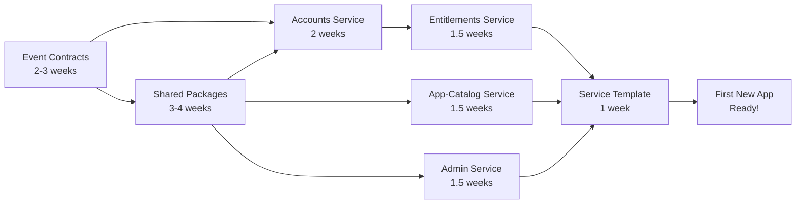

# Platform Readiness Analysis: DDD & Microservices Framework Assessment

**Date:** December 16, 2025
**Analyst:** DDD & Microservices Architecture Expert
**Scope:** Platform readiness for future application development
**Repository:** tomriddelsdell.com

---

## Executive Summary

### Overall Assessment: **Foundation Strong, Implementation Gap Critical**

The platform demonstrates **excellent architectural design** with comprehensive ADRs, well-documented principles, and a clear DDD/Event Sourcing strategy. However, there is a **significant implementation gap** preventing it from being immediately useful for new application development.

**Key Findings:**

- ✅ **Architecture Design**: 29 comprehensive ADRs covering all aspects (95% complete)
- ✅ **Infrastructure**: Solid observability, CI/CD, and deployment framework operational
- ✅ **Landing Page**: Successfully deployed reference implementation
- ⚠️ **Shared Services**: 0% implementation (all placeholder directories)
- ⚠️ **Domain Services**: 0% implementation (no actual service code)
- ⚠️ **Event Contracts**: Missing schema definitions and code generation
- ⚠️ **Shared Packages**: Observability only, missing domain/infra utilities
- ❌ **Developer Experience**: No service templates, scaffolding, or starter kits

**Severity:** **BLOCKING** - Cannot build new apps without implementing core services and shared infrastructure

**Priority Recommendation:** Focus on **Phase 1: Core Service Implementation** (4-6 weeks) to unblock application development

---

## Table of Contents

1. [Strengths: What's Working Well](#strengths-whats-working-well)
2. [Critical Gaps: Blocking Issues](#critical-gaps-blocking-issues)
3. [Strategic Gaps: Future Concerns](#strategic-gaps-future-concerns)
4. [Tactical Gaps: Developer Experience](#tactical-gaps-developer-experience)
5. [Infrastructure Gaps: Operations](#infrastructure-gaps-operations)
6. [Recommendations by Priority](#recommendations-by-priority)
7. [Implementation Roadmap](#implementation-roadmap)

---

## 1. Strengths: What's Working Well

### 1.1 Architectural Documentation ⭐⭐⭐⭐⭐

**Exceptional Quality - Best in Class**

- **29 comprehensive ADRs** covering all architectural concerns
- Clear relationships between ADRs documented
- Implementation status tracking in place
- Architecture diagrams and flow examples
- Ubiquitous language principles established

**Evidence:**
- `docs/decisions/` - 29 well-structured ADRs
- `docs/architecture.md` - Comprehensive overview
- ADR-relationships.md showing clear dependencies

**Impact:** Provides strong foundation for consistent implementation

### 1.2 Observability Framework ⭐⭐⭐⭐⭐

**Production-Ready Implementation**

- ✅ OpenTelemetry SDK integrated
- ✅ Platform-agnostic ACL pattern (`@platform/shared-infra/observability`)
- ✅ Grafana Cloud integration operational
- ✅ Landing page fully instrumented
- ✅ Domain-friendly API (no vendor lock-in)
- ✅ Multiple runtime support (Node.js, Edge)

**Evidence:**
- `packages/shared-infra/src/observability/` - Complete implementation
- Landing page using observability package successfully
- ADR-028 compliance: 95%+

**Impact:** Future apps can immediately adopt observability patterns

### 1.3 CI/CD Pipeline ⭐⭐⭐⭐

**Operational with Recent Fixes**

- ✅ GitHub Actions workflows for deployment
- ✅ Security scanning (CodeQL, Dependency checks, Terraform)
- ✅ Automated deployment to Cloudflare (staging + production)
- ✅ Doppler secrets management integrated
- ✅ Lighthouse performance testing
- ✅ Recently fixed: All workflows passing as of Dec 16, 2025

**Evidence:**
- `.github/workflows/` - Comprehensive workflow definitions
- Recent fix documented in `changes/2025-12-16-cicd-pipeline-remediation-plan.md`

**Impact:** New apps can leverage existing deployment patterns

### 1.4 Independent App Deployment Pattern ⭐⭐⭐⭐⭐

**True DDD Bounded Context Independence**

- ✅ Apps have own `package.json` and `pnpm-lock.yaml`
- ✅ No workspace dependencies or coupling
- ✅ Apps can use different framework versions
- ✅ Standalone build and deployment
- ✅ Clear bounded context boundaries

**Evidence:**
- `apps/landing-page/` - Fully independent deployment
- ADR-029: Independent App Deployment Architecture
- Root workspace file used ONLY for CI coordination

**Impact:** Apps truly isolated - optimal for DDD microservices

### 1.5 Infrastructure as Code ⭐⭐⭐⭐

**Terraform Foundation Established**

- ✅ Terraform modules for Cloudflare, Doppler, GitHub, Neon
- ✅ Multi-environment support (dev, staging, production)
- ✅ Secrets management via Doppler
- ✅ Reproducible infrastructure

**Evidence:**
- `infra/terraform/` - Complete module structure
- Provider configurations for all platforms

**Impact:** Infrastructure reproducible and portable

---

## 2. Critical Gaps: Blocking Issues

### 2.1 **CRITICAL**: No Implemented Domain Services ⛔

**Severity:** BLOCKING
**Impact:** Cannot build new applications without core services
**Effort to Fix:** 6-8 weeks

**Problem:**

All domain services are **placeholder directories** with no implementation:

```
services/
├── accounts/        # README.md only - no code
├── admin/           # README.md only - no code
├── app-catalog/     # README.md only - no code
└── entitlements/    # README.md only - no code
```

**Evidence:**
- Found 0 TypeScript/JavaScript files in `/services` (excluding node_modules)
- Each service has only a domain/README.md placeholder

**What's Missing:**

1. **No Domain Logic**
   - No aggregates (User, Project, Contact)
   - No domain events
   - No command handlers
   - No value objects
   - No domain services

2. **No Application Layer**
   - No use cases/commands
   - No query handlers
   - No DTOs or request/response models
   - No validation logic

3. **No Infrastructure**
   - No event store adapters
   - No repository implementations
   - No API controllers/routes
   - No message bus integration

4. **No Tests**
   - No unit tests
   - No integration tests
   - No contract tests

**Consequence:**

New applications **cannot**:
- Authenticate users (no accounts service)
- Check entitlements (no entitlements service)
- Query project catalog (no app-catalog service)
- Send notifications (no admin/notification service)

**Recommendation:**

**Phase 1A: Core Service Implementation (6-8 weeks)**

Priority order:
1. Accounts Service (2 weeks) - Authentication foundation
2. Entitlements Service (1.5 weeks) - Authorization foundation
3. App-Catalog Service (1.5 weeks) - Project management
4. Admin Service (1.5 weeks) - Contact/notification handling

### 2.2 **CRITICAL**: Missing Event Contracts & Code Generation ⛔

**Severity:** BLOCKING
**Impact:** Cannot implement event sourcing without schemas
**Effort to Fix:** 2-3 weeks

**Problem:**

The `contracts/` directory structure exists but contains **no schema definitions**:

```
contracts/
├── api/      # Empty (placeholder directory)
├── events/   # Empty (placeholder directory)
└── ui/       # Empty (placeholder directory)
```

**What's Missing:**

1. **No Avro Schemas**
   - No event schemas (UserRegistered, ProjectCreated, etc.)
   - No versioning metadata
   - No schema registry

2. **No OpenAPI Definitions**
   - No REST API contracts
   - No GraphQL schemas
   - No request/response models

3. **No Code Generation**
   - No TypeScript types generated from schemas
   - No validation code
   - No client SDKs

4. **No Schema Validation**
   - No CI/CD schema linting
   - No breaking change detection
   - No compatibility checks

**Architecture Impact:**

Per ADR-007 (Event Versioning) and ADR-023 (Contract Management), the platform relies on:
- Schema-first development
- Generated TypeScript types from Avro
- Contract-driven integration testing

**Consequence:**

Cannot implement:
- Event sourcing with versioned events
- Type-safe event handling
- Contract testing between services
- Schema evolution

**Recommendation:**

**Phase 1B: Event Contracts Foundation (2-3 weeks)**

1. Define core event schemas (Avro):
   - `user.events.avsc` - User lifecycle events
   - `project.events.avsc` - Project management events
   - `entitlement.events.avsc` - Access control events
   - `contact.events.avsc` - Contact form events

2. Set up code generation pipeline:
   - Avro → TypeScript code generation
   - npm script for code generation
   - CI validation of schema changes

3. Create API contracts:
   - OpenAPI for REST commands
   - GraphQL schema for queries

4. Implement schema validation in CI/CD

### 2.3 **HIGH**: Incomplete Shared Infrastructure Packages ⚠️

**Severity:** HIGH
**Impact:** Difficult onboarding, duplicated code across services
**Effort to Fix:** 3-4 weeks

**Problem:**

Only observability package is implemented. Other shared packages are placeholders:

```
packages/
├── observability/         ✅ Implemented (~95%)
├── observability-edge/    ✅ Implemented (~95%)
├── shared-infra/          ⚠️  Only observability submodule
├── shared-domain/         ❌ Placeholder
├── event-contracts/       ❌ Empty (needs generated code)
└── testing-utils/         ❌ Placeholder
```

**What's Missing:**

1. **`@platform/shared-domain`**
   - Common value objects (Email, UserId, ProjectId)
   - Shared domain primitives
   - Ubiquitous language types
   - DDD building blocks (Entity, ValueObject, AggregateRoot base classes)

2. **`@platform/shared-infra`** (partially implemented)
   - Event store adapter interface + implementations
   - Message bus adapter (Kafka, SNS, in-memory)
   - Repository base classes
   - Outbox pattern implementation
   - CQRS infrastructure (command bus, query bus)

3. **`@platform/testing-utils`**
   - Test fixtures for aggregates
   - Mock event store
   - Mock message bus
   - Test data builders
   - Event sourcing test helpers

4. **`@platform/event-contracts`**
   - Generated TypeScript from Avro schemas
   - Event envelope utilities
   - Serialization/deserialization

**Consequence:**

New services must:
- Reimplement common domain primitives (DRY violation)
- Write their own event store adapters (inconsistent)
- Create their own test utilities (slow onboarding)
- Manually manage event types (error-prone)

**Recommendation:**

**Phase 1C: Shared Package Implementation (3-4 weeks)**

Priority order:
1. `shared-domain` (1 week) - Foundation for all services
2. `shared-infra` (1.5 weeks) - Event store, message bus, outbox
3. `event-contracts` (1 week) - Generated from schemas
4. `testing-utils` (0.5 week) - Accelerate service development

### 2.4 **HIGH**: No Service Template or Scaffolding ⚠️

**Severity:** HIGH
**Impact:** Slow new service development, inconsistent structure
**Effort to Fix:** 1-2 weeks

**Problem:**

No templates or scaffolding tools for creating new services/apps.

**What's Missing:**

1. **Service Template**
   - Clean architecture folder structure
   - Pre-configured TypeScript, ESLint, Jest
   - Example aggregate, command, event, projection
   - Docker/Kubernetes manifests
   - CI/CD workflow templates

2. **Scaffolding CLI**
   - Command to create new service: `pnpm create:service <name>`
   - Command to create new app: `pnpm create:app <name>`
   - Generate aggregate/entity boilerplate
   - Generate CRUD operations

3. **Documentation Templates**
   - README.md template for services
   - ADR template for service-specific decisions
   - API documentation template

**Consequence:**

- Developers must figure out folder structure from scratch
- Risk of inconsistent architecture patterns
- Slower onboarding (no reference implementation)
- Duplication of boilerplate across services

**Recommendation:**

**Phase 2A: Developer Experience - Scaffolding (1-2 weeks)**

1. Create service template in `templates/service-template/`
2. Create app template in `templates/app-template/`
3. Implement scaffolding scripts:
   - `scripts/create-service.sh`
   - `scripts/create-app.sh`
4. Document templating in `docs/developer-guide/scaffolding.md`

---

## 3. Strategic Gaps: Future Concerns

### 3.1 Event Sourcing Operational Concerns ⚠️

**Severity:** MEDIUM
**Impact:** Production operational challenges
**Effort to Fix:** Ongoing

**Gaps:**

1. **Snapshot Strategy (ADR-008)**
   - Status: Not implemented
   - Impact: Large aggregates will have slow rehydration
   - Recommendation: Implement snapshot infrastructure before production

2. **Replay Strategy (ADR-009)**
   - Status: Not implemented
   - Impact: Cannot rebuild projections from events
   - Recommendation: Implement replay tooling before needing projection fixes

3. **Projection Monitoring**
   - Status: Observability exists, but no projection-specific metrics
   - Impact: Cannot detect projection lag or failures
   - Recommendation: Add projection health checks to observability package

**Recommendation:**

**Phase 3: Event Sourcing Maturity (3-4 weeks)**

1. Implement snapshot framework (1.5 weeks)
2. Create replay tooling (1 week)
3. Add projection lag metrics (0.5 week)
4. Document operational runbooks (1 week)

### 3.2 Missing Ubiquitous Language Documentation 📚

**Severity:** MEDIUM
**Impact:** Language drift across services, communication gaps
**Effort to Fix:** 1 week (initial), ongoing maintenance

**Problem:**

No centralized glossary of domain terms despite architecture.md recommending it:

> "Maintain a repository-level `docs/glossary.md` with canonical terms (aggregate names, event names, command names)."

**What's Missing:**

1. **`docs/glossary.md`** - Canonical domain term definitions
2. **`docs/conventions.md`** - Naming conventions, patterns
3. **Service-specific glossaries** - Bounded context terms

**Consequence:**

- Developers may use inconsistent terminology
- Events named differently across services
- Confusion between bounded contexts
- Harder to maintain ubiquitous language

**Recommendation:**

**Phase 2B: Ubiquitous Language Foundation (1 week)**

1. Create `docs/glossary.md` with initial terms:
   - Aggregates (User, Project, Contact, Entitlement)
   - Value Objects (Email, UserId, ProjectId, ContactId)
   - Domain Events (list all event types)
   - Commands (list all command types)

2. Create `docs/conventions.md`:
   - Event naming: `{Aggregate}{Action}` (e.g., UserRegistered)
   - Command naming: `{Action}{Aggregate}` (e.g., RegisterUser)
   - ID naming: `{Entity}Id` (e.g., UserId)
   - Repository naming: `{Aggregate}Repository`

3. Add glossary section to each service README

### 3.3 GraphQL Not Implemented ⚠️

**Severity:** MEDIUM
**Impact:** Query patterns more difficult, not following ADR
**Effort to Fix:** 2-3 weeks

**Problem:**

ADR-020 (API Design Standards) specifies:
- REST for commands (POST/PUT/DELETE)
- **GraphQL for queries** (GET operations)

Current state:
- ✅ Landing page has basic Next.js API routes
- ❌ No GraphQL server
- ❌ No GraphQL schema
- ❌ No resolvers

**What's Missing:**

1. **GraphQL Infrastructure**
   - GraphQL server (Apollo Server / GraphQL Yoga)
   - Schema definition
   - Type system integration with TypeScript
   - Federation (if using multiple services)

2. **Query Resolvers**
   - User profile queries
   - Project catalog queries
   - Entitlement checks
   - Contact history queries

3. **Developer Tooling**
   - GraphQL playground/sandbox
   - Schema introspection
   - Code generation from schema

**Consequence:**

- Cannot implement read-optimized queries per ADR
- Services fall back to REST for everything (not CQRS-friendly)
- Harder to optimize query performance (N+1 problems)

**Recommendation:**

**Phase 4: GraphQL Implementation (2-3 weeks)**

1. Set up GraphQL server infrastructure
2. Define schema from read models
3. Implement resolvers for core queries
4. Add to service template
5. Document in developer guide

### 3.4 No Authentication Service Implementation ⛔

**Severity:** CRITICAL
**Impact:** Apps cannot authenticate users
**Effort to Fix:** 2-3 weeks

**Problem:**

ADR-003 (Authentication Strategy) specifies AWS Cognito with OAuth 2.0 + OIDC, but:

- ❌ No Accounts service implementation
- ❌ No token validation middleware
- ❌ No user session management
- ❌ No JWKS endpoint integration
- ❌ No refresh token handling

**What's Missing:**

1. **Accounts Service Core**
   - User aggregate (registration, profile updates)
   - UserRegistered, UserUpdated events
   - Integration with AWS Cognito
   - Token validation utilities

2. **Authentication Middleware**
   - JWT validation middleware for Cloudflare Workers
   - Token refresh logic
   - User context injection
   - RBAC enforcement (via entitlements)

3. **Developer SDK**
   - `@platform/auth` package
   - Easy-to-use auth hooks for Next.js apps
   - Token management utilities

**Consequence:**

New apps cannot:
- Register or authenticate users
- Protect routes with authentication
- Access user context in services
- Implement authorization

**Recommendation:**

**Phase 1A.1: Accounts Service (2 weeks) - HIGHEST PRIORITY**

1. Implement User aggregate with event sourcing
2. Create AWS Cognito integration adapter
3. Build JWT validation middleware
4. Create `@platform/auth` package
5. Document authentication patterns

---

## 4. Tactical Gaps: Developer Experience

### 4.1 No Developer Documentation 📚

**Severity:** MEDIUM
**Impact:** Slow onboarding, duplicated questions
**Effort to Fix:** 2-3 weeks (initial)

**What's Missing:**

1. **Getting Started Guide**
   - Prerequisites and setup
   - First service tutorial
   - First app tutorial
   - Common workflows

2. **Architecture Guide**
   - DDD patterns in practice
   - Event sourcing examples
   - CQRS implementation guide
   - Clean architecture layers

3. **API Reference**
   - Shared package APIs
   - Event catalog
   - Command catalog
   - Query catalog

4. **Operations Guide**
   - Deployment procedures
   - Monitoring and alerts
   - Troubleshooting
   - Incident response

**Recommendation:**

**Phase 2C: Developer Documentation (2-3 weeks)**

Create in `docs/developer-guide/`:
1. `01-getting-started.md`
2. `02-creating-a-service.md`
3. `03-creating-an-app.md`
4. `04-event-sourcing-patterns.md`
5. `05-testing-guide.md`
6. `06-deployment-guide.md`
7. `07-troubleshooting.md`

### 4.2 No Example Reference Service 📝

**Severity:** MEDIUM
**Impact:** Developers lack concrete examples
**Effort to Fix:** 2-3 weeks

**Problem:**

No fully implemented reference service demonstrating best practices.

**What's Missing:**

1. Complete reference service showing:
   - Proper hexagonal architecture
   - Event sourcing with aggregates
   - CQRS with projections
   - Message bus integration
   - Complete test coverage
   - Full observability instrumentation

2. Reference app showing:
   - Authentication integration
   - Authorization checks
   - GraphQL queries
   - REST commands
   - Error handling
   - State management

**Recommendation:**

**Phase 2D: Reference Implementation (2-3 weeks)**

Create `examples/todo-service/` and `examples/todo-app/`:
- Full DDD/Event Sourcing implementation
- 100% test coverage
- Complete documentation
- Can be copied as starting point

### 4.3 Missing Local Development Experience 🛠️

**Severity:** MEDIUM
**Impact:** Difficult to develop and test services locally
**Effort to Fix:** 1-2 weeks

**Problem:**

No local development setup for running full stack:

**What's Missing:**

1. **Docker Compose for Local Stack**
   - Postgres (Neon equivalent)
   - Kafka (or Redpanda)
   - Jaeger for tracing
   - Grafana for observability

2. **Service Mocking**
   - Mock accounts service
   - Mock entitlements service
   - Mock message bus

3. **Development Seeds**
   - Test users
   - Test projects
   - Test events

4. **Hot Reload Configuration**
   - Watch mode for services
   - Hot reload for apps

**Recommendation:**

**Phase 2E: Local Development Setup (1-2 weeks)**

1. Create `docker-compose.dev.yml` with:
   - Postgres
   - Redpanda (Kafka)
   - Jaeger
   - Grafana

2. Create seed data scripts
3. Add development mode to all services
4. Document in `docs/developer-guide/local-development.md`

---

## 5. Infrastructure Gaps: Operations

### 5.1 No Production Monitoring Dashboards 📊

**Severity:** MEDIUM
**Impact:** Limited production visibility
**Effort to Fix:** 1-2 weeks

**Problem:**

Observability infrastructure exists, but no pre-built dashboards.

**What's Missing:**

1. **Grafana Dashboards**
   - Event Sourcing Health (per ADR-028)
   - CQRS Projections
   - Service Health
   - Infrastructure Overview

2. **Alert Rules**
   - Projection lag > 5 minutes
   - Event processing errors
   - High latency
   - Service down

3. **SLO Tracking**
   - Availability targets
   - Latency targets
   - Error rate targets

**Recommendation:**

**Phase 3B: Production Monitoring (1-2 weeks)**

1. Create Grafana dashboard templates in `infra/grafana-dashboards/`
2. Configure alert rules in `infra/grafana-alerts/`
3. Define SLOs in `docs/operations/slos.md`
4. Document in operational runbooks

### 5.2 No Database Migration Strategy Implemented ⚠️

**Severity:** MEDIUM
**Impact:** Cannot evolve database schema safely
**Effort to Fix:** 1 week

**Problem:**

ADR-026 (Database Migration Strategy) exists but not implemented.

**What's Missing:**

1. **Migration Tooling**
   - Flyway or Liquibase integration
   - Migration scripts version control
   - Rollback procedures

2. **Event Store Schema Management**
   - Event table migrations
   - Projection table migrations
   - Schema versioning

3. **CI/CD Integration**
   - Automated migration on deploy
   - Migration testing
   - Backward compatibility checks

**Recommendation:**

**Phase 3C: Database Migrations (1 week)**

1. Choose and configure migration tool (Flyway recommended)
2. Create initial migration scripts
3. Add to CI/CD pipeline
4. Document in `docs/operations/database-migrations.md`

### 5.3 No Disaster Recovery Plan 🚨

**Severity:** MEDIUM
**Impact:** Risk of data loss in production
**Effort to Fix:** 1-2 weeks

**Problem:**

No documented or tested disaster recovery procedures.

**What's Missing:**

1. **Backup Strategy**
   - Event store backups
   - Projection backups
   - Backup retention policy
   - Backup testing

2. **Recovery Procedures**
   - Event store recovery
   - Projection rebuild from events
   - Service restoration order
   - Data loss scenarios

3. **Testing**
   - Regular DR drills
   - Recovery time objective (RTO) measurement
   - Recovery point objective (RPO) measurement

**Recommendation:**

**Phase 4B: Disaster Recovery (1-2 weeks)**

1. Implement automated backups (Neon has built-in)
2. Document recovery procedures
3. Create runbooks for common scenarios
4. Schedule quarterly DR drills

---

## 6. Recommendations by Priority

### 🚨 **P0 - CRITICAL (Must Do Before Any New Apps)**

**Timeline: 8-10 weeks**

#### 1. Implement Core Domain Services (6-8 weeks)

**Blocking Issue:** No services = no functionality for apps

**Tasks:**
1. **Accounts Service** (2 weeks)
   - User aggregate with event sourcing
   - AWS Cognito integration
   - JWT validation middleware
   - `@platform/auth` package

2. **Entitlements Service** (1.5 weeks)
   - Entitlement aggregate
   - RBAC projection
   - Permission checking API

3. **App-Catalog Service** (1.5 weeks)
   - Project aggregate
   - Catalog projection
   - Query API

4. **Admin Service** (1.5 weeks)
   - Contact aggregate
   - Notification integration
   - Admin API

**Owner:** Platform Team
**Dependencies:** Shared packages (can develop in parallel)

#### 2. Event Contracts Foundation (2-3 weeks)

**Blocking Issue:** Cannot implement event sourcing without schemas

**Tasks:**
1. Define Avro schemas for core events (1 week)
2. Set up code generation pipeline (0.5 week)
3. Create OpenAPI contracts (0.5 week)
4. CI/CD schema validation (0.5 week)

**Owner:** Platform Team
**Dependencies:** None (can start immediately)

### 🔴 **P1 - HIGH (Need Before Production)**

**Timeline: 4-5 weeks**

#### 3. Complete Shared Infrastructure (3-4 weeks)

**High Priority:** DRY principle, consistent patterns

**Tasks:**
1. `@platform/shared-domain` (1 week)
2. `@platform/shared-infra` - event store, message bus (1.5 weeks)
3. `@platform/testing-utils` (0.5 week)
4. `@platform/event-contracts` (generated, 0.5 week)

**Owner:** Platform Team
**Dependencies:** Event contracts

#### 4. Service Template & Scaffolding (1-2 weeks)

**High Priority:** Accelerate new service development

**Tasks:**
1. Create service template
2. Create scaffolding CLI
3. Document usage

**Owner:** DevEx Team
**Dependencies:** At least one service implemented

### 🟡 **P2 - MEDIUM (Improve Developer Experience)**

**Timeline:** 5-7 weeks

#### 5. Developer Documentation (2-3 weeks)

**Tasks:**
1. Getting started guide
2. Service creation tutorial
3. App creation tutorial
4. Architecture patterns guide
5. Testing guide
6. Operations guide

**Owner:** Documentation Team
**Dependencies:** Reference implementations

#### 6. Reference Service & App (2-3 weeks)

**Tasks:**
1. Implement complete example service
2. Implement complete example app
3. 100% test coverage
4. Full documentation

**Owner:** Platform Team

#### 7. Local Development Setup (1-2 weeks)

**Tasks:**
1. Docker Compose for local stack
2. Seed data scripts
3. Hot reload configuration
4. Documentation

**Owner:** DevEx Team

### 🟢 **P3 - LOW (Operational Maturity)**

**Timeline:** 4-5 weeks

#### 8. Event Sourcing Maturity (3-4 weeks)

**Tasks:**
1. Snapshot framework
2. Replay tooling
3. Projection monitoring
4. Operational runbooks

**Owner:** Platform Team

#### 9. Production Monitoring (1-2 weeks)

**Tasks:**
1. Grafana dashboards
2. Alert rules
3. SLO definitions
4. On-call setup

**Owner:** DevOps Team

#### 10. Database Migrations (1 week)

**Tasks:**
1. Migration tooling setup
2. Initial migration scripts
3. CI/CD integration
4. Documentation

**Owner:** DevOps Team

---

## 7. Implementation Roadmap

### Phase 1: Core Platform (8-10 weeks) - **BLOCKING**

**Goal:** Minimum viable platform for new app development

**Deliverables:**
- ✅ Accounts service operational
- ✅ Entitlements service operational
- ✅ App-Catalog service operational
- ✅ Admin service operational
- ✅ Event contracts defined and generated
- ✅ Shared packages complete
- ✅ Service template available

**Success Criteria:**
- New app can authenticate users
- New app can check user permissions
- New app can query project catalog
- New app can send contact forms
- Developer can scaffold new service in < 5 minutes

**Resources:** 2-3 developers, full-time

### Phase 2: Developer Experience (5-7 weeks) - **HIGH**

**Goal:** Smooth onboarding and rapid development

**Deliverables:**
- ✅ Comprehensive developer documentation
- ✅ Reference service and app
- ✅ Local development setup
- ✅ Ubiquitous language glossary
- ✅ Scaffolding CLI tools

**Success Criteria:**
- New developer productive in < 1 day
- Can create new service from template in < 30 minutes
- Can run full stack locally
- Reference implementations demonstrate all patterns

**Resources:** 1-2 developers + 1 technical writer

### Phase 3: Production Readiness (4-5 weeks) - **MEDIUM**

**Goal:** Operational maturity for production workloads

**Deliverables:**
- ✅ Snapshot and replay infrastructure
- ✅ Production monitoring dashboards
- ✅ Database migration tooling
- ✅ Disaster recovery procedures
- ✅ Operational runbooks

**Success Criteria:**
- Can recover from any failure scenario
- Projection lag monitored and alerted
- Database schema evolution safe
- Clear escalation procedures

**Resources:** 1-2 DevOps + 1 developer

### Phase 4: Advanced Features (3-4 weeks) - **OPTIONAL**

**Goal:** Enhanced capabilities

**Deliverables:**
- ✅ GraphQL implementation
- ✅ Advanced monitoring
- ✅ Performance optimization
- ✅ Multi-region support (if needed)

**Success Criteria:**
- GraphQL queries performant
- 99.9% uptime
- <100ms p95 latency

**Resources:** 1-2 developers

---

## Summary: Gap Analysis Matrix

| Area | Status | Priority | Effort | Blocks New Apps? |
|------|--------|----------|--------|------------------|
| **Architecture Documentation** | ✅ Excellent | - | - | No |
| **Observability Framework** | ✅ Complete | - | - | No |
| **CI/CD Pipeline** | ✅ Operational | - | - | No |
| **Independent App Pattern** | ✅ Proven | - | - | No |
| **Infrastructure as Code** | ✅ Ready | - | - | No |
| **Domain Services** | ⛔ None | P0 | 6-8w | **YES** |
| **Event Contracts** | ⛔ Missing | P0 | 2-3w | **YES** |
| **Shared Packages** | ⚠️ Partial | P1 | 3-4w | **YES** |
| **Service Templates** | ❌ None | P1 | 1-2w | Partially |
| **Authentication** | ⛔ None | P0 | 2w | **YES** |
| **Developer Docs** | ❌ Minimal | P2 | 2-3w | No |
| **Reference Implementation** | ❌ None | P2 | 2-3w | No |
| **Local Dev Setup** | ❌ None | P2 | 1-2w | No |
| **GraphQL** | ❌ None | P2 | 2-3w | No |
| **Production Monitoring** | ⚠️ Basic | P3 | 1-2w | No |
| **Database Migrations** | ❌ None | P3 | 1w | No |
| **Disaster Recovery** | ❌ None | P3 | 1-2w | No |

**BLOCKING ITEMS: 3**
**HIGH PRIORITY: 2**
**MEDIUM PRIORITY: 5**
**LOW PRIORITY: 3**

---

## Critical Path to First New App

**Minimum Requirements (8-10 weeks):**



**Parallel Tracks:**
- Event Contracts (Week 1-3)
- Shared Packages (Week 2-5)
- Services (Week 4-10)
- Template (Week 9-10)

---

## Conclusion

### The Good News ✅

1. **Architectural foundation is excellent** - Well-thought-out ADRs covering all concerns
2. **Observability is production-ready** - Can be adopted immediately by new apps
3. **CI/CD is operational** - Deployment patterns established and working
4. **Independence pattern validated** - Landing page proves the architecture works

### The Challenge ⚠️

**The platform is currently 90% design, 10% implementation.**

While the architecture is sound, there is essentially **no working platform** for new applications to build upon. Every new app would need to:
- Implement its own authentication
- Implement its own authorization
- Implement its own event sourcing infrastructure
- Implement its own message bus integration
- Write everything from scratch

This defeats the purpose of a platform.

### The Path Forward 🛤️

**Focus on Phase 1 (8-10 weeks)** to unblock application development:

1. **Week 1-3:** Event contracts and schemas
2. **Week 2-5:** Shared packages (domain, infrastructure, testing)
3. **Week 4-6:** Accounts service (authentication)
4. **Week 6-7:** Entitlements service (authorization)
5. **Week 7-8:** App-Catalog service
6. **Week 8-9:** Admin service
7. **Week 9-10:** Service template and documentation

**After Phase 1:**
- New apps can authenticate and authorize users
- New apps can leverage shared infrastructure
- New services can be scaffolded rapidly
- Platform provides real value

### Estimated Total Effort

| Phase | Duration | Team Size | Total Person-Weeks |
|-------|----------|-----------|-------------------|
| Phase 1: Core Platform | 8-10 weeks | 2-3 developers | 16-30 weeks |
| Phase 2: Developer Experience | 5-7 weeks | 1-2 developers | 5-14 weeks |
| Phase 3: Production Readiness | 4-5 weeks | 1-2 DevOps | 4-10 weeks |
| **Total** | **17-22 weeks** | **2-3 people** | **25-54 person-weeks** |

**Recommendation:** Start with Phase 1 using 2-3 developers working full-time. This is the critical path to making the platform useful.

---

**Report Prepared By:** DDD & Microservices Architecture Expert
**Date:** December 16, 2025
**Next Review:** After Phase 1 completion (Q1 2026)
