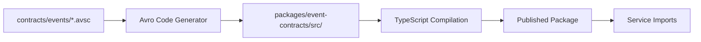

# Event Contracts Package

This package contains generated TypeScript types, validation utilities, and runtime support for domain events. It is automatically generated from Avro schemas defined in `/contracts/events` and provides type-safe event handling across all services.

## ⚠️ **GENERATED CODE - DO NOT EDIT MANUALLY**

**This package is automatically generated from Avro schemas. All changes must be made to the source schemas in `/contracts/events/`, not to the generated code in this package.**

## Purpose

**Type-Safe Event Handling**: Provides TypeScript interfaces, validation functions, and serialization utilities generated from Avro schemas to ensure type safety and contract compliance across all services.

## Generation Process



## Package Structure

```
src/                           # Generated source code
├── accounts/                  # Account-related events
│   ├── UserRegistered.ts          # UserRegistered event interface
│   ├── UserRegisteredV1_0_0.ts    # Version-specific type
│   ├── UserRegisteredValidator.ts # Runtime validation
│   ├── UserProfileUpdated.ts      # Profile update event
│   └── index.ts                   # Barrel export
├── projects/                  # Project-related events
│   ├── ProjectCreated.ts          # Project creation event
│   ├── ProjectCreatedValidator.ts # Runtime validation
│   ├── ProjectVisibilityChanged.ts # Visibility change event
│   └── index.ts                   # Barrel export
├── contact/                   # Contact-related events
│   ├── ContactRequestSubmitted.ts # Contact request event
│   ├── ContactRequestValidator.ts # Runtime validation
│   └── index.ts                   # Barrel export
├── registry/                  # Schema management utilities
│   ├── EventSchemaRegistry.ts     # Central schema registry
│   ├── EventFactory.ts            # Type-safe event creation
│   ├── EventValidator.ts          # Runtime validation engine
│   └── SchemaVersionManager.ts    # Version management
├── serialization/             # Event serialization
│   ├── AvroSerializer.ts          # Avro binary serialization
│   ├── JsonSerializer.ts          # JSON serialization
│   └── SerializationUtils.ts      # Utility functions
└── index.ts                   # Main package exports
```

## Generated Content Types

### 🎯 **TypeScript Interfaces**

Type-safe interfaces for each event:

```typescript
// Generated from UserRegistered.v1.0.0.avsc
export interface UserRegistered {
  eventId: string;
  aggregateId: string;
  aggregateVersion: number;
  occurredAt: Date;
  causedBy: string;
  userData: {
    userId: string;
    email: string;
    profile: UserProfile;
  };
}

export interface UserProfile {
  displayName: string;
  preferences?: UserPreferences;
}
```

### 🔍 **Runtime Validators**

Generated validation functions for type checking:

```typescript
// Generated validator for UserRegistered
export class UserRegisteredValidator {
  static validate(data: unknown): data is UserRegistered {
    // Generated validation logic based on Avro schema
    return this.schema.isValid(data);
  }

  static validateOrThrow(data: unknown): UserRegistered {
    if (!this.validate(data)) {
      throw new EventValidationError('Invalid UserRegistered event structure');
    }
    return data;
  }
}
```

### 🏭 **Event Factories**

Type-safe event creation with auto-generated fields:

```typescript
// Generated factory for UserRegistered
export class UserRegisteredFactory {
  static create(data: UserRegisteredData): UserRegistered {
    return {
      eventId: crypto.randomUUID(),
      aggregateId: data.userId,
      aggregateVersion: data.version,
      occurredAt: new Date(),
      causedBy: data.causedBy,
      userData: data.userData,
    };
  }

  static createAndValidate(data: UserRegisteredData): UserRegistered {
    const event = this.create(data);
    return UserRegisteredValidator.validateOrThrow(event);
  }
}
```

### 📊 **Schema Registry**

Centralized schema management and validation:

```typescript
// Generated schema registry
export class EventSchemaRegistry {
  private static schemas = new Map<string, AvroSchema>([
    ['UserRegistered', UserRegisteredSchema],
    ['ProjectCreated', ProjectCreatedSchema],
    ['ContactRequestSubmitted', ContactRequestSubmittedSchema],
  ]);

  static getSchema(eventType: string): AvroSchema | undefined {
    return this.schemas.get(eventType);
  }

  static validate(eventType: string, data: unknown): boolean {
    const schema = this.getSchema(eventType);
    return schema ? schema.isValid(data) : false;
  }
}
```

## Usage in Services

### Basic Event Creation

```typescript
import {
  UserRegistered,
  UserRegisteredFactory,
} from '@portfolio/event-contracts';

// In a service command handler
export class UserRegistrationHandler {
  async handle(command: RegisterUserCommand): Promise<void> {
    // Create type-safe event
    const event = UserRegisteredFactory.create({
      userId: command.userId,
      version: 1,
      causedBy: command.requesterId,
      userData: {
        userId: command.userId,
        email: command.email,
        profile: {
          displayName: command.displayName,
        },
      },
    });

    // Event is fully typed and validated
    await this.eventStore.append(command.userId, [event]);
  }
}
```

### Event Consumption with Validation

```typescript
import {
  UserRegistered,
  UserRegisteredValidator,
  ProjectCreated,
  ProjectCreatedValidator,
} from '@portfolio/event-contracts';

// In an event handler
export class ProjectionUpdater {
  async handleUserRegistered(rawEvent: unknown): Promise<void> {
    // Runtime validation with type narrowing
    if (!UserRegisteredValidator.validate(rawEvent)) {
      throw new Error('Invalid UserRegistered event structure');
    }

    // rawEvent is now typed as UserRegistered
    await this.updateUserProjection(rawEvent);
  }

  async handleProjectCreated(rawEvent: unknown): Promise<void> {
    const event = ProjectCreatedValidator.validateOrThrow(rawEvent);
    await this.updateProjectProjection(event);
  }
}
```

### Schema Registry Integration

```typescript
import { EventSchemaRegistry } from '@portfolio/event-contracts';

export class EventStore {
  async append(streamId: string, events: DomainEvent[]): Promise<void> {
    // Validate all events before persisting
    for (const event of events) {
      if (!EventSchemaRegistry.validate(event.eventType, event)) {
        throw new EventValidationError(
          `Event ${event.eventType} failed schema validation`
        );
      }
    }

    // Safe to persist - all events are valid
    await this.persistEvents(streamId, events);
  }
}
```

## Serialization Support

### JSON Serialization (Default)

```typescript
import { JsonSerializer } from '@portfolio/event-contracts';

const event = UserRegisteredFactory.create(userData);

// Serialize for event store
const jsonString = JsonSerializer.serialize(event);

// Deserialize from event store
const deserializedEvent = JsonSerializer.deserialize<UserRegistered>(
  jsonString,
  'UserRegistered'
);
```

### Avro Binary Serialization (Performance)

```typescript
import { AvroSerializer } from '@portfolio/event-contracts';

// Binary serialization for high-performance scenarios
const binaryData = AvroSerializer.serialize(event, 'UserRegistered');
const deserializedEvent = AvroSerializer.deserialize<UserRegistered>(
  binaryData,
  'UserRegistered'
);
```

## Version Management

### Event Version Evolution

```typescript
// Support for multiple event versions
import {
  UserRegisteredV1_0_0,
  UserRegisteredV1_1_0,
  EventVersionManager,
} from '@portfolio/event-contracts';

export class EventUpcaster {
  upcastUserRegistered(event: UserRegisteredV1_0_0): UserRegisteredV1_1_0 {
    // Generated upcasting based on schema evolution
    return EventVersionManager.upcast(event, '1.0.0', '1.1.0');
  }
}
```

### Schema Compatibility

```typescript
import { SchemaCompatibility } from '@portfolio/event-contracts';

// Check if event can be processed by consumer
const canProcess = SchemaCompatibility.isCompatible(
  'UserRegistered',
  '1.0.0', // Producer version
  '1.1.0' // Consumer version
);
```

## Build Integration

### Package.json Configuration

```json
{
  "name": "@portfolio/event-contracts",
  "version": "2.1.0",
  "main": "dist/index.js",
  "types": "dist/index.d.ts",
  "scripts": {
    "generate": "avro-codegen --input ../../contracts/events --output src/",
    "prebuild": "npm run generate",
    "build": "tsc",
    "validate": "npm run generate && npm run build && npm test"
  },
  "files": ["dist/"],
  "dependencies": {
    "@portfolio/shared-domain": "^1.0.0"
  }
}
```

### Generation Script

```bash
#!/bin/bash
# scripts/generate-event-contracts.sh

echo "Generating event contracts from Avro schemas..."

# Clean previous generated code
rm -rf packages/event-contracts/src/

# Generate TypeScript from Avro schemas
avro-codegen \
  --input contracts/events \
  --output packages/event-contracts/src \
  --language typescript \
  --namespace portfolio.events

echo "Event contracts generated successfully"
```

## Testing Integration

### Generated Test Utilities

```typescript
// Generated test data builders
export class UserRegisteredTestBuilder {
  private data: Partial<UserRegisteredData> = {};

  withUserId(userId: string): this {
    this.data.userId = userId;
    return this;
  }

  withEmail(email: string): this {
    this.data.email = email;
    return this;
  }

  build(): UserRegistered {
    return UserRegisteredFactory.create({
      userId: this.data.userId || 'test-user-id',
      email: this.data.email || 'test@example.com',
      // ... other defaults
    });
  }
}
```

### Validation Testing

```typescript
// Generated validation tests
describe('UserRegisteredValidator', () => {
  it('should validate correct event structure', () => {
    const validEvent = new UserRegisteredTestBuilder().build();
    expect(UserRegisteredValidator.validate(validEvent)).toBe(true);
  });

  it('should reject invalid event structure', () => {
    const invalidEvent = { eventType: 'UserRegistered' }; // Missing required fields
    expect(UserRegisteredValidator.validate(invalidEvent)).toBe(false);
  });
});
```

## Quality Assurance

### ✅ **Generated Code Standards**

- **100% Schema Coverage**: All Avro schemas generate corresponding TypeScript types
- **Runtime Validation**: All events can be validated at runtime
- **Type Safety**: Generated types prevent schema violations at compile time
- **Serialization Support**: JSON and binary serialization for all events

### 🔄 **Continuous Integration**

- **Schema Validation**: All schemas validated before code generation
- **Generation Testing**: Generated code must compile without errors
- **Contract Testing**: Generated types tested against schema examples
- **Version Compatibility**: Breaking changes detected automatically

## Troubleshooting

### Common Issues

#### Generation Failures

```bash
# If generation fails, check schema validity
avro-tools validate contracts/events/**/*.avsc

# Check for breaking changes
avro-tools compatibility-check old.avsc new.avsc
```

#### Type Errors

```typescript
// If TypeScript errors occur, check event structure
const event = UserRegisteredFactory.create(data);
UserRegisteredValidator.validateOrThrow(event); // Will show specific validation errors
```

#### Version Conflicts

```bash
# Check for version compatibility
npm run validate:schemas
npm run check:breaking-changes
```

## Architecture Integration

### Event Sourcing Compliance

- **Event Store Integration**: Generated types work seamlessly with event store
- **Event Replay**: Historical events can be deserialized with version support
- **Projection Updates**: Type-safe event handling in projection builders

### CQRS Support

- **Command Side**: Type-safe event creation in command handlers
- **Query Side**: Validated event consumption in projection updates
- **Integration Events**: Cross-context communication with contract validation

---

**Package Type**: Generated Code  
**Source**: `/contracts/events/*.avsc`  
**Generator**: Avro TypeScript Code Generator  
**Last Generated**: [Automatic on build]  
**Schema Version**: [Latest from source schemas]
